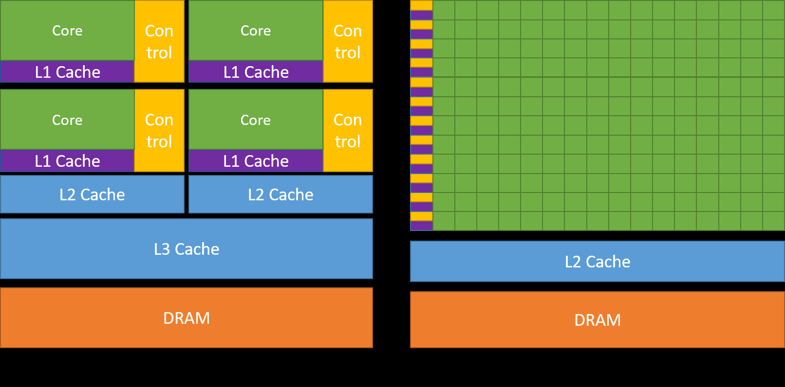

# 1.1 简介

## 1.1.1 图形处理器

图形处理器（Graphics Processing Unit，GPU）最初是为三维图形诞生的专用处理器，它从固定功能的硬件起步，用于加速实时三维渲染中的并行操作。经过一代代发展，GPU 的可编程性不断增强。到 2003 年，图形管线中的部分阶段已完全可编程，可以为三维场景或图像中的每个组件并行运行自定义代码。

2006 年，NVIDIA 推出了计算统一设备架构（Compute Unified Device Architecture，CUDA），使任何计算负载都能使用 GPU 的吞吐能力，而不再依赖图形 API。

自那以后，CUDA 与 GPU 计算已被用于加速几乎所有类型的计算负载，从流体动力学或能量传输等科学仿真，到数据库、数据分析等商业应用。此外，GPU 的能力与可编程性为新算法和新技术的发展奠定了基础，涵盖从图像分类到生成式人工智能（如扩散模型或大语言模型）的各个领域。

## 1.1.2 使用 GPU 的优势

在相似的价格和功耗范围内，GPU 提供的指令吞吐和内存带宽远高于 CPU。许多应用利用这些能力，在 GPU 上的运行速度远超 CPU（参见 GPU Applications）。FPGA 等其他计算设备也具有很高的能效，但编程灵活性远不如 GPU。

GPU 与 CPU 的设计目标不同。CPU 的设计目标是尽可能快地执行一段串行操作序列（称为线程），并能并行执行几十个这样的线程；而 GPU 的设计目标是并行执行数以千计的线程，以牺牲单线程性能为代价，换取更大的总吞吐。

GPU 专为高度并行的计算而设计，将更多晶体管投入数据处理单元，而 CPU 则将更多晶体管投入数据缓存与流控制。图 1 展示了 CPU 与 GPU 芯片资源分布的对比示例。

（图 1：GPU 将更多晶体管用于数据处理）

## 1.1.3 快速上手

利用 GPU 算力的方法有很多。本指南介绍如何在 CUDA GPU 平台上使用 C++ 等高级语言编程。不过，也有许多在应用中使用 GPU 的方法并不需要直接编写 GPU 代码。

各领域的算法与例程正在形成一个不断壮大的集合，可通过专用库获取。当某个库已经实现了所需功能——特别是 NVIDIA 提供的库——使用它往往比从零重新实现算法更高效、性能也更好。cuBLAS、cuFFT、cuDNN 和 CUTLASS 等只是其中几个例子，它们帮助开发者避免重复实现成熟的算法。这些库还有一个额外优势：针对每代 GPU 架构都做过优化，在生产力、性能与可移植性之间取得了理想的平衡。

还有一些框架——特别是人工智能领域的框架——提供了 GPU 加速的构建模块。其中许多框架的加速正是借助了上面提到的 GPU 加速库实现的。

此外，NVIDIA Warp、OpenAI Triton 等领域专用语言（DSL）可以直接编译到 CUDA 平台上运行。与本指南介绍的高级语言相比，这是更高一层的 GPU 编程方式。

NVIDIA 加速计算中心（NVIDIA Accelerated Computing Hub）提供了学习 GPU 与 CUDA 计算的资源、示例和教程。
