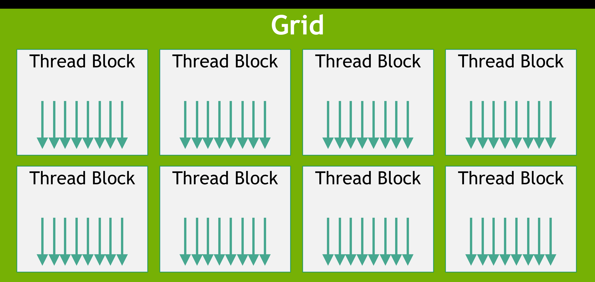
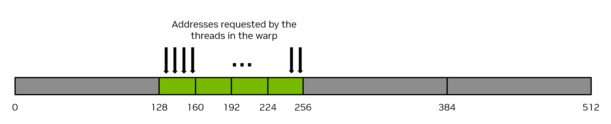
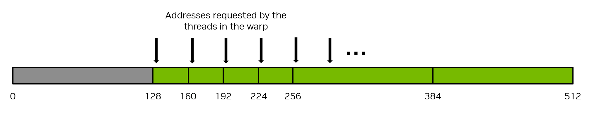
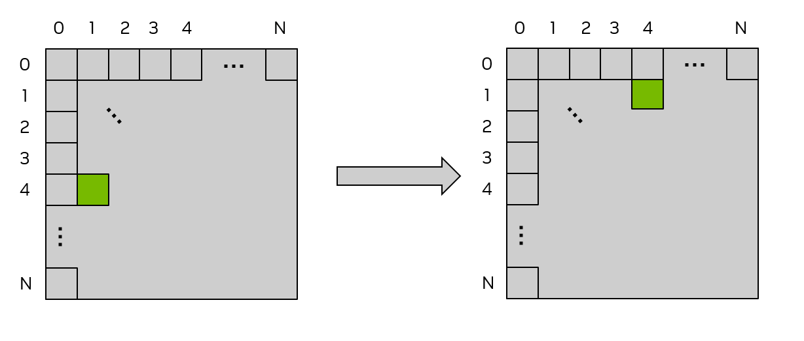
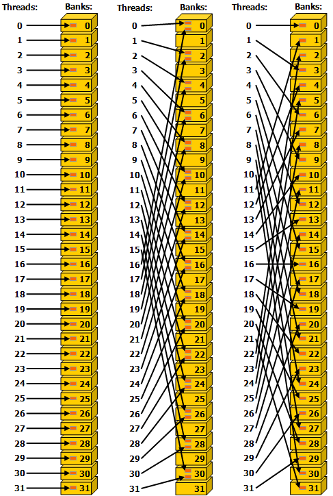
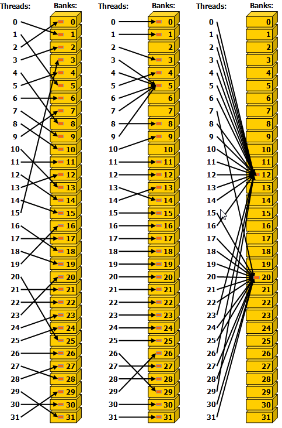
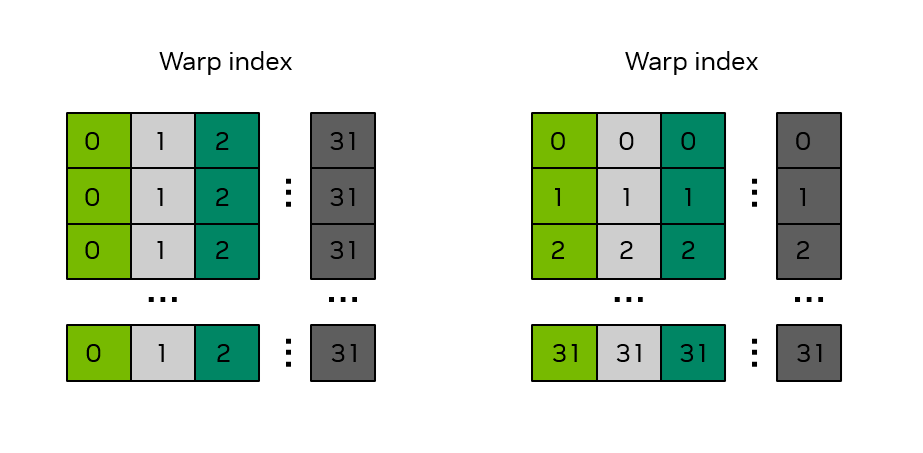
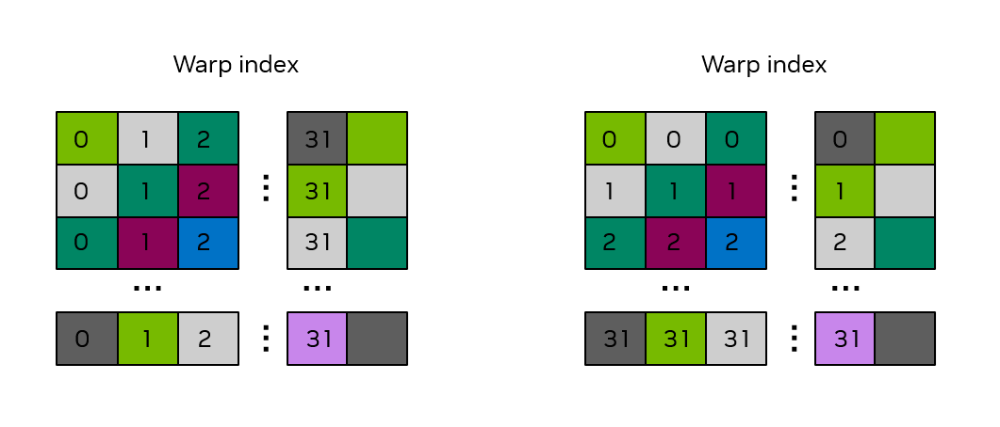

# 2.3 编写 SIMT 核函数

CUDA 核函数在很大程度上可以用与传统 CPU 代码相同的方式编写。然而，GPU 有一些独特特性，可用于提升性能。此外，理解 GPU 上线程如何被调度、如何访问内存、以及执行如何推进，有助于开发者编写充分利用可用计算资源的核函数。

本章介绍使用 SIMT 编程模型编写核函数的更多细节，覆盖 C++ 和 Python 两种语言。

## 2.3.1 SIMT 基础

从开发者的视角看，CUDA 线程是并行的基本单元。1.2.2.2 节介绍了 GPU 执行的基本 SIMT 模型，《SIMT 执行模型》一节提供了 SIMT 模型的更多细节。SIMT 模型允许每个线程维护自己的状态和控制流。从功能角度看，每个线程可以执行不同的代码路径。然而，注意让核函数代码尽量减少同一线程束（warp）中的线程走上分支路径的情况，可以带来显著的性能提升。

## 2.3.2 线程层级

线程被组织成线程块，线程块再被组织成网格。网格可以是 1 维、2 维或 3 维；在核函数内可以用内置变量 gridDim 查询网格的大小。线程块也可以是 1 维、2 维或 3 维；在核函数内可以用内置变量 blockDim 查询线程块的大小，用内置变量 blockIdx 查询线程块的索引。在线程块内，用内置变量 threadIdx 获取线程的索引。这些内置变量用于为每个线程计算唯一的全局线程索引，从而让每个线程能从全局内存中加载/存储特定数据，并在需要时执行独特代码路径。

**C++**

- gridDim.[x|y|z]：网格在 x、y、z 维度上的大小。这些值对所有线程都相同，是核函数启动时执行配置的一部分。
- blockDim.[x|y|z]：线程块在 x、y、z 维度上的大小。这些值对所有线程都相同，是核函数启动时执行配置的一部分。
- blockIdx.[x|y|z]：线程块在 x、y、z 维度上的索引。这些值在不同线程间会变化，用于标识正在执行的是哪个线程块。
- threadIdx.[x|y|z]：线程在 x、y、z 维度上的索引。这些值在不同线程间会变化，用于标识正在执行的是哪个线程。

**Python**

- cuda.gridDim.[xyz]：网格在 x、y、z 维度上的大小。这些值对所有线程都相同，是核函数启动时执行配置的一部分。
- cuda.blockDim.[xyz]：线程块在 x、y、z 维度上的大小。这些值对所有线程都相同，是核函数启动时执行配置的一部分。
- cuda.blockIdx.[xyz]：线程块在 x、y、z 维度上的索引。这些值在不同线程间会变化，用于标识正在执行的是哪个线程块。
- cuda.threadIdx.[xyz]：线程在 x、y、z 维度上的索引。这些值在不同线程间会变化，用于标识正在执行的是哪个线程。

使用多维线程块和网格只是为了方便，不影响性能。线程块内的线程按可预测的方式线性化：x 索引变化最快，其次是 y，最后是 z。这意味着在线程索引的线性化中，连续的 threadIdx.x 值表示连续的线程，threadIdx.y 的步长为 blockDim.x，threadIdx.z 的步长为 blockDim.x * blockDim.y。这会影响线程向线程束的分配，详见《硬件多线程》。



（图 11：线程块网格——展示一个 2D 网格与 1D 线程块的简单示例。）

### 2.3.2.1 线程块同步

在之前示例中，线程块内的线程不需要同步。当线程块内的线程协作，或访问相同的内存地址（尤其是下面介绍的共享内存）时，需要同步来避免竞态条件和内存冒险。

线程块内最基本的同步形式称为 `__syncthreads`。

## 2.3.3 GPU 设备端内存空间

CUDA 设备有多种内存空间，可供核函数内的 CUDA 线程访问。表 1 汇总了常见内存类型、其作用域和生命周期。下面各节分别详细介绍这些内存类型。

（表 1：内存类型、作用域与生命周期）

| 内存类型 | 作用域 | 生命周期 | 位置 |
| --- | --- | --- | --- |
| 全局内存 | 网格 | 应用程序 | 设备端 |
| 常量内存 | 网格 | 应用程序 | 设备端 |
| 共享内存 | 线程块 | 核函数 | SM |
| 本地内存 | 线程 | 核函数 | 设备端 |
| 寄存器 | 线程 | 核函数 | SM |

### 2.3.3.1 全局内存

全局内存（也称设备端内存）是存储数据的首要内存空间，可被核函数内的所有线程访问。它类似于 CPU 系统中的 RAM。运行在 GPU 上的核函数可以直接访问全局内存，就像运行在 CPU 上的代码访问系统内存一样。

全局内存是持久的：即在全局内存中分配的内存及存储的数据会一直保留，直到分配被释放或应用程序终止。`cudaDeviceReset` 也会释放所有分配。

全局内存通过 `cudaMalloc` 和 `cudaMallocManaged` 等 CUDA API 调用分配。可以用 `cudaMemcpy` 等 CUDA 运行时 API 调用把数据从 CPU 内存复制到全局内存。用 CUDA API 分配的全局内存通过 `cudaFree` 释放。

在核函数启动前，先由 CUDA API 调用分配并初始化全局内存。在核函数执行期间，CUDA 线程可以读取全局内存中的数据，也可以把 CUDA 线程运算的结果写回全局内存。核函数执行完毕后，写入全局内存的结果可以复制回主机端，或被 GPU 上的其他核函数使用。

因为网格中的所有线程都能访问全局内存，必须注意避免线程间的数据竞争。由于从主机端启动的 CUDA 核函数的返回类型为 void，核函数计算出的数值结果要返回给主机端，唯一的办法是把结果写入全局内存。

下面的向量加法核函数是一个展示全局内存用法的简单示例，三个数组 A、B、C 都位于全局内存中，被该向量加法核函数访问。

**C++**

```cpp
__global__ void vecAdd(float* A, float* B, float* C, int vectorLength)
{
    int workIndex = threadIdx.x + blockIdx.x*blockDim.x;
    if(workIndex < vectorLength)
    {
        C[workIndex] = A[workIndex] + B[workIndex];
    }
}
```

**Python**

```python
@cuda.jit
def vecadd(A, B, C):
    work_index = cuda.grid(1)
    C[work_index] = A[work_index] + B[work_index]
```

### 2.3.3.2 共享内存

共享内存是可被线程块中所有线程访问的内存空间。它物理上位于每个 SM 上，与 L1 缓存（统一数据缓存）共用同一物理资源。共享内存中的数据在整个核函数执行期间保持。可以把共享内存看作核函数执行期间由用户管理的暂存区。虽然容量远小于全局内存，但因为共享内存位于每个 SM 上，其带宽更高、延迟更低。

由于线程块内的所有线程都能访问共享内存，必须注意避免同一线程块内线程间的数据竞争。同一线程块内线程间的同步可以用 C++ 中的 `__syncthreads()` 函数实现；Python 中用 `cuda.syncthreads()` 实现同样的线程块同步。该函数会阻塞线程块中的所有线程，直到所有线程都到达 `__syncthreads()` 或 `cuda.syncthreads()` 的调用点。

**C++**

```cpp
// 假设 blockDim.x 为 128
__global__ void example_syncthreads(int* input_data, int* output_data)
{
     __shared__ int shared_data[128];
     shared_data[threadIdx.x] = input_data[blockDim.x*blockIdx.x + threadIdx.x];

     // 所有线程同步，保证在任一线程解除 '__syncthreads()' 阻塞之前，
     // 对 'shared_data' 的所有写入都已排序完成：
     __syncthreads();

     // 单个线程安全地读取 'shared_data'：
     if (threadIdx.x == 0) {
           float sum = 0;
           for (int i = 0; i < blockDim.x; ++i) {
               sum += shared_data[i];
           }
           output_data[blockIdx.x] = sum;
       }
}
```

**Python**

```python
import numpy as np
from numba import cuda
import cupy as cp

@cuda.jit
def example_syncthreads(input_data, output_data):
    shared_data = cuda.shared.array(shape=128, dtype=np.int32)

       shared_data[cuda.threadIdx.x] = input_data[cuda.blockIdx.x*cuda.blockDim.x + cuda.threadIdx.x]
       cuda.syncthreads()

       if cuda.threadIdx.x == 0:
           sum = 0.0
           for x in shared_data:
               sum = sum + x
           output_data[cuda.blockIdx.x] = sum
```

共享内存的大小取决于所用的 GPU 架构。因为共享内存与 L1 缓存共用同一物理空间，使用共享内存会减少核函数可用的 L1 缓存大小。另外，如果核函数不使用共享内存，整个物理空间都会被 L1 缓存利用。CUDA 运行时 API 提供函数，用 `cudaGetDeviceProperties` 函数查询每个 SM 和每个线程块的共享内存大小，查看 `cudaDeviceProp.sharedMemPerMultiprocessor` 和 `cudaDeviceProp.sharedMemPerBlock` 这两个设备属性。

CUDA 运行时 API 提供了 `cudaFuncSetCacheConfig` 函数，告诉运行时是分配更多空间给共享内存，还是更多空间给 L1 缓存。该函数只是向运行时表达偏好，不保证一定被采纳；运行时可以根据可用资源和核函数需求自行决策。

共享内存支持静态分配和动态分配。

#### 2.3.3.2.1 共享内存的静态分配

要静态分配共享内存，程序员需要在核函数内部声明变量，C++ 中用 `__shared__` 说明符，Python 中用 `cuda.shared.array()`。该数组将在共享内存中分配，并在整个核函数执行期间保持。用这种方式声明的共享内存大小必须在编译时确定。例如，位于核函数体内的下面这段代码，声明了一个 1024 个元素的 float 类型共享内存数组。

**C++**

```cpp
__shared__ float sharedArray[1024];
```

**Python**

```python
from numba import cuda
import numpy as np

shared_array = cuda.shared.array(shape=1024, dtype=np.float32)
```

声明之后，线程块中的所有线程都可以访问这个共享内存数组。

#### 2.3.3.2.2 共享内存的动态分配

要在 C++ 中动态分配共享内存，程序员可以在核函数启动的三角括号记法中，把所需的每线程块共享内存字节数作为第三个（可选）参数指定，如 `functionName<<<grid, block, sharedMemoryBytes>>>()`。未指定该参数时默认为 0。

在 Python 中，必须用 `cuda.core.launch()` 启动核函数。`LaunchConfig` 参数接受一个 `cuda.core.LaunchConfig` 对象，该对象有一个名为 `shmem_size` 的字段，其作用与 C++ 三角括号记法中的第三个参数相同。

在核函数内部，C++ 中用带空 `[]` 的 `extern __shared__` 说明符声明一个变量，该变量将在核函数启动时动态分配。Python 中用同样用于静态分配的 `cuda.shared.array` 方法，把 `shape` 参数设为 0。

**C++**

```cpp
extern __shared__ float sharedArray[];
```

**Python**

```python
from numba import cuda
import numpy as np

## shape=0 表示该数组将由核函数启动的执行配置动态指定大小

shared_array = cuda.shared.array(shape=0, type=np.float32)
```

需要注意，一个核函数只能有一个动态分配的共享数组。如果想有多个动态分配的共享内存数组，必须分配一个足够大的单一动态分配共享内存数组，再手动划分。例如，在 C++ 中，如果想获得与以下代码等效的动态分配共享内存：

**C++**

```cpp
short array0[128];
float array1[64];
int   array2[256];
```

可以用下面的方式声明和初始化这些数组：

**C++**

```cpp
extern __shared__ float array[];

short* array0 = (short*)array;
float* array1 = (float*)&array0[128];
int*   array2 =   (int*)&array1[64];
```

注意指针必须按其所指向的类型对齐。例如下面的代码是行不通的，因为 array1 没有按 4 字节对齐：

**C++**

```cpp
extern __shared__ float array[];
short* array0 = (short*)array;
float* array1 = (float*)&array0[127];
```

Python 中没有指针，因此这种类型重解释（type punning）形式不可用。

### 2.3.3.3 寄存器

寄存器位于 SM 上，作用域为线程局部。寄存器的使用由编译器管理，用于核函数执行期间的线程局部存储。每个 SM 的寄存器数量和每个线程块的寄存器数量，可以用 GPU 的 `regsPerMultiprocessor` 和 `regsPerBlock` 设备属性查询。

编译 C++ 代码时，NVCC 允许开发者通过 `-maxrregcount` 选项指定核函数可使用的最大寄存器数。用该选项减少核函数可用的寄存器数，可能会让 SM 上同时调度更多的线程块，但也可能导致更多寄存器溢出。寄存器溢出指当前存储在片上寄存器中的值必须写出到全局内存，之后再读回，以腾出空间给其他值。

### 2.3.3.4 本地内存

本地内存是类似寄存器的线程局部存储，由 NVCC 管理，但其物理位置在全局内存空间中。“本地”指的是逻辑作用域，而非物理位置。本地内存用于核函数执行期间的线程局部存储。编译器可能把以下自动变量放在本地内存中：

- 无法确定是否以常量下标索引的数组；
- 会占用过多寄存器空间的大结构体或大数组；
- 核函数使用的寄存器数超过可用数时（即寄存器溢出）的任何变量。

因为本地内存空间位于设备内存中，本地内存访问的延迟和带宽与全局内存访问相同，并受《合并的全局内存访问》中描述的相同合并访存要求约束。不过，本地内存的组织方式使得连续的 32 位字由连续的线程 ID 访问。因此，只要线程束中的所有线程访问相同的相对地址（例如数组变量中的同一索引，或结构体变量中的同一成员），访问就会完全合并。

### 2.3.3.5 常量内存

常量内存的作用域为网格，在应用程序的生命周期内可访问。常量内存位于设备端，对核函数只读。

C++ 中，变量或数组在任何核函数或函数之外用 `__constant__` 说明符声明。Python 中，在核函数代码内调用 `const_array = numba.cuda.const.array_like(ary)` 方法，创建一个常量内存数组，其中存放主机端数组 ary 的数据。

常量内存意味着变量：

- 位于常量内存空间；
- 每个设备端有一个独立对象；
- 网格内的所有线程都可访问；C++ 中主机端也可通过运行时库访问（`cudaGetSymbolAddress()` / `cudaGetSymbolSize()` / `cudaMemcpyToSymbol()` / `cudaMemcpyFromSymbol()`）。

C++ 中，常量内存的生命周期与其创建时所在的上下文相同。Python 中，常量内存的生命周期与其声明所在的核函数相同。

常量内存总量可以用 `totalConstMem` 设备属性元素查询。

常量内存适用于每个线程以只读方式使用的小数据量。相对于其他内存，常量内存很小，典型值是每设备端 64KB。

下面是声明和使用常量内存的示例代码片段。

**C++**

```cpp
// 在 .cu 文件中
__constant__ float coeffs[4];

__global__ void compute(float *out) {
    int idx = threadIdx.x;
    out[idx] = coeffs[0] * idx + coeffs[1];
}

// 在主机端代码中
float h_coeffs[4] = {1.0f, 2.0f, 3.0f, 4.0f};
cudaMemcpyToSymbol(coeffs, h_coeffs, sizeof(h_coeffs));
compute<<<1, 10>>>(device_out);
```

**Python**

```python
from numba import cuda
import numpy as np

host_array = np.zeros(128, dtype=np.float32)
## 用其他数据填充 host_array

@cuda.jit
def kernel(args):
    ...

     const_array = cuda.const.array_like(a)

     # 这次访问现在走常量内存
     a = const_array[cuda.threadIdx.x]
```

### 2.3.3.6 缓存

GPU 设备有多级缓存结构，包括 L2 和 L1 缓存。

L2 缓存位于设备端，由所有 SM 共享。L2 缓存大小可以用 `cudaGetDeviceProperties` 函数的 `l2CacheSize` 设备属性元素查询。

如上文《共享内存》所述，L1 缓存物理上位于每个 SM，与共享内存共用同一物理空间。如果核函数不使用共享内存，整个物理空间都会被 L1 缓存利用。

L2 和 L1 缓存可通过函数控制，开发者可以指定各种缓存行为。这些函数的细节见《配置 L1/共享内存配比》、《L2 缓存控制》及《低层加载与存储函数》。

如果不使用这些提示，编译器和运行时会尽力高效利用缓存。

### 2.3.3.7 纹理和表面内存

> **说明**
>
> 一些旧的 CUDA 代码可能使用纹理内存，因为在旧的 NVIDIA GPU 上，某些场景下这样做有性能好处。在所有当前受支持的 GPU 上，这些场景可以用直接加载/存储指令处理，使用纹理和表面内存指令对非纹理加载不再提供任何性能好处。

GPU 可能有从图像中加载数据作为 3D 渲染纹理用的专用指令。CUDA 通过纹理对象 API 和表面对象 API 暴露了这些指令及使用它们的相关机制。

在任何当前受支持的 NVIDIA GPU 上，纹理和表面内存对 CUDA 中的非图形应用不提供任何性能优势。这些 API 在读取用于渲染的纹理或表面数据时仍然有用，例如编写 NVIDIA OptiX 的着色器（OptiX 以 CUDA 作为其着色器语言）。

对于仍在用这些 API 做非纹理加载的现有代码库，这些 API 的说明仍可在旧版《CUDA C++ Programming Guide》中找到。

### 2.3.3.8 分布式共享内存

> **说明**
>
> 分布式共享内存是使用线程块簇时的可用特性。线程块簇使用 cooperative_groups API，这些 API 目前仅在 C++ 中可用。

线程块簇（Thread Block Clusters）在计算能力 9.0 中引入，由 Cooperative Groups 提供支持，允许线程块簇中各线程块的线程访问该簇内所有参与线程块的共享内存。这种分区的共享内存称为分布式共享内存，对应的地址空间称为分布式共享内存地址空间。属于某个线程块簇的线程可以在分布式地址空间中读取、写入或执行原子操作，无论该地址属于本地线程块还是远端线程块。无论核函数是否使用分布式共享内存，共享内存大小规格（静态或动态）仍然是按每个线程块计的。分布式共享内存的大小就是每簇线程块数乘以每线程块共享内存大小。

访问分布式共享内存中的数据需要所有线程块都存在。用户可以用 `cluster_group` 类的 `cluster.sync()` 保证所有线程块都已开始执行。用户还需要保证所有分布式共享内存操作都在线程块退出前完成——例如，若远端线程块试图读取某个线程块的共享内存，程序要保证远端线程块读取该共享内存的操作完成后，该线程块才能退出。

来看一个简单的直方图计算，以及如何用线程块簇在 GPU 上优化它。计算直方图的标准做法是在每个线程块的共享内存中计算，再执行全局内存原子操作。这种方法的局限是共享内存容量：当直方图分箱不再能装进共享内存，用户就必须直接在全局内存中计算直方图和执行原子操作。有了分布式共享内存，CUDA 提供了一个中间方案：根据直方图分箱大小，可以在共享内存、分布式共享内存中计算直方图，或直接在全局内存中计算。

下面的 CUDA 核函数示例展示如何根据直方图分箱数，在共享内存或分布式共享内存中计算直方图。

**C++**

```cpp
#include <cooperative_groups.h>

// 分布式共享内存直方图核函数
__global__ void clusterHist_kernel(int *bins, const int nbins, const int bins_per_block, const int *__restrict__ input,
                                     size_t array_size)
{
     extern __shared__ int smem[];
     namespace cg = cooperative_groups;
     int tid = cg::this_grid().thread_rank();

      // 簇初始化、簇大小以及计算本地分箱偏移。
      cg::cluster_group cluster = cg::this_cluster();
      unsigned int clusterBlockRank = cluster.block_rank();
      int cluster_size = cluster.dim_blocks().x;

       for (int i = threadIdx.x; i < bins_per_block; i += blockDim.x)
       {
       smem[i] = 0; //将共享内存直方图初始化为零
       }

       // 簇同步保证簇内所有线程块的共享内存都被初始化为零，
       // 也保证所有线程块都已开始执行并同时存在。
       cluster.sync();

       for (int i = tid; i < array_size; i += blockDim.x * gridDim.x)
       {
       int ldata = input[i];

       //找到正确的直方图分箱。
       int binid = ldata;
       if (ldata < 0)
           binid = 0;
       else if (ldata >= nbins)
           binid = nbins - 1;

       //计算目标块 rank 和偏移，用于计算
       //分布式共享内存直方图
       int dst_block_rank = (int)(binid / bins_per_block);
       int dst_offset = binid % bins_per_block;

       //指向目标块共享内存的指针
       int *dst_smem = cluster.map_shared_rank(smem, dst_block_rank);

       //对直方图分箱执行原子更新
       atomicAdd(dst_smem + dst_offset, 1);
       }

       //簇同步确保所有分布式共享内存
       //操作都已完成，并且没有任何线程块在
       //其他线程块仍在访问分布式共享内存时退出
       cluster.sync();

       //用本地分布式内存直方图执行全局内存直方图计算
       int *lbins = bins + cluster.block_rank() * bins_per_block;
       for (int i = threadIdx.x; i < bins_per_block; i += blockDim.x)
       {
       atomicAdd(&lbins[i], smem[i]);
       }
}
```

上面的核函数可以在运行时用取决于所需分布式共享内存量的簇大小来启动。如果直方图足够小，能装进一个线程块的共享内存，用户可以用簇大小 1 来启动核函数。下面代码片段展示如何根据共享内存需求动态启动簇核函数。

**C++**

```cpp
// 通过可扩展启动方式启动
{
    cudaLaunchConfig_t config = {0};
    config.gridDim = array_size / threads_per_block;
    config.blockDim = threads_per_block;

    // cluster_size 取决于直方图大小。
    // ( cluster_size == 1 ) 意味着没有分布式共享内存，只有线程块本地共享内存

    int cluster_size = 2; // 此处以 2 为例
    int nbins_per_block = nbins / cluster_size;

    //动态共享内存大小按每个块计。
    //分布式共享内存大小 = cluster_size * nbins_per_block * sizeof(int)

    config.dynamicSmemBytes = nbins_per_block * sizeof(int);

       CUDA_CHECK(::cudaFuncSetAttribute((void *)clusterHist_kernel,   cudaFuncAttributeMaxDynamicSharedMemorySize, config.dynamicSmemBytes));

       cudaLaunchAttribute attribute[1];
       attribute[0].id = cudaLaunchAttributeClusterDimension;
       attribute[0].val.clusterDim.x = cluster_size;
       attribute[0].val.clusterDim.y = 1;
       attribute[0].val.clusterDim.z = 1;

       config.numAttrs = 1;
       config.attrs = attribute;

       cudaLaunchKernelEx(&config, clusterHist_kernel, bins, nbins, nbins_per_block, input, array_size);
}
```

## 2.3.4 内存性能

确保内存使用得当是 CUDA 核函数获得高性能的关键。本节讨论在 CUDA 核函数中从全局内存和共享内存获得高内存吞吐量的一般原则和示例。全局内存性能是大多数核函数的首要性能考量。当线程操作并非自己显式加载或创建的数据时，常会用到共享内存，因此理解共享内存与性能相关的特性也很重要。

下面小节将通过一个矩阵转置示例核函数，逐步改进全局内存和共享内存的访问，阐释内存访问的重要方面。

### 2.3.4.1 合并的全局内存访问

全局内存通过 32 字节的内存事务访问。当一个 CUDA 线程从全局内存请求一个字（word）的数据时，相关线程束把该线程束内所有线程的内存请求合并成满足该请求所需的若干内存事务，具体取决于每个线程访问的字大小及内存地址在线程间的分布。例如，如果线程请求一个 4 字节的字，线程束向全局内存生成的实际内存事务总计为 32 字节。为了最高效地利用内存系统，线程束应当用足单次内存事务取回的所有内存。也就是说，如果一个线程从全局内存请求一个 4 字节的字，而事务大小为 32 字节，若该线程束中其他线程能用上这 32 字节请求中的其他 4 字节数据字，就能最有效地利用内存系统。

举个简单例子，如果线程束中连续的线程请求内存中连续的 4 字节字，线程束共请求 128 字节内存，这 128 字节会用四次 32 字节内存事务取回。这样线程束对内存事务的利用率达到 100%。图 12 展示了这种完美合并内存访问的例子。



（图 12：合并的内存访问。）

相反，病态的最坏场景是：连续的线程访问在内存中彼此相隔 32 字节或更远的数据元素。此时线程束被迫为每个线程发起一次 32 字节内存事务，总内存流量为 32 字节 × 32 线程/线程束 = 1024 字节。而实际用到的内存只有 128 字节（线程束中每个线程 4 字节），内存利用率仅为 128 / 1024 = 12.5%。这是对内存系统的极低效使用。图 13 展示了这种未合并内存访问的例子。



（图 13：未合并的内存访问。）

实现合并内存访问最直接的办法是让连续的线程访问内存中的连续元素。例如，对于用 1D 线程块启动的核函数，前面展示的向量加法核函数就能实现合并内存访问。注意线程如何访问三个数组：连续的线程（由连续的 workIndex 值表示）访问数组中的连续元素。

**C++**

```cpp
__global__ void vecAdd(float* A, float* B, float* C, int vectorLength)
{
    int workIndex = threadIdx.x + blockIdx.x*blockDim.x;
    if(workIndex < vectorLength)
       {
            C[workIndex] = A[workIndex] + B[workIndex];
       }
}
```

**Python**

```python
## 定义执行 C = A + B 向量加法的 CUDA 核函数
@cuda.jit
def vecadd(A, B, C):
    work_index = cuda.grid(1)
    C[work_index] = A[work_index] + B[work_index]
```

合并内存访问并不要求连续的线程访问内存的连续元素才能实现——那只是实现合并的典型方式。只要线程束中的不同线程以某种线性或置换方式访问同一批 32 字节内存段中的元素，就能实现合并内存访问。换句话说，实现合并内存访问的最佳方式是最大化“用到的字节数/传输的字节数”之比。

另一种理解全局内存合并的概念化方式是：考虑满足一次线程束单条加载指令请求的 32 个地址需要多少次全局内存事务。在最好的情况下，满足所有加载只需一次全局内存事务。对于完美合并的 4 字节数据元素访问，需要 4 次全局内存事务。在最坏情况下，满足一次线程束单条加载指令请求的地址可能需要 32 次全局内存事务。一般来说，满足一次加载所需的全局内存事务数越小，性能越好。

> **说明**
>
> 确保全局内存访问正确合并是编写高性能 CUDA 核函数最重要的性能考量之一。应用程序必须尽可能高效地使用内存系统。

#### 2.3.4.1.1 用全局内存实现矩阵转置的示例

举个简单例子：考虑一个异地（out-of-place）矩阵转置核函数，把 N x N 的 32 位浮点方阵从矩阵 a 转置到矩阵 c。该示例用 2D 网格，假设以 32 x 32 线程的 2D 线程块启动，即 blockDim.x = 32 且 blockDim.y = 32，因此每个 2D 线程块处理矩阵的一个 32 x 32 分块。每个线程处理矩阵的一个唯一元素，因此不需要对线程做显式同步。图 14 展示了该矩阵转置操作。图后附核函数源代码。

**C++**

```cpp
/* 用 2D 索引以行优先顺序索引 1D 内存数组的宏 */
/* ld 是主维度，即矩阵的列数                    */

#define INDX( row, col, ld ) ( ( (row) * (ld) ) + (col) )

/* 矩阵转置的 CUDA 核函数 */

__global__ void cuda_transpose(int m, float *a, float *c )
{
    int myCol = blockDim.x * blockIdx.x + threadIdx.x;
    int myRow = blockDim.y * blockIdx.y + threadIdx.y;

    if( myRow < m && myCol < m )
    {
        c[INDX( myCol, myRow, m )] = a[INDX( myRow, myCol, m )];
    } /* 结束 if */
    return;
} /* 结束 cuda_transpose */
```

**Python**

```python
import numpy as np
from numba import cuda
import cupy as cp

## 矩阵转置核函数，每个矩阵元素一个线程，用
## 2D 线程块在 2D 网格上启动以匹配矩阵尺寸
@cuda.jit
def transpose(a, c):
    col = cuda.blockDim.x * cuda.blockIdx.x + cuda.threadIdx.x
     row = cuda.blockDim.y * cuda.blockIdx.y + cuda.threadIdx.y
     c[(col,row)] = a[(row,col)]
```



（图 14：用全局内存的矩阵转置。每个矩阵顶部和左侧的标签是 2D 线程块索引，也可视为分块索引，其中每个小方块表示将由一个 2D 线程块处理的一个矩阵分块。本例中分块大小为 32 x 32 元素，因此每个小方块代表矩阵的一个 32 x 32 分块。绿色阴影方块展示了转置前后一个示例分块的位置。）

要判断该核函数是否实现了合并内存访问，需要判断连续的线程是否访问了内存中的连续元素。在 2D 线程块中，x 索引变化最快，因此连续的 threadIdx.x 值应当访问内存中的连续元素。threadIdx.x 出现在 myCol 中，可以看出当 myCol 作为 INDX 宏的第二个参数时，连续的线程读取 a 的连续值，因此 a 的读操作完美合并。

然而，c 的写操作没有合并，因为连续的 threadIdx.x 值（同样看 myCol）向 c 中写入的元素彼此相隔 ld（主维度）个元素。这是因为此时 myCol 是 INDX 宏的第一个参数，INDX 的第一个参数每增加 1，内存位置就变化 ld。当 ld 大于 32（即矩阵尺寸大于 32 时总成立）时，这等价于图 13 所示的病态场景。

为缓解这种未合并的写，可以使用共享内存，下一节会介绍。

### 2.3.4.2 共享内存访问模式

共享内存有 32 个存储体（bank），组织方式为：连续的 32 位字映射到连续的存储体。每个存储体每个时钟周期带宽为 32 位。

当同一线程束中的多个线程试图访问同一存储体中的不同元素时，会发生存储体冲突。此时，对该存储体数据的访问会被串行化，直到所有请求该数据的线程都拿到数据。这种访问串行化会带来性能损失。

有两种例外：同一线程束中的多个线程访问（读或写）同一共享内存位置。读访问时，该字会被广播给请求线程。写访问时，每个共享内存地址只由其中一个线程写入（具体是哪个线程未定义）。

图 15 展示了一些跨步访问的例子。存储体内的红色方块表示共享内存中的一个唯一位置。

图 16 展示了一些涉及广播机制的内存读访问例子。存储体内的红色方块表示共享内存中的一个唯一位置。如果多个箭头指向同一位置，数据会广播给所有请求的线程。

> **说明**
>
> 避免存储体冲突是编写高性能、使用共享内存的 CUDA 核函数的一个重要性能考量。



（图 15：32 位存储体大小模式下的跨步共享内存访问。左：步长为一个 32 位字的线性寻址（无存储体冲突）。中：步长为两个 32 位字的线性寻址（2 路存储体冲突）。右：步长为三个 32 位字的线性寻址（无存储体冲突）。）



（图 16：不规则共享内存访问。左：通过随机置换实现无冲突访问。中：无冲突访问，因为线程 3、4、6、7、9 访问存储体 5 中的同一字。右：无冲突的广播访问（线程访问一个存储体中的同一字）。）

#### 2.3.4.2.1 用共享内存实现矩阵转置的示例

在上一个例子《用全局内存实现矩阵转置的示例》中，展示了一个功能正确、但未针对全局内存高效使用优化的矩阵转置实现，因为 c 矩阵的写没有正确合并。在本例中，共享内存被当作用户管理的缓存，用来暂存来自全局内存的加载和存储，从而让读和写都实现合并的全局内存访问。

**C++**

```cpp
#define THREADS_PER_BLOCK_X 32
#define THREADS_PER_BLOCK_Y 32

/* 用 2D 索引以列优先顺序索引 1D 内存数组的宏 */
/* ld 是主维度，即矩阵的行数     */

#define INDX( row, col, ld ) ( ( (col) * (ld) ) + (row) )

/* 共享内存矩阵转置的 CUDA 核函数 */
__global__ void smem_transpose(int m,
                                     float *a,
                                     float *c )
{

      /* 声明一个静态分配的共享内存数组 */

      __shared__ float smemArray[THREADS_PER_BLOCK_X][THREADS_PER_BLOCK_Y];

      /* 确定我的行列索引，用于错误检查代码 */

      const int myRow = blockDim.x * blockIdx.x + threadIdx.x;
      const int myCol = blockDim.y * blockIdx.y + threadIdx.y;

      /* 确定我的行分块和列分块索引 */

      const int tileX = blockDim.x * blockIdx.x;
      const int tileY = blockDim.y * blockIdx.y;

    if( myRow < m && myCol < m )
    {
        /* 从全局内存读入共享内存数组 */
        smemArray[threadIdx.x][threadIdx.y] = a[INDX( tileX + threadIdx.x, tileY + threadIdx.y, m )];

    } /* 结束 if */

      /* 同步线程块中的线程 */
      __syncthreads();

    if( myRow < m && myCol < m )
    {
        /* 把结果从共享内存写到全局内存 */
        c[INDX( tileY + threadIdx.x, tileX + threadIdx.y, m )] = smemArray[threadIdx.y][threadIdx.x];

    } /* 结束 if */
    return;

}
```

**Python**

```python
import numpy as np
from numba import cuda
import cupy as cp

## 矩阵转置核函数，每个矩阵元素一个线程，用
## 2D 线程块在 2D 网格上启动以匹配矩阵尺寸
## 把输入暂存到共享内存
@cuda.jit
def smem_transpose(a, c):
    smemArray = cuda.shared.array(shape=(32, 32), dtype=np.float32)

      tile_col = cuda.blockDim.x * cuda.blockIdx.x
      tile_row = cuda.blockDim.y * cuda.blockIdx.y

       smemArray[(cuda.threadIdx.x, cuda.threadIdx.y)] = a[(tile_row + cuda.threadIdx.y, tile_col + cuda.threadIdx.x)]

      cuda.syncthreads()

       c[(tile_col + cuda.threadIdx.y, tile_row + cuda.threadIdx.x)] = smemArray[(cuda.threadIdx.y, cuda.threadIdx.x)]
```

本例展示的根本性性能优化是：访问全局内存时，确保内存访问正确合并。在拷贝执行前，每个线程计算自己的 tileRow 和 tileCol 索引。这些是将要操作的特定分块的索引，基于正在执行的线程块。同一线程块中的每个线程有相同的 tileRow 和 tileCol 值，可以认为这是该线程块将要处理的分块的起始位置。

随后核函数让每个线程块把矩阵的 32 x 32 分块从全局内存拷贝到共享内存，语句如下。由于线程束大小为 32 个线程，该拷贝操作将由 32 个线程束执行，线程束之间没有保证的顺序。

**C++**

```cpp
smemArray[threadIdx.x][threadIdx.y] = a[INDX( tileRow + threadIdx.y, tileCol + threadIdx.x, m )];
```

**Python**

```python
smemArray[(cuda.threadIdx.x, cuda.threadIdx.y)] = a[(tile_row + cuda.threadIdx.y, tile_col + cuda.threadIdx.x)]
```

注意因为 threadIdx.x 出现在 INDX 的第二个参数中，连续的线程访问内存中的连续元素，a 的读操作完美合并。Python 中，用 cuda.threadIdx.x 作为元组的最后一个索引有同样的效果：对 a 的访问完美合并。

核函数的下一步是调用 `__syncthreads()` / `cuda.syncthreads()`。这保证线程块中的所有线程都执行完前面的代码再继续，因此 a 写入共享内存的操作在进入下一步之前已经完成。这至关重要，因为下一步要从共享内存读取。当一个线程处理或存储并非自己加载的数据时，需要同步以保证在访问该元素之前，其加载操作已完成。

到核函数的这个位置，每个线程块的共享内存数组中已有矩阵的一个 32 x 32 分块，排列顺序与原矩阵相同。为了确保分块内的元素被正确转置，从 smemArray 读取时交换 threadIdx.x 和 threadIdx.y。为了确保整个分块在 c 中的位置正确，写 c 时也交换 tileRow 和 tileCol 索引。为了保证正确合并，在 INDX 的第二个参数中使用 threadIdx.x，如下所示。Python 中，这同样通过在矩阵索引元组的最后一个位置用 cuda.threadIdx.x 实现。

**C++**

```cpp
c[INDX( tileCol + threadIdx.y, tileRow + threadIdx.x, m )] = smemArray[threadIdx.y][threadIdx.x];
```

**Python**

```python
c[(tile_col + cuda.threadIdx.y, tile_row + cuda.threadIdx.x)] = smemArray[(cuda.threadIdx.y, cuda.threadIdx.x)]
```

该核函数展示了共享内存的两种常见用法。

- 共享内存用于暂存来自全局内存的数据，确保对全局内存的读和写都正确合并。
- 共享内存用于让同一线程块中的线程彼此共享数据。

#### 2.3.4.2.2 共享内存存储体冲突

2.3.4.2 节介绍了共享内存的存储体结构。在上一个矩阵转置示例中，实现了对全局内存的正确合并访问，但没有考虑是否存在共享内存存储体冲突。考虑下面的 2D 共享内存声明：

**C++**

```cpp
__shared__ float smemArray[32][32];
```

**Python**

```python
from numba import cuda
import numpy as np

smemArray = cuda.shared.array(shape=(32,32), dtype=np.float32)
```

假设核函数将以 32 x 32 线程的 2D 线程块启动。由于一个线程束是 32 个线程，特定线程束中的每个线程的 threadIdx.y 固定，且 0 <= threadIdx.x < 32。

图 17 左面板展示了线程束中的线程沿 smemArray 的一列访问数据时的情况。线程束 0 访问 smemArray[0][0] 到 smemArray[31][0]（Python 中为 smemArray[(0,0)] 到 smemArray[(31,0)]）。C++ 和 Python 的多维数组顺序都是最后一个索引变化最快，因此线程束 0 中连续的线程访问相隔 32 个元素的内存位置。如图所示，颜色表示存储体，线程束 0 沿整列访问导致 32 路存储体冲突。

图 17 右面板展示了线程束中的线程沿 smemArray 的一行访问数据时的情况。线程束 0 访问 smemArray[0][0] 到 smemArray[0][31]（Python 中为 smemArray[(0,0)] 到 smemArray[(0,31)]）。此时线程束 0 中连续的线程访问相邻的内存位置。如图所示，颜色表示存储体，线程束 0 沿整行访问没有存储体冲突。

理想情形是线程束中的每个线程访问不同颜色的共享内存位置。



（图 18 之前的图 17：32 x 32 共享内存数组中的存储体结构。方块中的数字表示线程束索引。颜色表示与该共享内存位置关联的存储体。）

回到 2.3.4.2.1 节的例子，可以检查共享内存的用法是否存在存储体冲突。共享内存的第一次使用是把数据从全局内存存入共享内存：

**C++**

```cpp
smemArray[threadIdx.x][threadIdx.y] = a[INDX( tileRow + threadIdx.y, tileCol + threadIdx.x, m )];
```

**Python**

```python
smemArray[(cuda.threadIdx.x, cuda.threadIdx.y)] = a[(tile_row + cuda.threadIdx.y, tile_col + cuda.threadIdx.x)]
```

因为数组按行优先存储，同一线程束中的连续线程（由连续的 threadIdx.x 值表示）访问 smemArray 的步长为 32 个元素，因为 threadIdx.x 是数组的第一个索引。这导致 32 路存储体冲突，如图 17 左面板所示。

共享内存的第二次使用是把数据从共享内存写回全局内存：

**C++**

```cpp
c[INDX( tileCol + threadIdx.y, tileRow + threadIdx.x, m )] = smemArray[threadIdx.y][threadIdx.x];
```

**Python**

```python
c[(tile_col + cuda.threadIdx.y, tile_row + cuda.threadIdx.x)] = smemArray[(cuda.threadIdx.y, cuda.threadIdx.x)]
```

此时因为 threadIdx.x 是 smemArray 数组的第二个索引，同一线程束中的连续线程访问 smemArray 的步长为 1 个元素。这没有存储体冲突，如图 17 右面板所示。

2.3.4.2.1 节中的矩阵转置核函数对共享内存的一次访问没有存储体冲突，另一次有 32 路存储体冲突。避免存储体冲突的常见修复办法是对共享内存做填充，在数组的列维度上加 1，如下所示：

**C++**

```cpp
__shared__ float smemArray[THREADS_PER_BLOCK_X][THREADS_PER_BLOCK_Y+1];
```

**Python**

```python
smemArray = cuda.shared.array(shape=(32, 32 + 1), dtype=np.float32)
```

对 smemArray 声明的这个小调整就能消除存储体冲突。如图 18 所示，共享内存数组声明为 32 x 33 后可以观察到：无论同一线程束中的线程是沿整列还是沿整行访问共享内存数组，存储体冲突都消除了——同一线程束中的线程访问不同颜色的位置。



（图 18：32 x 33 共享内存数组中的存储体结构。方块中的数字表示线程束索引。颜色表示与该共享内存位置关联的存储体。）

## 2.3.5 原子操作

高性能的 CUDA 核函数依赖于尽可能多地表达算法并行性。GPU 核函数执行的异步特性要求线程尽可能独立运行。但线程不可能总是完全独立；如《共享内存》中所见，同一线程块内的线程有交换数据和同步的机制。

在整个网格层面，没有这样的机制来同步网格中的所有线程。不过，有一种机制能通过原子函数提供对全局内存位置的同步访问。原子函数允许一个线程锁定一个全局内存位置，并对该位置执行读-改-写操作。在持有锁期间，没有其他线程能访问同一位置。

### 2.3.5.1 类 C++ std::atomic 的原子操作

C++ 中，CUDA 提供与 C++ 标准库同名原子 `cuda::std::atomic` 和 `cuda::std::atomic_ref` 类似的语法和行为。CUDA 还提供扩展的 C++ 原子 `cuda::atomic` 和 `cuda::atomic_ref`，允许用户指定原子操作的作用域。原子函数的细节见《原子函数》。

下面是用 `cuda::atomic_ref` 执行设备端全局原子加的示例，其中 array 是 float 数组，result 是指向全局内存中某个位置的 float 指针，该位置存放数组的求和结果。

**C++**

```cpp
__global__ void sumReduction(int n, float *array, float *result) {
...
tid = threadIdx.x + blockIdx.x * blockDim.x;

cuda::atomic_ref<float, cuda::thread_scope_device> result_ref(result);
result_ref.fetch_add(array[tid]);
...
}
```

原子函数应谨慎使用，因为它们强制线程同步，会影响性能。

### 2.3.5.2 Python 中的内存原子操作

Python 中，原子内存操作由 GPU 代码在 `numba.cuda.atomic` 命名空间中可用的函数提供。`add`、`sub`、`max`、`min`、`compare_and_swap` 等典型操作都可用。完整支持的原子操作列表见 Numba CUDA 文档。

下面代码展示了一个用原子内存访问计算数组所有值之和的核函数示例。每个线程块把数组的一个分片加载到共享内存。每个线程块的单个线程计算局部和，并对结果数组 s 执行一次原子加。因为数据位于靠近 SM 计算资源的共享内存中，让单个线程做求和通常仍然相当高效。

**Python**

```python
import numpy as np
from numba import cuda
import cupy as cp


@cuda.jit
def sum_reduce(a, s):
    ## 创建一个共享数组，支持最多 512 线程的块大小
    ## 虽然本例中会用得更少
    shared_staging = cuda.shared.array(shape=512, dtype=np.float32)

    ## 把值加载到共享内存，然后同步以保证所有加载都完成
    shared_staging[cuda.threadIdx.x] = a[cuda.blockIdx.x*cuda.blockDim.x + cuda.threadIdx.x]

    cuda.syncthreads()

       ## 每个块只有线程 0 做局部加法，随后
       ## 每个线程块执行一次原子操作
       local_sum = float(0.0)
       if cuda.threadIdx.x == 0:
            for i in range(cuda.blockDim.x):
                local_sum = local_sum + shared_staging[i]
            cuda.atomic.add(s, 0, local_sum)


array_length = 2**18

a = cp.ones(array_length)
s = cp.zeros(1, dtype=np.float32)

block_size = 256
grid_size = int(array_length/block_size)
sum_reduce[grid_size, block_size](a, s)

s_host = cp.asnumpy(s)
print(f"Sum is {int(s_host[0])}, expected {array_length}")
```

在这个简单示例中，输入数组全是 1，所以正确结果就等于 array_length。

如果把

```python
cuda.atomic.add(s, 0, local_sum)
```

这一行换成非原子的加法

```python
s[0] = s[0] + local_sum
```

对 s[0] 的访问就不是原子的，s[0] 的最终值会小于 array_length。此外，该值每次运行都可能变化，在不同 SM 数量的 GPU 上运行也可能不同。这说明这段代码为了正确性需要原子内存访问。

> **说明**
>
> 该示例虽可运行，但无意于展示如何在 GPU 上编写峰值性能的规约操作。NVIDIA 的 CUDA Core 计算库（CCCL）为许多操作（包括规约）提供了高性能原语。出于生产效率和性能考虑，开发者应优先使用这些高度调优的实现，而不是重写相同的算法。这些原语在 Python 中可通过 `cuda.coop` 包使用。

C++ 中也有类似的原子操作，见 5.4.5.1 节，但推荐且被视为 CUDA C++ 最佳实践的是使用类 std::atomic 的原子操作。

## 2.3.6 Cooperative Groups

Cooperative groups 是 CUDA C++ 中的一个软件工具，允许应用程序定义可以相互同步的线程组，即使该线程组横跨多个线程块、单 GPU 上的多个网格，甚至多个 GPU。一般来说，CUDA 编程模型允许线程块或线程块簇内的线程高效同步，但不提供指定小于线程块或簇的线程组的机制。同样，CUDA 编程模型也不提供跨线程块同步的机制或保证。

Cooperative groups 通过软件提供这两种能力。它允许应用程序创建跨越线程块和簇边界的线程组，但这样做有一些语义限制和性能影响，详见介绍 cooperative groups 的特性章节。

## 2.3.7 核函数启动与占用率

当 CUDA 核函数启动时，CUDA 线程根据启动时指定的执行配置被分组为线程块和网格。核函数启动后，调度器把线程块分配给 SM。哪些线程块被调度到哪些 SM 上执行，应用程序无法控制也无法查询，调度器也不做排序保证，因此程序的正确执行不能依赖特定的调度顺序或方案。

一个 SM 上能调度多少个线程块，取决于给定线程块所需的硬件资源，以及 SM 上可用的硬件资源。核函数首次启动时，调度器开始把线程块分配给 SM。只要 SM 还有未被其他线程块占用的足够硬件资源，调度器就会继续向 SM 分配线程块。如果某时没有 SM 能接纳另一个线程块，调度器会等待，直到 SM 完成之前分配的线程块。之后 SM 就能接受更多工作，调度器再把线程块分配给它们。该过程持续，直到所有线程块都被调度和执行。

`cudaGetDeviceProperties` 函数允许应用程序通过设备属性查询每个 SM 的限制。注意有每个 SM 的限制和每个线程块的限制。

- maxBlocksPerMultiProcessor：每个 SM 的最大常驻线程块数。
- sharedMemPerMultiprocessor：每个 SM 可用的共享内存字节数。
- regsPerMultiprocessor：每个 SM 可用的 32 位寄存器数。
- maxThreadsPerMultiProcessor：每个 SM 的最大常驻线程数。
- sharedMemPerBlock：一个线程块可分配的最大共享内存字节数。
- regsPerBlock：一个线程块可分配的最大 32 位寄存器数。
- maxThreadsPerBlock：每个线程块的最大线程数。

CUDA 核函数的占用率（occupancy）是活跃线程束数与 SM 支持的最大活跃线程束数之比。一般来说，占有率越高越好，因为它隐藏延迟、提升性能。

要计算占用率，需要知道 SM 的资源限制（上文刚介绍过），还要知道相关 CUDA 核函数所需的资源。要在程序编译期间确定每个核函数的资源使用，可以用 nvcc 的 `--resource-usage` 选项，它会显示核函数所需的寄存器数和共享内存。

举例来说，考虑一个计算能力 10.0 的设备，其设备属性如表 2 所列。

（表 2：SM 资源示例）

| 资源 | 值 |
| --- | --- |
| maxBlocksPerMultiProcessor | 32 |
| sharedMemPerMultiprocessor | 233472 |
| regsPerMultiprocessor | 65536 |
| maxThreadsPerMultiProcessor | 2048 |
| sharedMemPerBlock | 49152 |
| regsPerBlock | 65536 |
| maxThreadsPerBlock | 1024 |

如果核函数以 `testKernel<<<512, 768>>>()` 启动，即每线程块 768 个线程，每个 SM 一次只能执行 2 个线程块。因为 maxThreadsPerMultiProcessor 为 2048，调度器无法给每个 SM 分配超过 2 个线程块。所以占用率为 (768 * 2) / 2048，即 75%。

如果核函数以 `testKernel<<<512, 32>>>()` 启动，即每线程块 32 个线程，每个 SM 不会触及 maxThreadsPerMultiProcessor 限制，但因为 maxBlocksPerMultiProcessor 为 32，调度器每个 SM 最多只能分配 32 个线程块。每块线程数为 32，SM 上常驻线程总数为 32 块 × 32 线程/块 = 1024 个线程。计算能力 10.0 的 SM 每 SM 最大常驻线程数为 2048，这种情况下占用率为 1024 / 2048，即 50%。

共享内存也可以做同样的分析。例如，如果一个核函数用 100KB 共享内存，调度器每个 SM 最多只能分配 2 个线程块，因为第三个线程块在该 SM 上会再需要 100KB 共享内存，总计 300KB，超过了每 SM 可用的 233472 字节。

每线程块的线程数和每线程块的共享内存用量由程序员显式控制，可以调整以达到期望的占用率。程序员对寄存器用量的控制有限，因为编译器和运行时会尝试优化寄存器使用。不过程序员可以用 nvcc 的 `--maxrregcount` 选项指定每线程块的最大寄存器数。如果核函数需要的寄存器数超过这个指定值，核函数很可能溢出到本地内存，这会改变核函数的性能特性。某些情况下，即使发生溢出，限制寄存器也能让更多线程块被调度，进而提高占用率，可能带来净性能提升。
