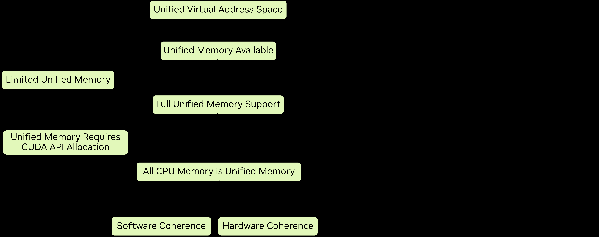

# 2.6 统一内存与系统内存

异构系统有多块物理内存可以存放数据。主机 CPU 有直连的 DRAM，系统中的每个 GPU 也有自己直连的 DRAM。当数据常驻在访问它的处理器的内存中时，性能最好。CUDA 提供了显式管理内存放置的 API，但这可能很冗长，还会让软件设计复杂化。CUDA 提供了一些特性和能力，旨在简化不同物理内存之间数据的分配、放置和迁移。

本章的目的是介绍和解释这些特性，以及它们对应用程序开发者的功能和性能意味着什么。统一内存有几种不同的表现形式，取决于操作系统、驱动版本和所用的 GPU。本章将展示如何判断适用哪种统一内存范式，以及在每种范式下统一内存的特性如何表现。关于统一内存的后续章节会对统一内存做更详细的解释。

本章将定义和解释以下概念：

- 统一虚拟地址空间（Unified Virtual Address Space）——CPU 内存和每个 GPU 的内存在一个虚拟地址空间中各自占据不同的区间
- 统一内存（Unified Memory）——一种 CUDA 特性，允许托管内存（managed memory）被 CPU 或 GPU 上运行的代码访问
  - 有限统一内存（Limited Unified Memory）——有一定限制的统一内存范式
  - 完整统一内存（Full Unified Memory）——对统一内存特性的完整支持
  - 带硬件一致性的完整统一内存（Full Unified Memory with Hardware Coherency）——利用硬件能力实现完整统一内存支持
  - 统一内存提示（Unified memory hints）——用于指导特定分配的统一内存行为的 API
- 页锁定主机内存（Page-locked Host Memory）——不可分页的系统内存，某些 CUDA 操作需要它
  - 映射内存（Mapped memory）——一种与统一内存不同的机制，用于直接从核函数访问主机内存

此外，讨论统一内存和系统内存时会用到以下术语，这里也一并介绍：

- 异构托管内存（Heterogeneous Managed Memory，HMM）——Linux 内核的一项特性，为完整统一内存提供软件一致性
- 地址转换服务（Address Translation Services，ATS）——一种硬件特性，当 GPU 通过 NVLink 芯对芯（C2C）互联与 CPU 相连时可用，为完整统一内存提供硬件一致性

## 2.6.1 统一虚拟地址空间

在一个操作系统进程内，所有主机内存和所有 GPU 上的所有全局内存共用一个虚拟地址空间。主机和所有设备上的所有内存分配都位于这个虚拟地址空间中。无论是用 CUDA API（如 `cudaMalloc`、`cudaMallocHost`）还是系统分配 API（如 `new`、`malloc`、`mmap`）分配的内存，都是如此。CPU 和每个 GPU 在统一虚拟地址空间中都有各自唯一的区间。

这意味着：

- 任何内存的位置（即它位于 CPU 还是哪块 GPU 的内存中）可以用 `cudaPointerGetAttributes()` 从指针的值推断出来；
- `cudaMemcpy*()` 的 `cudaMemcpyKind` 参数可以设为 `cudaMemcpyDefault`，从而根据指针自动确定拷贝类型。

## 2.6.2 统一内存

统一内存是一项 CUDA 内存特性，它允许称为托管内存（managed memory）的内存分配被 CPU 或 GPU 上运行的代码访问。在“C++ 中的 CUDA 入门”一节中介绍过统一内存。统一内存在 CUDA 支持的所有系统上都可用。

在某些系统上，托管内存必须显式分配。在 CUDA 中可以用几种不同的方式显式分配托管内存：

- CUDA API `cudaMallocManaged`
- CUDA API `cudaMallocFromPoolAsync`，配合 `allocType` 设为 `cudaMemAllocationTypeManaged` 创建的内存池
- 带 `__managed__` 修饰符的全局变量（见“内存空间修饰符”）

在有 HMM 或 ATS 的系统上，所有系统内存都是隐式的托管内存，无论以何种方式分配。无需特殊分配。

### 2.6.2.1 统一内存范式

统一内存的特性和行为在不同的操作系统、Linux 内核版本、GPU 硬件和 GPU–CPU 互联之间有所不同。可用的统一内存形式可以通过 `cudaDeviceGetAttribute` 查询几个属性来确定：

- `cudaDevAttrConcurrentManagedAccess`——完整统一内存支持为 1，有限支持为 0
- `cudaDevAttrPageableMemoryAccess`——为 1 表示所有系统内存都是完整支持的统一内存，为 0 表示只有显式分配为托管内存的内存才是完整支持的统一内存
- `cudaDevAttrPageableMemoryAccessUsesHostPageTables`——指示 CPU/GPU 一致性的机制：1 表示硬件实现，0 表示软件实现

图 21 直观展示了如何判断统一内存范式，其后附有一份实现相同逻辑的代码示例。

统一内存有四种工作范式：

- 对显式托管内存分配的完整支持
- 对所有分配的完整支持（软件一致性）
- 对所有分配的完整支持（硬件一致性）
- 有限统一内存支持

当完整支持可用时，它可以只要求显式分配，也可以让所有系统内存都隐式成为统一内存。当所有内存都隐式成为统一内存时，一致性机制可以是软件或硬件。Windows 和部分 Tegra 设备只有有限的统一内存支持。



（图 21：当前所有 GPU 都使用统一虚拟地址空间，且都提供统一内存。当 `cudaDevAttrConcurrentManagedAccess` 为 1 时，完整统一内存支持可用，否则只有有限支持。当完整支持可用时，如果 `cudaDevAttrPageableMemoryAccess` 也为 1，则所有系统内存都是统一内存；否则，只有用 CUDA API（如 `cudaMallocManaged`）分配的内存才是统一内存。当所有系统内存都是统一内存时，`cudaDevAttrPageableMemoryAccessUsesHostPageTables` 指示一致性由硬件（值为 1）还是软件（值为 0）提供。）

表 3 用表格形式展示了与图 21 相同的信息，并附有本章相关章节和本指南后续更完整文档的链接。

**表 3：统一内存范式概览**

| 统一内存范式 | 设备属性 | 完整文档 |
| --- | --- | --- |
| 有限统一内存支持 | `cudaDevAttrConcurrentManagedAccess` 为 0 | Unified Memory on Windows, WSL, and Tegra / CUDA for Tegra Memory Management / Unified memory on Tegra |
| 对显式托管内存分配的完整支持 | `cudaDevAttrPageableMemoryAccess` 为 0 且 `cudaDevAttrConcurrentManagedAccess` 为 1 | Unified Memory on Devices with only CUDA Managed Memory Support |
| 对所有分配的完整支持（软件一致性） | `cudaDevAttrPageableMemoryAccessUsesHostPageTables` 为 0 且 `cudaDevAttrPageableMemoryAccess` 为 1 且 `cudaDevAttrConcurrentManagedAccess` 为 1 | Unified Memory on Devices with Full CUDA Unified Memory Support |
| 对所有分配的完整支持（硬件一致性） | `cudaDevAttrPageableMemoryAccessUsesHostPageTables` 为 1 且 `cudaDevAttrPageableMemoryAccess` 为 1 且 `cudaDevAttrConcurrentManagedAccess` 为 1 | Unified Memory on Devices with Full CUDA Unified Memory Support |

#### 2.6.2.1.1 统一内存范式：代码示例

以下代码示例演示如何查询设备属性，并按图 21 的逻辑判断系统中每块 GPU 的统一内存范式。

```cuda
void queryDevices()
{
    int numDevices = 0;
    cudaGetDeviceCount(&numDevices);
    for(int i=0; i<numDevices; i++)
    {
        cudaSetDevice(i);
        cudaInitDevice(0, 0, 0);
        int deviceId = i;

        int concurrentManagedAccess = -1;
        cudaDeviceGetAttribute (&concurrentManagedAccess, cudaDevAttrConcurrentManagedAccess, deviceId);

        int pageableMemoryAccess = -1;
        cudaDeviceGetAttribute (&pageableMemoryAccess, cudaDevAttrPageableMemoryAccess, deviceId);

        int pageableMemoryAccessUsesHostPageTables = -1;
        cudaDeviceGetAttribute (&pageableMemoryAccessUsesHostPageTables, cudaDevAttrPageableMemoryAccessUsesHostPageTables, deviceId);

        printf("Device %d has ", deviceId);
        if(concurrentManagedAccess){
             if(pageableMemoryAccess){
                  printf("full unified memory support");
                  if( pageableMemoryAccessUsesHostPageTables)
                       { printf(" with hardware coherency\n"); }
                  else
                       { printf(" with software coherency\n"); }
             }
             else
                  { printf("full unified memory support for CUDA-made managed allocations\n"); }
        }
        else
        {    printf("limited unified memory support: Windows, WSL, or Tegra\n");  }
    }
}
```

### 2.6.2.2 完整统一内存特性支持

大多数 Linux 系统都支持完整统一内存。如果设备属性 `cudaDevAttrPageableMemoryAccess` 为 1，那么所有系统内存——无论用 CUDA API 还是系统 API 分配——都是完整特性支持的统一内存。这包括用 `mmap` 创建的基于文件的内存分配。

如果 `cudaDevAttrPageableMemoryAccess` 为 0，那么只有被 CUDA 分配为托管内存的内存才是统一内存。用系统 API 分配的内存不是托管内存，GPU 核函数不一定能访问。

一般来说，对完整支持的统一分配：

- 托管内存通常分配在首次访问（first touched）它的处理器的内存空间中
- 托管内存通常在被当前所在处理器之外的处理器使用时迁移
- 托管内存在内存页粒度（软件一致性）或缓存行粒度（硬件一致性）上迁移或被访问
- 允许超额认购（oversubscription）：应用程序分配的托管内存可以超过 GPU 上物理可用的内存

分配和迁移行为可能偏离上述情况。程序员可以使用提示（hints）和预取（prefetches）来影响这种行为。关于完整统一内存支持的完整内容见“具有完整 CUDA 统一内存支持的设备上的统一内存（Unified Memory on Devices with Full CUDA Unified Memory Support）”。

#### 2.6.2.2.1 带硬件一致性的完整统一内存

在 Grace Hopper 和 Grace Blackwell 等硬件上，CPU 是 NVIDIA 的 CPU，且 CPU 与 GPU 之间的互联为 NVLink 芯对芯（C2C），此时地址转换服务（ATS）可用。当 ATS 可用时，`cudaDevAttrPageableMemoryAccessUsesHostPageTables` 为 1。使用 ATS，除了对所有主机分配的完整统一内存支持外，还可以：

- 常驻在 GPU 上的托管分配（如 `cudaMallocManaged`）可以直接从 CPU 访问，无需迁移（`cudaDevAttrDirectManagedMemAccessFromHost` 将为 1）
- CPU 与 GPU 之间的链路支持原生原子操作（`cudaDevAttrHostNativeAtomicSupported` 将为 1）
- 硬件一致性相比软件一致性可以提高性能

ATS 具备 HMM 的所有能力。当 ATS 可用时，HMM 会自动禁用。硬件一致性与软件一致性的进一步讨论见“CPU 与 GPU 页表：硬件一致性与软件一致性（CPU and GPU Page Tables: Hardware Coherency vs. Software Coherency）”。

> **注意**
>
> 硬件一致性并不能使主机访问仅 GPU 可见的分配，例如用 `cudaMalloc` 分配的内存。

#### 2.6.2.2.2 HMM——带软件一致性的完整统一内存

异构内存管理（Heterogeneous Memory Management，HMM）是 Linux 操作系统的一项特性（需要适当的内核版本），它启用了带软件一致性的完整统一内存支持。异构内存管理为 PCIe 连接的 GPU 带来了一些 ATS 提供的能力与便利。

在 Linux 上，内核版本至少为 6.1.24、6.2.11 或 6.3 及更高版本时，异构内存管理（HMM）可能可用。可以用以下命令查看寻址模式是否为 HMM：

```bash
$ nvidia-smi -q | grep Addressing
Addressing Mode : HMM
```

当 HMM 可用时，支持完整统一内存，所有系统分配都是隐式的统一内存。如果系统同时有 ATS，HMM 会被禁用而使用 ATS，因为 ATS 具备 HMM 的所有能力，而且更多。

### 2.6.2.3 有限统一内存支持

在 Windows（包括 Windows Subsystem for Linux，WSL）和部分 Tegra 系统上，只有统一内存功能的一个有限子集可用。在这些系统上，托管内存可用，但 CPU 与 GPU 之间的迁移行为不同：

- 托管内存首先分配在 CPU 的物理内存中
- 托管内存以比虚拟内存页更大的粒度迁移
- GPU 开始执行时，托管内存迁移到 GPU
- GPU 活动期间 CPU 不得访问托管内存
- GPU 同步后，托管内存迁回 CPU
- 不允许 GPU 内存超额认购
- 只有 CUDA 显式分配为托管内存的内存才是统一内存

该范式的完整内容见“Windows、WSL 和 Tegra 上的统一内存（Unified Memory on Windows, WSL, and Tegra）”。

### 2.6.2.4 内存建议和预取

程序员可以向管理统一内存的 NVIDIA 驱动提供提示（hints），以帮助它最大化应用程序性能。CUDA API `cudaMemAdvise` 允许程序员指定分配的某些属性，这些属性会影响内存的放置位置，以及从其他设备访问时内存是否迁移。

`cudaMemPrefetchAsync` 允许程序员建议启动一个将特定分配异步迁移到不同位置的操作。常见用法是：在启动核函数之前，先开始传输核函数将要使用的数据。这样，数据的拷贝可以与其他 GPU 核函数的执行同时进行。

“性能提示（Performance Hints）”一节介绍了可以传给 `cudaMemAdvise` 的不同提示，并展示了使用 `cudaMemPrefetchAsync` 的示例。

## 2.6.3 页锁定主机内存

在入门代码示例中，`cudaMallocHost` 被用来在 CPU 上分配内存。它分配的是主机上的页锁定内存（也称为固定内存（pinned memory））。通过 `malloc`、`new` 或 `mmap` 等传统机制分配的主机内存不是页锁定的，这意味着它们可能被交换到磁盘，或被操作系统物理重定位。

CPU 与 GPU 之间的异步拷贝需要页锁定主机内存。页锁定主机内存也能提高同步拷贝的性能。页锁定内存可以映射到 GPU，供 GPU 核函数直接访问。

CUDA 运行时提供 API 来分配页锁定主机内存，或页锁定已有的分配：

- `cudaMallocHost` 分配页锁定主机内存
- `cudaHostAlloc` 默认行为与 `cudaMallocHost` 相同，但还接受标志来指定其他内存参数
- `cudaFreeHost` 释放用 `cudaMallocHost` 或 `cudaHostAlloc` 分配的内存
- `cudaHostRegister` 页锁定一段现有的、用 CUDA API 之外（如 `malloc` 或 `mmap`）分配的内存

`cudaHostRegister` 让第三方库分配的、或开发者无法控制的其他代码分配的主机内存也能被页锁定，从而可用于异步拷贝或映射。

> **注意**
>
> 系统中的所有 GPU 都可以用页锁定主机内存做异步拷贝和映射内存。
>
> 在非 I/O 一致（non I/O coherent）的 Tegra 设备上，页锁定主机内存不会被缓存。此外，在非 I/O 一致的 Tegra 设备上不支持 `cudaHostRegister()`。

### 2.6.3.1 映射内存

在有 HMM 或 ATS 的系统上，所有主机内存都可以用主机指针直接从 GPU 访问。当 ATS 或 HMM 不可用时，可以通过把内存映射到 GPU 的内存空间，使主机分配对 GPU 可访问。映射内存始终是页锁定的。

下面的代码示例将演示以下数组拷贝核函数直接操作映射的主机内存：

```cuda
__global__ void copyKernel(float* a, float* b)
{
        int idx = threadIdx.x + blockDim.x * blockIdx.x;
        a[idx] = b[idx];
}
```

虽然在某些场景下映射内存可能有用——某些数据不被拷贝到 GPU，但需要从核函数访问——但在核函数中访问映射内存需要经过 CPU–GPU 互联（PCIe 或 NVLink C2C）的事务。这些操作相比访问设备内存有更高的延迟和更低的带宽。对于核函数的大部分内存需求，映射内存不应被视为统一内存或显式内存管理的性能替代方案。

#### 2.6.3.1.1 cudaMallocHost 与 cudaHostAlloc

用 `cudaMallocHost` 或 `cudaHostAlloc` 分配的主机内存会自动映射。这些 API 返回的指针可以直接在核函数代码中使用，用以访问主机上的内存。主机内存通过 CPU–GPU 互联被访问。

cudaMallocHost

```cuda
void usingMallocHost() {
  float* a = nullptr;
  float* b = nullptr;

  CUDA_CHECK(cudaMallocHost(&a, vLen*sizeof(float)));
  CUDA_CHECK(cudaMallocHost(&b, vLen*sizeof(float)));

  initVector(b, vLen);
  memset(a, 0, vLen*sizeof(float));

  int threads = 256;
  int blocks = vLen/threads;
  copyKernel<<<blocks, threads>>>(a, b);
  CUDA_CHECK(cudaGetLastError());
  CUDA_CHECK(cudaDeviceSynchronize());

  printf("Using cudaMallocHost: ");
  checkAnswer(a,b);
}
```

cudaHostAlloc

```cuda
void usingCudaHostAlloc() {
  float* a = nullptr;
  float* b = nullptr;

  CUDA_CHECK(cudaHostAlloc(&a, vLen*sizeof(float), cudaHostAllocMapped));
  CUDA_CHECK(cudaHostAlloc(&b, vLen*sizeof(float), cudaHostAllocMapped));

  initVector(b, vLen);
  memset(a, 0, vLen*sizeof(float));

  int threads = 256;
  int blocks = vLen/threads;
  copyKernel<<<blocks, threads>>>(a, b);
  CUDA_CHECK(cudaGetLastError());
  CUDA_CHECK(cudaDeviceSynchronize());

  printf("Using cudaHostAlloc: ");
  checkAnswer(a, b);
}
```

#### 2.6.3.1.2 cudaHostRegister

当 ATS 和 HMM 不可用时，系统分配器分配的内存仍然可以用 `cudaHostRegister` 映射，以供 GPU 核函数直接访问。但与用 CUDA API 创建的内存不同，该内存不能用主机指针从核函数访问。必须用 `cudaHostGetDevicePointer()` 获得设备内存区域中的指针，核函数代码中必须使用该指针进行访问。

```cuda
void usingRegister() {
  float* a = nullptr;
  float* b = nullptr;
  float* devA = nullptr;
  float* devB = nullptr;

  a = (float*)malloc(vLen*sizeof(float));
  b = (float*)malloc(vLen*sizeof(float));
  CUDA_CHECK(cudaHostRegister(a, vLen*sizeof(float), 0 ));
  CUDA_CHECK(cudaHostRegister(b, vLen*sizeof(float), 0 ));

  CUDA_CHECK(cudaHostGetDevicePointer((void**)&devA, (void*)a, 0));
  CUDA_CHECK(cudaHostGetDevicePointer((void**)&devB, (void*)b, 0));

  initVector(b, vLen);
  memset(a, 0, vLen*sizeof(float));

  int threads = 256;
  int blocks = vLen/threads;
  copyKernel<<<blocks, threads>>>(devA, devB);
  CUDA_CHECK(cudaGetLastError());
  CUDA_CHECK(cudaDeviceSynchronize());

  printf("Using cudaHostRegister: ");
  checkAnswer(a, b);
}
```

#### 2.6.3.1.3 统一内存与映射内存的比较

映射内存使 CPU 内存能从 GPU 访问，但不保证所有访问类型（例如原子操作）在所有系统上都受支持。统一内存保证支持所有访问类型。

映射内存仍在 CPU 内存中，这意味着 GPU 的所有访问都必须经过 CPU 与 GPU 之间的连接：PCIe 或 NVLink。跨这些链路的访问延迟显著高于访问 GPU 内存，总带宽也更低。因此，用映射内存承担核函数的所有内存访问，不太可能充分利用 GPU 的计算资源。

统一内存最常被迁移到访问它的处理器的物理内存中。首次迁移后，核函数对同一内存页或缓存行的重复访问可以利用完整的 GPU 内存带宽。

> **注意**
>
> 映射内存在以前的文档中也被称为零拷贝内存（zero-copy memory）。
>
> 在所有 CUDA 应用程序使用统一虚拟地址空间之前，需要额外的 API 来启用内存映射（带 `cudaDeviceMapHost` 的 `cudaSetDeviceFlags`）。这些 API 不再需要。
>
> 在映射的主机内存上操作的原子函数（见“原子函数（Atomic Functions）”）从主机或其他 GPU 的角度看不是原子的。
>
> CUDA 运行时要求：从设备发起的对主机内存的 1 字节、2 字节、4 字节、8 字节和 16 字节自然对齐的加载和存储，必须从主机和其他设备的角度看被保留为单次访问。在某些平台上，硬件可能把对内存的原子操作拆成单独的加载和存储操作。这些组成加载和存储操作对自然对齐访问的保留有同样的要求。CUDA 运行时不支持这样的 PCI Express 总线拓扑：PCI Express 桥把 8 字节自然对齐的操作拆开；NVIDIA 也未发现会拆开 16 字节自然对齐操作的拓扑。

## 2.6.4 小结

- 在带异构内存管理（HMM）或地址转换服务（ATS）的 Linux 平台上，所有系统分配的内存都是托管内存
- 在没有 HMM 或 ATS 的 Linux 平台、Tegra 处理器和所有 Windows 平台上，托管内存必须用 CUDA 分配：
  - `cudaMallocManaged`，或
  - `cudaMallocFromPoolAsync`（配合 `allocType=cudaMemAllocationTypeManaged` 创建的内存池）
  - 带 `__managed__` 修饰符的全局变量
- 在 Windows 和 Tegra 处理器上，统一内存有限制
- 在带 ATS 的 NVLink C2C 互联系统上，用 `cudaMallocManaged` 分配的设备内存可以直接从 CPU 或其他 GPU 访问
