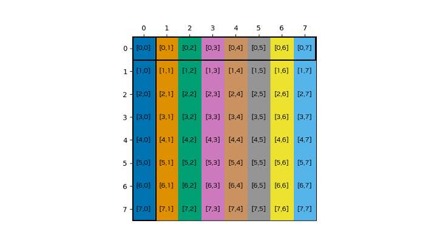
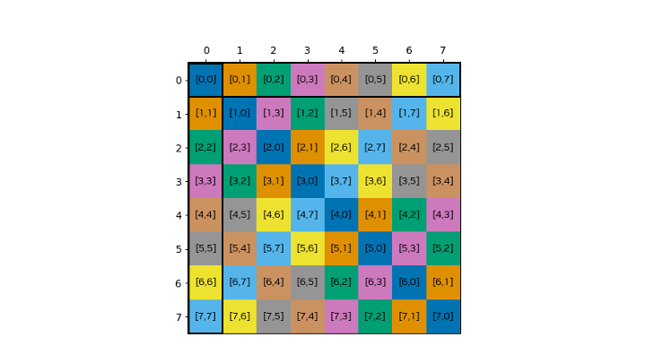
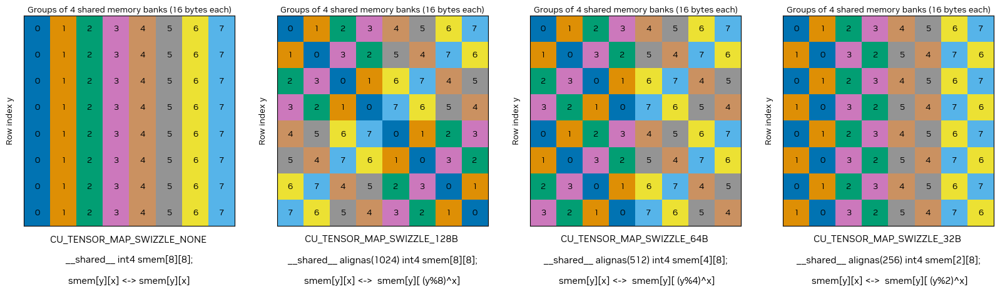

# 4.12 异步数据拷贝

在 3.2.5 节的基础上，本节提供 GPU 内存层级内异步数据传输的详细指南和示例。它涵盖用于逐元素拷贝的 LDGSTS、用于大块（一维和多维）传输的张量内存加速器（Tensor Memory Accelerator，TMA），以及用于寄存器到分布式共享内存拷贝的 STAS，并展示这些机制如何与异步屏障（asynchronous barriers）和流水线（pipelines）集成。

## 4.12.1 使用 LDGSTS

许多 CUDA 应用需要在全局内存和共享内存之间频繁传输数据。通常，这涉及拷贝较小的数据元素或执行不规则的内存访问模式。LDGSTS（计算能力 8.0 及以上，参见 PTX 文档）的主要目标是为从全局内存到共享内存的较小、逐元素的数据传输提供高效的异步数据传输机制，同时通过重叠执行更好地利用计算资源。

维度。LDGSTS 支持拷贝 4、8 或 16 字节。拷贝 4 或 8 字节时始终使用所谓的 L1 ACCESS 模式，此时数据也会缓存在 L1 中；而拷贝 16 字节时启用 L1 BYPASS 模式，此时不会污染 L1。

源和目标。LDGSTS 的异步拷贝操作支持的唯一方向是从全局内存到共享内存。指针需要按 4、8 或 16 字节对齐，具体取决于所拷贝数据的大小。当共享内存和全局内存的对齐均为 128 字节时，可获得最佳性能。

异步性。使用 LDGSTS 的数据传输是异步的，被建模为异步线程操作（参见 Async Thread 和 Async Proxy）。这允许发起线程在硬件异步拷贝数据的同时继续计算。实际中数据传输是否异步进行取决于硬件实现，未来可能发生变化。

LDGSTS 必须在操作完成时提供信号。LDGSTS 可以使用共享内存屏障或流水线作为提供完成信号的机制。默认情况下，每个线程只等待自己的 LDGSTS 拷贝。因此，如果你使用 LDGSTS 预取将与其他线程共享的数据，则在与 LDGSTS 完成机制同步之后还需要一个 `__syncthreads()`。

表 18：使用 LDGSTS 的异步拷贝，含可能的源和目标内存空间及完成机制。空单元格表示不支持该源-目标对。

| 方向 |  | 异步拷贝（LDGSTS，计算能力 8.0+） |  |
|---|---|---|---|
| 源 | 目标 | 完成机制 | API |
| global | global |  |  |
| shared::cta | global |  |  |
| global | shared::cta | 共享内存屏障、流水线 | `cuda::memcpy_async`、`cooperative_groups::memcpy_async`、`__pipeline_memcpy_async` |
| global | shared::cluster |  |  |
| shared::cluster | shared::cta |  |  |
| shared::cta | shared::cta |  |  |

下面几节将通过示例演示 LDGSTS 的使用，并解释不同 API 之间的差异。

### 4.12.1.1 条件代码中的批量加载

在这个模板（stencil）示例中，线程块的第一个线程束负责从中心以及左右两侧的光晕（halo）区域协同加载所有需要的数据。使用同步拷贝时，由于代码的条件性质，编译器可能会选择生成一连串"从全局加载（LDG）-存入共享（STS）"指令序列，而不是先发 3 次 LDG 再发 3 次 STS 的最优方式——后者才是隐藏全局内存延迟的最优加载方式。

```cpp
__global__ void stencil_kernel(const float *left, const float *center, float *right)
{
    // 左光晕（8 个元素）- 中心（32 个元素）- 右光晕（8 个元素）
    __shared__ float buffer[8 + 32 + 8];
    const int tid = threadIdx.x;

    if (tid < 8) {
        buffer[tid] = left[tid]; // 左光晕
    } else if (tid >= 32 - 8) {
        buffer[tid + 16] = right[tid]; // 右光晕
    }
    if (tid < 32) {
      buffer[tid + 8] = center[tid]; // 中心
    }
    __syncthreads();

    // 计算模板
}
```

为了确保数据以最优方式加载，我们可以用直接从全局内存向共享内存加载数据的异步拷贝替换同步内存拷贝。这不仅减少了直接拷贝数据到共享内存带来的寄存器使用，还能确保所有从全局内存的加载都处于在途状态。

CUDA C++ `cuda::memcpy_async` 示例：

```cpp
#include <cooperative_groups.h>
#include <cuda/barrier>

__global__ void stencil_kernel(const float *left, const float *center, float *right)
{
    auto block = cooperative_groups::this_thread_block();
    auto thread = cooperative_groups::this_thread();
    using barrier_t = cuda::barrier<cuda::thread_scope_block>;
    __shared__ barrier_t barrier;
    __shared__ float buffer[8 + 32 + 8];

    // 初始化同步对象。
    if (block.thread_rank() == 0) {
        init(&barrier, block.size());
    }
    __syncthreads();

    // 版本 1：在各个线程中发起拷贝。
    if (tid < 8) {
        cuda::memcpy_async(buffer + tid, left + tid, cuda::aligned_size_t<4>(sizeof(float)), barrier); // 左光晕

        // 或 cuda::memcpy_async(thread, buffer + tid, left + tid, cuda::aligned_size_t<4>(sizeof(float)), barrier);
    } else if (tid >= 32 - 8) {
        cuda::memcpy_async(buffer + tid + 16, right + tid, cuda::aligned_size_t<4>(sizeof(float)), barrier); // 右光晕

        // 或 cuda::memcpy_async(thread, buffer + tid + 16, right + tid, cuda::aligned_size_t<4>(sizeof(float)), barrier);
    }
    if (tid < 32) {
        cuda::memcpy_async(buffer + tid + 8, center + tid, cuda::aligned_size_t<4>(sizeof(float)), barrier); // 中心

        // 或 cuda::memcpy_async(thread, buffer + tid + 8, center + tid, cuda::aligned_size_t<4>(sizeof(float)), barrier);
    }

    // 版本 2：在所有线程间协作发起拷贝。
    cuda::memcpy_async(block, buffer, left, cuda::aligned_size_t<4>(8 * sizeof(float)), barrier); // 左光晕
    cuda::memcpy_async(block, buffer + 8, center, cuda::aligned_size_t<4>(32 * sizeof(float)), barrier); // 中心
    cuda::memcpy_async(block, buffer + 40, right, cuda::aligned_size_t<4>(8 * sizeof(float)), barrier); // 右光晕

    // 等待所有拷贝完成。
    barrier.arrive_and_wait();
    __syncthreads();

    // 计算模板
}
```

CUDA C++ `cooperative_groups::memcpy_async` 示例：

```cpp
#include <cooperative_groups.h>
#include <cooperative_groups/memcpy_async.h>

namespace cg = cooperative_groups;

__global__ void stencil_kernel(const float *left, const float *center, float *right)
{
    cg::thread_block block = cg::this_thread_block();
    // 左光晕（8 个元素）- 中心（32 个元素）- 右光晕（8 个元素）。
    __shared__ float buffer[8 + 32 + 8];

    // 在所有线程间协作发起拷贝。
    cg::memcpy_async(block, buffer, left, 8 * sizeof(float)); // 左光晕
    cg::memcpy_async(block, buffer + 8, center, 32 * sizeof(float)); // 中心
    cg::memcpy_async(block, buffer + 40, right, 8 * sizeof(float)); // 右光晕

    cg::wait(block); // 等待所有拷贝完成。
    __syncthreads();

    // 计算模板。
}
```

CUDA C 原语示例：

```cpp
#include <cuda_pipeline.h>

__global__ void stencil_kernel(const float *left, const float *center, float *right)
{
    // 左光晕（8 个元素）- 中心（32 个元素）- 右光晕（8 个元素）。
    __shared__ float buffer[8 + 32 + 8];
    const int tid = threadIdx.x;

    if (tid < 8) {
        __pipeline_memcpy_async(buffer + tid, left + tid, sizeof(float)); // 左光晕
    } else if (tid >= 32 - 8) {
        __pipeline_memcpy_async(buffer + tid + 16, right + tid, sizeof(float)); // 右光晕
    }
    if (tid < 32) {
        __pipeline_memcpy_async(buffer + tid + 8, center + tid, sizeof(float)); // 中心
    }
    __pipeline_commit();
    __pipeline_wait_prior(0);
    __syncthreads();

    // 计算模板。
}
```

`cuda::memcpy_async` 的 `cuda::barrier` 重载版本支持使用异步屏障来同步异步数据传输。该重载把拷贝操作当作由绑定到该屏障的另一个线程执行：创建时递增当前阶段的期望计数，拷贝操作完成时递减它，使得屏障的阶段只有在参与屏障的所有线程都已到达、且绑定到屏障当前阶段的所有 memcpy_async 都已完成时才会推进。这里我们使用块级屏障，块中所有线程都参与，并用 `arrive_and_wait` 合并屏障上的到达与等待，因为我们在各阶段之间不做任何工作。

注意，我们既可以使用线程级拷贝（版本 1），也可以使用协作拷贝（版本 2）来达到相同的结果。在版本 2 中，API 会在底层自动处理拷贝如何进行。在两个版本中，我们都用 `cuda::aligned_size_t<4>()` 告知编译器数据按 4 字节对齐、且拷贝数据的大小是 4 的倍数，从而启用 LDGSTS。注意，为了与 `cuda::barrier` 互操作，这里使用的是 `cuda/barrier` 头文件中的 `cuda::memcpy_async`。

`cooperative_groups::memcpy_async` 实现在块中所有线程之间协作协调内存传输，但用 `cg::wait(block)` 而不是显式的屏障操作来同步完成。

基于底层原语的实现使用 `__pipeline_memcpy_async()` 发起逐元素内存传输，用 `__pipeline_commit()` 提交这批拷贝，用 `__pipeline_wait_prior(0)` 等待流水线中的所有操作完成。相比高层 API，这提供了最直接的控制，代价是代码更冗长。它还能确保底层使用 LDGSTS，而高层 API 不保证这一点。

> 注
>

### 4.12.1.2 预取数据

在这个例子中，我们将演示如何使用异步数据拷贝将数据从全局内存预取到共享内存。在"迭代式拷贝与计算"模式下，这可以用当前迭代的计算隐藏未来迭代数据传输的延迟，从而可能提高在途字节数。

CUDA C++ `cuda::memcpy_async` 示例：

```cpp
#include <cooperative_groups.h>
#include <cuda/pipeline>

template <size_t num_stages = 2 /* 具有 num_stages 个阶段的流水线 */>
__global__ void prefetch_kernel(int* global_out, int const* global_in, size_t size, size_t batch_size) {

    auto grid = cooperative_groups::this_grid();
    auto block = cooperative_groups::this_thread_block();
    auto thread = cooperative_groups::this_thread();
    assert(size == batch_size * grid.size()); // 假设输入大小为 batch_size * grid_size

    extern __shared__ int shared[]; // num_stages * block.size() * sizeof(int) 字节
    size_t shared_offset[num_stages];
    for (int s = 0; s < num_stages; ++s) shared_offset[s] = s * block.size();

    cuda::pipeline<cuda::thread_scope_thread> pipeline = cuda::make_pipeline();

    auto block_batch = [&](size_t batch) -> int {
        return block.group_index().x * block.size() + grid.size() * batch;
    };

    // 用前 num_stages 个批次填充流水线。
    for (int s = 0; s < num_stages; ++s) {
        pipeline.producer_acquire();
        cuda::memcpy_async(shared + shared_offset[s] + tid, global_in + block_batch(s) + tid, cuda::aligned_size_t<4>(sizeof(int)), pipeline);
        pipeline.producer_commit();
    }

    int stage = 0;

    // compute_batch：下一个要处理的批次
    // fetch_batch：下一个要从全局内存获取的批次
    for (size_t compute_batch = 0, fetch_batch = num_stages; compute_batch < batch_size; ++compute_batch, ++fetch_batch) {

        // 等待第一个请求的阶段完成。
        constexpr size_t pending_batches = num_stages - 1;
        cuda::pipeline_consumer_wait_prior<pending_batches>(pipeline);
        __syncthreads(); // 如果每个线程只处理自己拷贝的数据，则不需要。

        // 对当前批次进行计算
        compute(global_out + block_batch(compute_batch) + tid, shared + shared_offset[stage] + tid);

        // 释放当前阶段。
        pipeline.consumer_release();
        __syncthreads(); // 如果每个线程只处理自己拷贝的数据，则不需要。

        // 提前 num_stages 个阶段加载未来的阶段。
        if (fetch_batch < batch_size) {
            pipeline.producer_acquire();
            cuda::memcpy_async(shared + shared_offset[stage] + tid, global_in + block_batch(fetch_batch) + tid, cuda::aligned_size_t<4>(sizeof(int)), pipeline);
        }
        pipeline.producer_commit();
        stage = (stage + 1) % num_stages;
    }
}
```

CUDA C++ `cooperative_groups::memcpy_async` 示例：

```cpp
#include <cooperative_groups.h>
#include <cooperative_groups/memcpy_async.h>

namespace cg = cooperative_groups;

template <size_t num_stages = 2 /* 具有 num_stages 个阶段的流水线 */>
__global__ void prefetch_kernel(int* global_out, int const* global_in, size_t size, size_t batch_size) {

    auto grid = cooperative_groups::this_grid();
    auto block = cooperative_groups::this_thread_block();
    assert(size == batch_size * grid.size()); // 假设输入大小为 batch_size * grid_size

    extern __shared__ int shared[]; // num_stages * block.size() * sizeof(int) 字节
    size_t shared_offset[num_stages];
    for (int s = 0; s < num_stages; ++s) shared_offset[s] = s * block.size();

    cuda::pipeline<cuda::thread_scope_thread> pipeline = cuda::make_pipeline();

    auto block_batch = [&](size_t batch) -> int {
        return block.group_index().x * block.size() + grid.size() * batch;
    };

    // 用前 num_stages 个批次填充流水线。
    for (int s = 0; s < num_stages; ++s) {
        size_t block_batch_idx = block_batch(s);
        cg::memcpy_async(block, shared + shared_offset[s], global_in + block_batch_idx, cuda::aligned_size_t<4>(sizeof(int)));
    }

    int stage = 0;

    // compute_batch：下一个要处理的批次
    // fetch_batch：下一个要从全局内存获取的批次
    for (size_t compute_batch = 0, fetch_batch = num_stages; compute_batch < batch_size; ++compute_batch, ++fetch_batch) {

        // 等待第一个请求的阶段完成。
        size_t pending_batches = (fetch_batch < batch_size - num_stages) ? num_stages - 1 : batch_size - fetch_batch - 1;
        cg::wait_prior(pending_batches);
        __syncthreads(); // 如果每个线程只处理自己拷贝的数据，则不需要。

        // 对当前批次进行计算。
        compute(global_out + block_batch(compute_batch) + tid, shared + shared_offset[stage] + tid);

        __syncthreads(); // 如果每个线程只处理自己拷贝的数据，则不需要。

        // 提前 num_stages 个阶段加载未来的阶段。
        size_t fetch_batch_idx = block_batch(fetch_batch);
        if (fetch_batch < batch_size) {
            cg::memcpy_async(block, shared + shared_offset[stage], global_in + fetch_batch_idx, cuda::aligned_size_t<4>(sizeof(int)));
        }
        stage = (stage + 1) % num_stages;
    }
}
```

CUDA C 原语示例：

```cpp
#include <cooperative_groups.h>
#include <cuda_awbarrier_primitives.h>

template <size_t num_stages = 2 /* 具有 num_stages 个阶段的流水线 */>
__global__ void prefetch_kernel(int* global_out, int const* global_in, size_t size, size_t batch_size) {

    auto grid = cooperative_groups::this_grid();
    auto block = cooperative_groups::this_thread_block();
    assert(size == batch_size * grid.size()); // 假设输入大小为 batch_size * grid_size

    extern __shared__ int shared[]; // num_stages * block.size() * sizeof(int) 字节
    size_t shared_offset[num_stages];
    for (int s = 0; s < num_stages; ++s) shared_offset[s] = s * block.size();

    auto block_batch = [&](size_t batch) -> int {
        return block.group_index().x * block.size() + grid.size() * batch;
    };

    // 用前 num_stages 个批次填充流水线。
    for (int s = 0; s < num_stages; ++s) {
        __pipeline_memcpy_async(shared + shared_offset[s] + tid, global_in + block_batch(s) + tid, cuda::aligned_size_t<4>(sizeof(int)));
        __pipeline_commit();
    }

    // compute_batch：下一个要处理的批次
    // fetch_batch：下一个要从全局内存获取的批次
    for (size_t compute_batch = 0, fetch_batch = num_stages; compute_batch < batch_size; ++compute_batch, ++fetch_batch) {

        // 等待第一个请求的阶段完成。
        constexpr size_t pending_batches = num_stages - 1;
        __pipeline_wait_prior<pending_batches>();
        __syncthreads(); // 如果每个线程只处理自己拷贝的数据，则不需要。

        // 对当前批次进行计算。
        compute(global_out + block_batch(compute_batch) + tid, shared + shared_offset[stage] + tid);

        __syncthreads(); // 如果每个线程只处理自己拷贝的数据，则不需要。

        // 提前 num_stages 个阶段加载未来的阶段。
        if (fetch_batch < batch_size) {
            __pipeline_memcpy_async(shared + shared_offset[stage] + tid, global_in + block_batch(fetch_batch) + tid, cuda::aligned_size_t<4>(sizeof(int)));
        }
        __pipeline_commit();
        stage = (stage + 1) % num_stages;
    }
}
```

`cuda::memcpy_async` 实现演示了使用 `cuda::pipeline`（参见流水线）和 `cuda::memcpy_async` 的多阶段数据预取。它：

- 初始化一个线程局部的流水线。
- 通过调度 num_stages 个 memcpy_async 操作来启动流水线。
- 遍历所有批次：在当前批次完成时阻塞所有线程，然后对当前批次执行计算，最后在还有待拷贝的批次时调度下一个 memcpy_async。

`cooperative_groups::memcpy_async` 实现演示了使用 `cooperative_groups::memcpy_async` 的多阶段数据预取。与前一个实现的主要区别是，我们不使用流水线对象，而是依靠 `cooperative_groups::memcpy_async` 在底层按阶段调度内存传输。

基于 CUDA C 原语的实现以与第一个实现相当相似的方式，使用底层原语演示多阶段数据预取。

本示例中实现高效代码生成的一个重要细节是，即使没有更多批次要获取，也要在流水线中保持 num_stages 个批次。这通过在没有更多批次要获取时仍然向流水线提交（`pipeline.producer_commit()` 或 `__pipeline_commit()`）来实现。注意，cooperative groups API 做不到这一点，因为我们无法访问其内部流水线。

### 4.12.1.3 通过线程束特化的生产者-消费者模式

在这个例子中，我们将演示如何实现一种生产者-消费者模式：单个线程束被特化为生产者，执行从全局内存到共享内存的异步数据拷贝，其余线程束从共享内存消费数据并执行计算。为了让生产者和消费者线程能够并发，我们在共享内存中使用双缓冲。当消费者线程束处理一个缓冲区中的数据时，生产者线程束异步地把下一批数据取到另一个缓冲区中。

CUDA C++ `cuda::memcpy_async` 示例：

```cpp
#include <cooperative_groups.h>
#include <cuda/pipeline>

#pragma nv_diag_suppress static_var_with_dynamic_init

using pipeline = cuda::pipeline<cuda::thread_scope_block>;

__device__ void produce(pipeline &pipe, int num_stages, int stage, int num_batches, int batch, float *buffer, int buffer_len, float *in, int N)
{
   if (batch < num_batches)
   {
     pipe.producer_acquire();
     /* 使用异步内存拷贝将数据从 in(batch) 拷贝到 buffer(stage) */

     cuda::memcpy_async(buffer + stage * buffer_len + threadIdx.x, in + batch * buffer_len + threadIdx.x, cuda::aligned_size_t<4>(sizeof(float)), pipe);

     pipe.producer_commit();
   }
}

__device__ void consume(pipeline &pipe, int num_stages, int stage, int num_batches, int batch, float *buffer, int buffer_len, float *out, int N)
{
   pipe.consumer_wait();
   /* 消费 buffer(stage) 并更新 out(batch) */
   pipe.consumer_release();
}

__global__ void producer_consumer_pattern(float *in, float *out, int N, int buffer_len)
{
   auto block = cooperative_groups::this_thread_block();
   constexpr int warpSize = 32;

   /* 下面声明的共享内存缓冲区大小为 2 * buffer_len，
      以便在两个缓冲区之间交替工作。
      buffer_0 = buffer，buffer_1 = buffer + buffer_len */
   __shared__ extern float buffer[];

   const int num_batches = N / buffer_len;

   // 创建一个 2 阶段的分区流水线，其中第一个线程束是生产者，其他线程束是消费者。
   constexpr auto scope = cuda::thread_scope_block;
   constexpr int num_stages = 2;
   cuda::std::size_t producer_count = warpSize;
   __shared__ cuda::pipeline_shared_state<scope, num_stages> shared_state;
   pipeline pipe = cuda::make_pipeline(block, &shared_state, producer_count);

   // 生产者填充流水线
   if (block.thread_rank() < producer_count)
      for (int s = 0; s < num_stages; ++s)
         produce(pipe, num_stages, s, num_batches, s, buffer, buffer_len, in, N);

   // 注：原文 PDF 提取中此示例主处理循环部分截断，以下代码仅为提取到的部分。
}
```

CUDA C 原语示例：

```cpp
#include <cooperative_groups.h>
#include <cuda_awbarrier_primitives.h>

__device__ void produce(__mbarrier_t ready[], __mbarrier_t filled[], float *buffer, int buffer_len, float *in, int N)
{
   for (int i = 0; i < N / buffer_len; ++i)
   {
     __mbarrier_token_t token = __mbarrier_arrive(&ready[i % 2]); /* 等待 buffer_(i%2) 准备好被填充 */

     while(!__mbarrier_try_wait(&ready[i % 2], token, 1000)) {}
     /* 生产，即填充 buffer_(i%2) */
     __pipeline_memcpy_async(buffer + i * buffer_len + threadIdx.x, in + i * buffer_len + threadIdx.x, cuda::aligned_size_t<4>(sizeof(float)));

     __pipeline_arrive_on(filled[i % 2]);
     __mbarrier_arrive(filled[i % 2]); /* buffer_(i%2) 已填充完毕 */
   }
}

__device__ void consume(__mbarrier_t ready[], __mbarrier_t filled[], float *buffer, int buffer_len, float *out, int N)
{
   __mbarrier_arrive(&ready[0]); /* buffer_0 已准备好初始填充 */
   __mbarrier_arrive(&ready[1]); /* buffer_1 已准备好初始填充 */
   for (int i = 0; i < N / buffer_len; ++i)
   {
     __mbarrier_token_t token = __mbarrier_arrive(&filled[i % 2]);
     while(!__mbarrier_try_wait(&filled[i % 2], token, 1000)) {}
     /* 消费 buffer_(i%2) */
     __mbarrier_arrive(&ready[i % 2]); /* buffer_(i%2) 已准备好重新填充 */
   }
}

__global__ void producer_consumer_pattern(int N, float *in, float *out, int buffer_len)
{
   /* 下面声明的共享内存缓冲区大小为 2 * buffer_len，
      以便在两个缓冲区之间交替工作。
      buffer_0 = buffer，buffer_1 = buffer + buffer_len */
   __shared__ extern float buffer[];

   /* bar[0] 和 bar[1] 跟踪 buffer_0 和 buffer_1 是否已准备好被填充，
      而 bar[2] 和 bar[3] 分别跟踪 buffer_0 和 buffer_1 是否已填充完毕 */

   __shared__ __mbarrier_t bar[4];

   // 初始化屏障
   auto block = cooperative_groups::this_thread_block();
   if (block.thread_rank() < 4)
      __mbarrier_init(bar + block.thread_rank(), block.size());
   __syncthreads();
}
```

`cuda::memcpy_async` 实现演示了最高抽象层级的 API，配合 `cuda::memcpy_async` 和一个 2 阶段的 `cuda::pipeline`。它使用分区流水线（参见流水线），其中第一个线程束作为生产者，其余线程束作为消费者。生产者最初填满流水线的两个阶段。然后，在主处理循环中，当消费者处理当前批次时，生产者为未来批次获取数据，保持稳定的工作流。

基于 CUDA C 原语的实现将 `__pipeline_memcpy_async()` 与共享内存屏障作为完成机制结合起来，以协调异步内存传输。`__pipeline_arrive_on()` 函数将内存拷贝与屏障关联起来。它将屏障到达计数加一，当所有排在它之前的异步操作完成时，到达计数会自动减一，因此对到达计数的净影响为零。正因如此，我们还需要用 `__mbarrier_arrive()` 显式地到达屏障。

## 4.12.2 使用张量内存加速器（Tensor Memory Accelerator，TMA）

许多应用需要向全局内存移入/移出大量数据。数据在全局内存中通常以多维数组的形式布局，访问模式不连续。为了减少全局内存访问，这类数组的子块在参与计算前会被拷贝到共享内存中。加载和存储涉及的地址计算既容易出错又重复。为了卸载这些计算，计算能力 9.0（Hopper）及更高版本（参见 PTX 文档）配备了张量内存加速器（TMA）。TMA 的主要目标是为多维数组提供从全局内存到共享内存的高效数据传输机制。

命名。张量内存加速器（TMA）是一个广义术语，指代本节描述的特性。为了前向兼容并减少与 PTX ISA 的表述差异，本节中的文本根据所用拷贝的具体类型，把 TMA 操作称为大块异步拷贝（bulk-asynchronous copies）或大块张量异步拷贝（bulk-tensor asynchronous copies）。"大块（bulk）"一词用于与上一节描述的异步内存操作形成对比。

维度。TMA 支持拷贝一维和多维数组（最多 5 维）。一维连续数组的大块异步拷贝的编程模型，与多维数组的大块张量异步拷贝的编程模型不同。要对多维数组执行大块张量异步拷贝，硬件需要一张张量映射（tensor map）。该对象描述多维数组在全局内存和共享内存中的布局。张量映射通常在主机端使用 cuTensorMapEncode API 创建，然后作为带 `__grid_constant__` 注解的 const 核函数参数从主机端传输到设备端（参见 `__grid_constant__` 参数）。张量映射以带 `__grid_constant__` 注解的 const 核函数参数形式从主机端传输到设备端，可用于在设备端在共享内存与全局内存之间拷贝一块数据。相比之下，对连续一维数组执行大块异步拷贝不需要张量映射：只需指针和大小参数即可在设备端执行。

源和目标。TMA 操作的源地址和目标地址可以位于共享内存或全局内存中。操作可以从全局内存读取数据到共享内存，从共享内存写入数据到全局内存，也可以从共享内存拷贝到同一簇（cluster）中另一个块的分布式共享内存。此外，当处于簇中时，大块异步张量操作可以指定为组播（multicast）。此时，数据可以从全局内存传输到簇内多个块的共享内存中。组播特性针对当前设备的全局内存访问进行了优化——即不针对通过 NVLink 访问对端设备——以及 PTX 组播目标 ISA 说明中记载的某些数据中心 GPU 目标架构，在其他目标上性能可能显著降低。因此，建议仅将其用于本地 GPU 的全局内存访问，且仅在 PTX 组播目标 ISA 说明中推荐的计算能力的 GPU 上使用。

异步性。使用 TMA 的数据传输是异步的，被建模为异步代理操作（参见 Async Thread 和 Async Proxy）。这允许发起线程在硬件异步拷贝数据的同时继续计算。实际中数据传输是否异步进行取决于硬件实现，未来可能发生变化。大块异步操作可以使用多种完成机制来发出完成信号。当操作从全局内存读取到共享内存时，块中任何线程都可以通过等待共享内存屏障来等待数据在共享内存中可读。当大块异步操作从共享内存写入全局内存或分布式共享内存时，只有发起线程可以等待该操作完成。这通过基于大块异步组的完成机制实现。描述完成机制的表格见下文以及 PTX ISA 文档。

表 19：使用 TMA 的异步拷贝，含可能的源和目标内存空间及完成机制。空单元格表示不支持该源-目标对。

| 方向 |  | 异步拷贝（TMA，计算能力 9.0+） |
|---|---|---|
| 源 | 目标 | 完成机制 |
| global | global |  |
| shared::cta | global | 大块异步组 |
| global | shared::cta | 共享内存屏障 |
| global | shared::cluster | 共享内存屏障（组播） |
| shared::cta | shared::cluster | 共享内存屏障 |
| shared::cta | shared::cta |  |

### 4.12.2.1 使用 TMA 传输一维数组

下表总结了大块异步 TMA 可能的源和目标内存空间及完成机制，以及暴露该功能的 API。

表 20：使用大块异步 TMA 的异步拷贝，含可能的源和目标内存空间及完成机制。空单元格表示不支持该源-目标对。

| 方向 |  | 大块异步拷贝（TMA，计算能力 9.0+） |  |
|---|---|---|---|
| 源 | 目标 | 完成机制 | API |
| global | global |  |  |
| shared::cta | global | 大块异步组 | `cuda::ptx::cp_async_bulk` |
| global | shared::cta | 共享内存屏障 | `cuda::memcpy_async`、`cuda::device::memcpy_async_tx`、`cuda::ptx::cp_async_bulk` |
| global | shared::cluster | 共享内存屏障 | `cuda::ptx::cp_async_bulk` |
| shared::cta | shared::cluster | 共享内存屏障 | `cuda::ptx::cp_async_bulk` |
| shared::cta | shared::cta |  |  |

部分功能需要内联 PTX，目前通过 CUDA 标准 C++ 库中的 `cuda::ptx` 命名空间提供。这些封装的可用性可以用以下代码检查：

```cpp
#if defined(__CUDA_MINIMUM_ARCH__) && __CUDA_MINIMUM_ARCH__ < 900
static_assert(false, "Device code is being compiled with older architectures that are incompatible with TMA.");
#endif // __CUDA_MINIMUM_ARCH__
```

注意，如果源地址和目标地址都是 16 字节对齐且大小是 16 字节的倍数，`cuda::memcpy_async` 会使用 TMA，否则回退到同步拷贝。而 `cuda::device::memcpy_async_tx` 和 `cuda::ptx::cp_async_bulk` 始终使用 TMA，如果不满足要求会导致未定义行为。

下面，我们通过一个示例演示如何使用大块异步拷贝。该示例对一维数组进行"读-修改-写"。核函数执行以下步骤：

1. 初始化共享内存屏障，作为从全局内存到共享内存的大块异步拷贝的完成机制。
2. 发起从全局内存向共享内存拷贝一块内存的拷贝。
3. 到达共享内存屏障并等待拷贝完成。
4. 递增共享内存缓冲区中的值。
5. 使用代理 fence 确保共享内存写入（通用代理）对后续的大块异步拷贝（异步代理）可见。
6. 发起把共享内存中的缓冲区拷贝到全局内存的大块异步拷贝。
7. 等待大块异步拷贝完成对共享内存的读取。

```cpp
#include <cuda/barrier>
#include <cuda/ptx>

using barrier = cuda::barrier<cuda::thread_scope_block>;
namespace ptx = cuda::ptx;

static constexpr size_t buf_len = 1024;

__device__ inline bool is_elected()
{
     unsigned int tid = threadIdx.x;
     unsigned int warp_id = tid / 32;
     unsigned int uniform_warp_id = __shfl_sync(0xFFFFFFFF, warp_id, 0); // 从 lane 0 广播。

     return (uniform_warp_id == 0 && ptx::elect_sync(0xFFFFFFFF)); // 在 warp 0 中选举一个领导线程。
}

__global__ void add_one_kernel(int* data, size_t offset)
{
  // 共享内存缓冲区。大块操作的目标共享内存缓冲区应 16 字节对齐。
  __shared__ alignas(16) int smem_data[buf_len];

     // 1. 用参与屏障的线程数初始化共享内存屏障。
     #pragma nv_diag_suppress static_var_with_dynamic_init
     __shared__ barrier bar;
     if (threadIdx.x == 0) {
       init(&bar, blockDim.x);
     }
     __syncthreads();

  // 2. 由单个线程发起 TMA 传输，将全局内存拷贝到共享内存。
  if (is_elected()) {
    // 启动异步拷贝，并告知屏障预计有多少字节到来（事务计数）。

       // 版本 1：cuda::memcpy_async
       cuda::memcpy_async(
           smem_data, data + offset,
           cuda::aligned_size_t<16>(sizeof(smem_data)),
           bar);

       // 版本 2：cuda::device::memcpy_async_tx
       // cuda::device::memcpy_async_tx(
       //   smem_data, data + offset,
       //   cuda::aligned_size_t<16>(sizeof(smem_data)),
       //   bar);
       // cuda::device::barrier_expect_tx(
       //     cuda::device::barrier_native_handle(bar),
       //     sizeof(smem_data));

        // 版本 3：cuda::ptx::cp_async_bulk
        // ptx::cp_async_bulk(
        //     ptx::space_shared, ptx::space_global,
        //     smem_data, data + offset,
        //     sizeof(smem_data),
        //     cuda::device::barrier_native_handle(bar));
        // cuda::device::barrier_expect_tx(
        //     cuda::device::barrier_native_handle(bar),
        //     sizeof(smem_data));
    }

    // 3a. 所有线程到达屏障。
    barrier::arrival_token token = bar.arrive();

    // 3b. 等待数据到达。
    bar.wait(std::move(token));

    // 4. 计算 saxpy 并写回共享内存。
    for (int i = threadIdx.x; i < buf_len; i += blockDim.x) {
      smem_data[i] += 1;
    }

    // 5. 等待共享内存写入对 TMA 引擎可见。
    ptx::fence_proxy_async(ptx::space_shared);
    __syncthreads();
    // syncthreads 之后，所有线程的写入对 TMA 引擎可见。

    // 6. 发起 TMA 传输，将共享内存拷贝到全局内存。
    if (is_elected()) {
      ptx::cp_async_bulk(
          ptx::space_global, ptx::space_shared,
          data + offset, smem_data, sizeof(smem_data));
      // 7. 等待 TMA 传输完成对共享内存的读取。
      // 为上一个大块拷贝操作创建一个"大块异步组"。
      ptx::cp_async_bulk_commit_group();
      // 等待该组完成从共享内存的读取。
      ptx::cp_async_bulk_wait_group_read(ptx::n32_t<0>());
    }
}
```

屏障初始化。屏障用参与块的线程数初始化。因此，只有所有线程都到达该屏障，屏障才会翻转。共享内存屏障的更多细节见共享内存屏障一节。

TMA 读取。大块异步拷贝指令指示硬件将大块数据拷贝到共享内存，并在完成读取后更新共享内存屏障的事务计数。一般来说，发起尽可能少、尽可能大的大块拷贝能获得最佳性能。由于硬件可以异步执行拷贝，因此没有必要把拷贝拆成小块。

发起大块异步拷贝操作的线程还会告诉屏障预计有多少事务（tx）会到达。在本例中，事务按字节计数。这一步由 `cuda::memcpy_async` 自动完成，但 `cuda::device::memcpy_async_tx` 和 `cuda::ptx::cp_async_bulk` 之后需要显式调用 `cuda::ptx::mbarrier_expect_tx`。如果多个线程更新事务计数，期望的事务计数将是各更新值之和。屏障只有在所有线程都已到达、且所有字节都已到达时才会翻转。屏障翻转后，字节可以安全地从共享内存读取，既可被线程读取，也可被后续的大块异步拷贝读取。关于屏障事务记账的更多信息见"跟踪异步内存操作"（Tracking Asynchronous Memory Operations）。

屏障等待。使用 `bar.wait()` 配合令牌来等待屏障翻转。使用显式的屏障阶段跟踪（参见显式阶段跟踪）可能更高效。

共享内存写入与同步。缓冲区值的递增涉及共享内存的读写。为了让写入对后续的大块异步拷贝可见，使用 `cuda::ptx::fence_proxy_async` 函数。它把对共享内存的写入排在后续大块异步拷贝操作的读取之前——后者通过异步代理读取。因此，每个线程先通过 `cuda::ptx::fence_proxy_async` 把对共享内存对象的写入排到异步代理中，然后所有线程的这些操作都排在线程 0 中使用 `__syncthreads()` 执行的异步操作之前。

TMA 写入与同步。从共享内存到全局内存的写入同样由单个线程发起。写入的完成不由共享内存屏障跟踪，而是使用线程局部机制。多次写入可以批处理为一个所谓的大块异步组。之后，线程可以等待该组中的所有操作完成从共享内存的读取（如上面的代码），或等待完成向全局内存的写入，使写入对发起线程可见。更多信息请参阅 PTX ISA 文档中 cp.async.bulk.wait_group 的说明。注意，大块异步和非大块异步拷贝指令有不同的异步组：分别存在 cp.async.wait_group 和 cp.async.bulk.wait_group 指令。

> 注
>
> 建议由块中的单个线程发起 TMA 操作。虽然 `if (threadIdx.x == 0)` 看起来就够了，但编译器无法验证确实只有一个线程发起拷贝，可能会插入一个遍历所有活动线程的剥离循环（peeling loop），导致线程束序列化并降低性能。为了避免这一点，我们定义了 `is_elected()` 辅助函数，它使用 `cuda::ptx::elect_sync` 从 warp 0 中选择一个线程——编译器知道这一点——来执行拷贝，从而生成更高效的代码。也可以用 `cooperative_groups::invoke_one` 达到同样的效果。

大块异步指令对源地址和目标地址有特定的对齐要求。更多信息见下表。

表 21：一维大块异步操作的对齐要求。

| 地址/大小 | 对齐要求 |
|---|---|
| 全局内存地址 | 必须 16 字节对齐。 |
| 共享内存地址 | 必须 16 字节对齐。 |
| 共享内存屏障地址 | 必须 8 字节对齐（`cuda::barrier` 可保证）。 |
| 传输大小 | 必须是 16 字节的倍数。 |

#### 4.12.2.1.1 预取数据

在这个例子中，我们将演示如何使用 TMA 将数据从全局内存预取到共享内存。在"迭代式拷贝与计算"模式下，这可以用当前迭代的计算隐藏未来迭代数据传输的延迟，从而可能提高在途字节数。

CUDA C++ `cuda::device::memcpy_async_tx` 示例：

```cpp
#include <cooperative_groups.h>
#include <cuda/barrier>
#include <cuda/ptx>

namespace ptx = cuda::ptx;
namespace cg = cooperative_groups;

__device__ inline bool is_elected()
{
     unsigned int tid = threadIdx.x;
     unsigned int warp_id = tid / 32;
     unsigned int uniform_warp_id = __shfl_sync(0xFFFFFFFF, warp_id, 0); // 从 lane 0 广播。

     return (uniform_warp_id == 0 && ptx::elect_sync(0xFFFFFFFF)); // 在 warp 0 中选举一个领导线程。
}

template <int block_size, int num_stages>
__global__ void prefetch_kernel(int* global_out, int const* global_in, size_t size, size_t batch_size) {

     auto grid = cg::this_grid();
     auto block = cg::this_thread_block();
     const int tid = threadIdx.x;
     assert(size == batch_size * grid.size()); // 假设输入大小为 batch_size * grid_size

     // 1. 初始化阶段
     __shared__ int shared[num_stages * block_size];
     size_t shared_offset[num_stages];
     for (int s = 0; s < num_stages; ++s) shared_offset[s] = s * block.size();

      auto block_batch = [&](size_t batch) -> int {
          return block.group_index().x * block.size() + grid.size() * batch;
      };

      // 用参与屏障的线程数初始化共享内存屏障。
      // 我们将使用屏障的显式阶段跟踪，这允许只有一个线程到达屏障
      // 来设置事务计数，其他线程等待基于奇偶的阶段翻转。
      #pragma nv_diag_suppress static_var_with_dynamic_init
      __shared__ cuda::barrier<cuda::thread_scope_block> bar[num_stages];
      if (tid == 0) {
          #pragma unroll num_stages
          for (int i = 0; i < num_stages; i++) {
               init(&bar[i], 1);
          }
      }
      __syncthreads();

      // 用前 num_stages 个批次填充流水线。
      if (is_elected()) {
          size_t num_bytes = block_size * sizeof(int);
          // 注：原文 PDF 提取中此示例后续主处理循环截断，此处仅保留提取到的部分。
      }
}
```

该示例使用 `cuda::device::memcpy_async_tx` 执行 TMA 拷贝实现多阶段数据预取，并用带显式阶段跟踪的共享内存屏障来同步拷贝。

1. 初始化阶段：设置共享内存屏障（每个阶段一个），并把前 num_stages 个批次预加载到不同的共享内存区域中。
2. 主处理循环：
   a. 等待：用 `mbarrier_try_wait_parity()` 等待当前批次拷贝完成。
   b. 计算：处理当前批次的数据。
   c. 预取：为未来的数据调度下一个 memcpy_async_tx 操作（保持领先 num_stages 个阶段）。
   d. 阶段管理：使用轮转缓冲方式在各阶段间循环，并跟踪屏障奇偶性。

### 4.12.2.2 使用 TMA 传输多维数组

本节聚焦多维 TMA 拷贝。一维和多维情况的主要区别在于：必须在主机端创建张量映射（tensor map）并传递给 CUDA 核函数。

下表总结了大块张量异步 TMA 可能的源和目标内存空间及完成机制，以及在设备代码中暴露该功能的 API。

表 22：使用大块张量异步 TMA 的异步拷贝，含可能的源和目标内存空间及完成机制。空单元格表示不支持该源-目标对。

| 方向 |  | 大块张量异步拷贝（TMA，计算能力 9.0+） |  |
|---|---|---|---|
| 源 | 目标 | 完成机制 | API |
| global | global |  |  |
| shared::cta | global | 大块异步组 | `cuda::ptx::cp_async_bulk_tensor` |
| global | shared::cta | 共享内存屏障 | `cuda::ptx::cp_async_bulk_tensor` |
| global | shared::cluster | 共享内存屏障 | `cuda::ptx::cp_async_bulk_tensor` |
| shared::cta | shared::cluster | 共享内存屏障 | `cuda::ptx::cp_async_bulk_tensor` |
| shared::cta | shared::cta |  |  |

所有功能都需要内联 PTX，目前通过 CUDA 标准 C++ 库中的 `cuda::ptx` 命名空间提供。

下面我们描述如何使用 CUDA 驱动 API 创建张量映射、如何将其传递给设备、以及如何在设备上使用它。

驱动 API。使用 `cuTensorMapEncodeTiled` 驱动 API 创建张量映射。该 API 可以通过直接链接驱动（`-lcuda`）访问，也可以使用 `cudaGetDriverEntryPointByVersion` API 访问。下面我们展示如何获取指向 `cuTensorMapEncodeTiled` API 的指针。更多信息请参阅驱动入口点访问（Driver Entry Point Access）。

```cpp
#include <cudaTypedefs.h> // PFN_cuTensorMapEncodeTiled, CUtensorMap

PFN_cuTensorMapEncodeTiled_v12000 get_cuTensorMapEncodeTiled() {
   // 获取 cuTensorMapEncodeTiled 的函数指针
   cudaDriverEntryPointQueryResult driver_status;
   void* cuTensorMapEncodeTiled_ptr = nullptr;
   CUDA_CHECK(cudaGetDriverEntryPointByVersion("cuTensorMapEncodeTiled", &cuTensorMapEncodeTiled_ptr, 12000, cudaEnableDefault, &driver_status));

   assert(driver_status == cudaDriverEntryPointSuccess);

     return reinterpret_cast<PFN_cuTensorMapEncodeTiled_v12000>(cuTensorMapEncodeTiled_ptr);
}
```

创建。创建张量映射需要很多参数。其中包括全局内存中数组的基指针、数组的大小（以元素个数计）、从一行到下一行的步长（以字节计）、共享内存缓冲区的大小（以元素个数计）。下面的代码创建了一张描述大小为 GMEM_HEIGHT x GMEM_WIDTH 的二维行主序数组的张量映射。注意参数的顺序：移动最快的维度在前。

```cpp
  CUtensorMap tensor_map{};
  // rank 是数组的维数。
  constexpr uint32_t rank = 2;
  uint64_t size[rank] = {GMEM_WIDTH, GMEM_HEIGHT};
  // stride 是从一行的第一个元素走到下一行第一个元素需要跨越的字节数。
  // 它必须是 16 的倍数。
  uint64_t stride[rank - 1] = {GMEM_WIDTH * sizeof(int)};
  // box_size 是用作 TMA 传输目标的共享内存缓冲区的大小。
  uint32_t box_size[rank] = {SMEM_WIDTH, SMEM_HEIGHT};
  // 以 sizeof(element) 为单位的元素间距。例如，步长为 2 可用于只加载复数张量的实部。
  uint32_t elem_stride[rank] = {1, 1};

     // 获取 cuTensorMapEncodeTiled 驱动 API 的函数指针。
     auto cuTensorMapEncodeTiled = get_cuTensorMapEncodeTiled();

     // 创建张量描述符。
     CUresult res = cuTensorMapEncodeTiled(
       &tensor_map,                 // CUtensorMap *tensorMap,
       CUtensorMapDataType::CU_TENSOR_MAP_DATA_TYPE_INT32,
       rank,                        // cuuint32_t tensorRank,
       tensor_ptr,                  // void *globalAddress,
       size,                        // const cuuint64_t *globalDim,
       stride,                      // const cuuint64_t *globalStrides,
       box_size,                    // const cuuint32_t *boxDim,
       elem_stride,                 // const cuuint32_t *elementStrides,
       // 交错模式（Interleave）可用于加速加载小于 4 字节的值。
       CUtensorMapInterleave::CU_TENSOR_MAP_INTERLEAVE_NONE,
       // 混洗（Swizzle）可用于避免共享内存 bank 冲突。
       CUtensorMapSwizzle::CU_TENSOR_MAP_SWIZZLE_NONE,
       // L2 提升（L2 Promotion）可将缓存策略的作用扩大到更广泛的 L2 缓存行集合。
       CUtensorMapL2promotion::CU_TENSOR_MAP_L2_PROMOTION_NONE,
       // 任何越界的元素都会被 TMA 传输置为零。
       CUtensorMapFloatOOBfill::CU_TENSOR_MAP_FLOAT_OOB_FILL_NONE
  );
```

主机到设备的传输。让张量映射可被设备代码访问有三种方式。推荐的做法是把张量映射作为带 `__grid_constant__` 注解的 const 核函数参数传递给核函数。其他可能性包括：用 `cudaMemcpyToSymbol` 把张量映射拷贝到设备 `__constant__` 内存中，或者通过全局内存访问它。当以参数形式传递张量映射时，某些版本的 GCC C++ 编译器会发出警告"the ABI for passing parameters with 64-byte alignment has changed in GCC 4.6"。该警告可以忽略。

```cpp
#include <cuda.h>

__global__ void kernel(const __grid_constant__ CUtensorMap tensor_map)
{
   // 在此处使用 tensor_map。
}
int main() {
  CUtensorMap map;
  // [ ..初始化映射.. ]
  kernel<<<1, 1>>>(map);
}
```

作为 `__grid_constant__` 核函数参数的替代方案，可以使用全局 `__constant__` 变量。示例如下。

```cpp
#include <cuda.h>

__constant__ CUtensorMap global_tensor_map;
__global__ void kernel()
{
   // 在此处使用 global_tensor_map。
}
int main() {
   CUtensorMap local_tensor_map;
   // [ ..初始化映射.. ]
   cudaMemcpyToSymbol(global_tensor_map, &local_tensor_map, sizeof(CUtensorMap));

   kernel<<<1, 1>>>();
}
```

最后，还可以把张量映射拷贝到全局内存。在全局设备内存中使用指向张量映射的指针时，要求每个线程块在块内任何线程使用更新后的张量映射之前先执行一次 fence。之后该线程块再使用张量映射就不需要再 fence，除非张量映射又被修改了。注意，该机制可能比上述两种机制慢。

```cpp
#include <cuda.h>
#include <cuda/ptx>
namespace ptx = cuda::ptx;

__device__ CUtensorMap global_tensor_map;
__global__ void kernel(CUtensorMap *tensor_map)
{
   // 对张量映射执行 fence acquire：
   ptx::n32_t<128> size_bytes;
   // 由于张量映射是主机端通过 cudaMemcpy 修改的，作用域应为 .sys。
   ptx::fence_proxy_tensormap_generic(
      ptx::sem_acquire, ptx::scope_sys, tensor_map, size_bytes
  );
  // fence 之后，本线程可以安全地使用 tensor_map。
}
int main() {
   CUtensorMap local_tensor_map;
   // [ ..初始化映射.. ]
   cudaMemcpy(&global_tensor_map, &local_tensor_map, sizeof(CUtensorMap), cudaMemcpyHostToDevice);

   kernel<<<1, 1>>>(global_tensor_map);
}
```

使用。下面的核函数从一个更大的二维数组中加载一块大小为 SMEM_HEIGHT x SMEM_WIDTH 的二维块。块的左上角由索引 x 和 y 指定。该块被加载到共享内存中，修改后再写回全局内存。

```cpp
#include <cuda.h>                // CUtensormap
#include <cuda/barrier>

using barrier = cuda::barrier<cuda::thread_scope_block>;
namespace ptx = cuda::ptx;

__device__ inline bool is_elected()
{
     unsigned int tid = threadIdx.x;
     unsigned int warp_id = tid / 32;
     unsigned int uniform_warp_id = __shfl_sync(0xFFFFFFFF, warp_id, 0); // 从 lane 0 广播。

     return (uniform_warp_id == 0 && ptx::elect_sync(0xFFFFFFFF)); // 在 warp 0 中选举一个领导线程。
}

__global__ void kernel(const __grid_constant__ CUtensorMap tensor_map, int x, int y) {

   // 大块张量操作的目标共享内存缓冲区应 128 字节对齐。
   __shared__ alignas(128) int smem_buffer[SMEM_HEIGHT][SMEM_WIDTH];

     // 用参与屏障的线程数初始化共享内存屏障。
     #pragma nv_diag_suppress static_var_with_dynamic_init
     __shared__ barrier bar;

  if (threadIdx.x == 0) {
    // 初始化屏障。块中所有 `blockDim.x` 个线程都参与。
    init(&bar, blockDim.x);
  }
  // 同步，让初始化好的屏障对所有线程可见。
  __syncthreads();

  barrier::arrival_token token;
  if (is_elected()) {
    // 发起大块张量拷贝。
    int32_t tensor_coords[2] = { x, y };
    ptx::cp_async_bulk_tensor(
      ptx::space_shared, ptx::space_global,
      &smem_buffer, &tensor_map, tensor_coords,
      cuda::device::barrier_native_handle(bar));
    // 到达屏障，并告知屏障预计有多少字节到来。
    token = cuda::device::barrier_arrive_tx(bar, 1, sizeof(smem_buffer));
  } else {
    // 其他线程只需到达。
    token = bar.arrive();
  }
  // 等待数据到达。
  bar.wait(std::move(token));

  // 象征性地修改共享内存中的一个值。
  smem_buffer[0][threadIdx.x] += threadIdx.x;

  // 等待共享内存写入对 TMA 引擎可见。
  ptx::fence_proxy_async(ptx::space_shared);
  __syncthreads();
  // syncthreads 之后，所有线程的写入对 TMA 引擎可见。

  // 发起 TMA 传输，将共享内存拷贝到全局内存
  if (is_elected()) {
    int32_t tensor_coords[2] = { x, y };
    ptx::cp_async_bulk_tensor(
      ptx::space_global, ptx::space_shared,
      &tensor_map, tensor_coords, &smem_buffer);
    // 等待 TMA 传输完成对共享内存的读取。
    // 为上一个大块拷贝操作创建一个"大块异步组"。
    ptx::cp_async_bulk_commit_group();
    // 等待该组完成从共享内存的读取。
    ptx::cp_async_bulk_wait_group_read(ptx::n32_t<0>());
  }

  // 销毁屏障。这会使屏障的内存区域失效。如果核函数中还有后续计算，
  // 共享内存屏障的内存位置就可以被复用。
  if (threadIdx.x == 0) {
    (&bar)->~barrier();
    }
}
```

负索引与越界。当从全局内存读取到共享内存的块有一部分越界时，共享内存中对应越界区域的部分会被零填充。块的左上角索引也可以是负数。当从共享内存写入全局内存时，块的一部分可以越界，但左上角不能有任何负索引。

大小与步长。张量的大小是沿某一维度的元素个数。所有大小都必须大于一。步长是同一维度元素之间的字节数。例如，一个 4 x 4 的整数矩阵，大小为 4 和 4。由于每个元素 4 字节，步长为 4 和 16 字节。由于对齐要求，一个 4 x 3 的行主序整数矩阵的步长也必须是 4 和 16 字节。每行会填充 4 个额外字节，以确保下一行的起始 16 字节对齐。关于对齐要求的更多信息见下表。

表 23：多维大块张量异步拷贝操作的对齐要求。

| 地址/大小 | 对齐要求 |
|---|---|
| 全局内存地址 | 必须 16 字节对齐。 |
| 全局内存大小 | 必须大于或等于一。不必是 16 字节的倍数。 |
| 全局内存步长 | 必须是 16 字节的倍数。 |
| 共享内存地址 | 必须 128 字节对齐。 |
| 共享内存屏障地址 | 必须 8 字节对齐（`cuda::barrier` 可保证）。 |
| 传输大小 | 必须是 16 字节的倍数。 |
##### 4.12.2.2.1 在设备端编码张量映射

前几节描述了如何使用 CUDA 驱动 API 在主机端创建张量映射。本节解释如何在设备端编码 tiled 类型的张量映射。这在典型的张量映射传输方式（使用 const `__grid_constant__` 核函数参数）不合适的情况下很有用，例如在单次核函数启动中处理一批大小各异的张量时。

推荐的模式如下：

1. 使用主机端的驱动 API 创建一张张量映射"模板" template_tensor_map。
2. 在设备核函数中，拷贝 template_tensor_map，修改副本，存入全局内存，并做好 fence。
3. 在核函数中使用该张量映射，并做好 fence。

高层代码结构如下：

```cpp
// 初始化设备上下文：
CUDA_CHECK(cudaDeviceSynchronize());

// 使用 cuTensorMapEncodeTiled 驱动函数创建张量映射模板
CUtensorMap template_tensor_map = make_tensormap_template();

// 在全局内存中分配张量映射和张量
CUtensorMap* global_tensor_map;
CUDA_CHECK(cudaMalloc(&global_tensor_map, sizeof(CUtensorMap)));
char* global_buf;
CUDA_CHECK(cudaMalloc(&global_buf, 8 * 256));

// 填充全局缓冲区。
fill_global_buf<<<1, 1>>>(global_buf);

// 定义将在设备端创建的张量映射的参数。
tensormap_params p{};
p.global_address    = global_buf;
p.rank              = 2;
p.box_dim[0]        = 128; // 共享内存中的盒子宽度为整个缓冲区的一半
p.box_dim[1]        = 4;    // 共享内存中的盒子高度为整个缓冲区的一半
p.global_dim[0]     = 256; //
p.global_dim[1]     = 8;    //
p.global_stride[0] = 256; //
p.element_stride[0] = 1;    //
p.element_stride[1] = 1;    //

// 在设备端编码 global_tensor_map：
encode_tensor_map<<<1, 32>>>(template_tensor_map, p, global_tensor_map);

// 从另一个核函数使用它：
consume_tensor_map<<<1, 1>>>(global_tensor_map);

// 检查错误：
CUDA_CHECK(cudaDeviceSynchronize());
```

以下各节描述这些高层步骤。阅读示例时可参考下面这个 tensormap_params 结构体，它包含待更新字段的新值。

```cpp
struct tensormap_params {
   void* global_address;
   int rank;
   uint32_t box_dim[5];
   uint64_t global_dim[5];
   size_t global_stride[4];
   uint32_t element_stride[5];
};
```

##### 4.12.2.2.2 张量映射的设备端编码与修改

在全局内存中编码张量映射的推荐流程如下。

1. 把已有的张量映射 template_tensor_map 传给核函数。与在 cp.async.bulk.tensor 指令中使用张量映射的核函数不同，这里可以用任何方式传递：全局内存指针、核函数参数、`__constant__` 变量等等。
2. 在共享内存中用 template_tensor_map 的值拷贝初始化一张张量映射。
3. 用 `cuda::ptx::tensormap_replace` 系列函数在共享内存中修改张量映射。这些函数封装了 tensormap.replace PTX 指令，可用于修改 tiled 类型张量映射的任何字段，包括基地址、大小、步长等。
4. 用 `cuda::ptx::tensormap_copy_fenceproxy` 函数把修改后的张量映射从共享内存拷贝到全局内存，并执行必要的 fence。

下面的代码是一个遵循这些步骤的核函数。为完整起见，它修改了张量映射的所有字段。通常，一个核函数只会修改其中几个字段。

在这个核函数中，template_tensor_map 以核函数参数的形式传入。这是把 template_tensor_map 从主机端移到设备端的首选方式。如果核函数打算更新设备内存中已有的张量映射，它可以接收指向该张量映射的指针进行修改。

> 注
>
> 张量映射的格式可能随时间变化。因此，`cuda::ptx::tensormap_replace` 系列函数以及对应的 tensormap.replace.tile PTX 指令被标记为 sm_90a 专用。要使用它们，请用 `nvcc -arch sm_90a ...` 编译。

> 提示
>
> 在 sm_90a 上，共享内存中的零初始化缓冲区也可以用作初始张量映射值。这使得纯粹在设备端编码张量映射成为可能，无需用驱动 API 编码 template_tensor_map 值。

> 注
>
> 设备端修改仅支持 tiled 类型的张量映射；其他类型的张量映射不能在设备端修改。关于张量映射类型的更多信息，请参阅驱动 API 参考。

```cpp
#include <cuda/ptx>

namespace ptx = cuda::ptx;

// 用 1 个线程束启动。
__launch_bounds__(32)
__global__ void encode_tensor_map(const __grid_constant__ CUtensorMap template_tensor_map, tensormap_params p, CUtensorMap* out) {

    __shared__ alignas(128) CUtensorMap smem_tmap;
    if (threadIdx.x == 0) {
      // 把模板拷贝到共享内存：
      smem_tmap = template_tensor_map;

      const auto space_shared = ptx::space_shared;
      ptx::tensormap_replace_global_address(space_shared, &smem_tmap, p.global_address);

      // 对于 .rank 字段，操作数 new_val 必须比期望的张量秩小一，
      // 因为该字段使用从零开始的编号。
      ptx::tensormap_replace_rank(space_shared, &smem_tmap, p.rank - 1);

      // 设置盒子维度：
      if (0 < p.rank) { ptx::tensormap_replace_box_dim(space_shared, &smem_tmap, ptx::n32_t<0>{}, p.box_dim[0]); }
      if (1 < p.rank) { ptx::tensormap_replace_box_dim(space_shared, &smem_tmap, ptx::n32_t<1>{}, p.box_dim[1]); }
      if (2 < p.rank) { ptx::tensormap_replace_box_dim(space_shared, &smem_tmap, ptx::n32_t<2>{}, p.box_dim[2]); }
      if (3 < p.rank) { ptx::tensormap_replace_box_dim(space_shared, &smem_tmap, ptx::n32_t<3>{}, p.box_dim[3]); }
      if (4 < p.rank) { ptx::tensormap_replace_box_dim(space_shared, &smem_tmap, ptx::n32_t<4>{}, p.box_dim[4]); }

      // 设置全局维度：
      if (0 < p.rank) { ptx::tensormap_replace_global_dim(space_shared, &smem_tmap, ptx::n32_t<0>{}, (uint32_t) p.global_dim[0]); }
      if (1 < p.rank) { ptx::tensormap_replace_global_dim(space_shared, &smem_tmap, ptx::n32_t<1>{}, (uint32_t) p.global_dim[1]); }
      if (2 < p.rank) { ptx::tensormap_replace_global_dim(space_shared, &smem_tmap, ptx::n32_t<2>{}, (uint32_t) p.global_dim[2]); }
      if (3 < p.rank) { ptx::tensormap_replace_global_dim(space_shared, &smem_tmap, ptx::n32_t<3>{}, (uint32_t) p.global_dim[3]); }
      if (4 < p.rank) { ptx::tensormap_replace_global_dim(space_shared, &smem_tmap, ptx::n32_t<4>{}, (uint32_t) p.global_dim[4]); }

      // 设置全局步长：
      if (1 < p.rank) { ptx::tensormap_replace_global_stride(space_shared, &smem_tmap, ptx::n32_t<0>{}, p.global_stride[0]); }
      if (2 < p.rank) { ptx::tensormap_replace_global_stride(space_shared, &smem_tmap, ptx::n32_t<1>{}, p.global_stride[1]); }
      if (3 < p.rank) { ptx::tensormap_replace_global_stride(space_shared, &smem_tmap, ptx::n32_t<2>{}, p.global_stride[2]); }
      if (4 < p.rank) { ptx::tensormap_replace_global_stride(space_shared, &smem_tmap, ptx::n32_t<3>{}, p.global_stride[3]); }

      // 设置元素步长：
      if (0 < p.rank) { ptx::tensormap_replace_element_size(space_shared, &smem_tmap, ptx::n32_t<0>{}, p.element_stride[0]); }
      if (1 < p.rank) { ptx::tensormap_replace_element_size(space_shared, &smem_tmap, ptx::n32_t<1>{}, p.element_stride[1]); }
      if (2 < p.rank) { ptx::tensormap_replace_element_size(space_shared, &smem_tmap, ptx::n32_t<2>{}, p.element_stride[2]); }
      if (3 < p.rank) { ptx::tensormap_replace_element_size(space_shared, &smem_tmap, ptx::n32_t<3>{}, p.element_stride[3]); }
      if (4 < p.rank) { ptx::tensormap_replace_element_size(space_shared, &smem_tmap, ptx::n32_t<4>{}, p.element_stride[4]); }

       // 这些常量记载在这张表中：
       // https://docs.nvidia.com/cuda/parallel-thread-execution/index.html#tensormap-new-val-validity

       auto u8_elem_type = ptx::n32_t<0>{};
       ptx::tensormap_replace_elemtype(space_shared, &smem_tmap, u8_elem_type);
       auto no_interleave = ptx::n32_t<0>{};
       ptx::tensormap_replace_interleave_layout(space_shared, &smem_tmap, no_interleave);

       auto no_swizzle = ptx::n32_t<0>{};
       ptx::tensormap_replace_swizzle_mode(space_shared, &smem_tmap, no_swizzle);

       auto zero_fill = ptx::n32_t<0>{};
       ptx::tensormap_replace_fill_mode(space_shared, &smem_tmap, zero_fill);
    }
    // 让线程束中的其他线程与修改同步
    __syncwarp();
    // 用线程束中的线程集体把张量映射拷贝到全局内存。
    // 此外：让更新后的张量映射对设备上供 cp.async.bulk 使用的其他线程可见。
    ptx::n32_t<128> bytes_128;
    ptx::tensormap_cp_fenceproxy(ptx::sem_release, ptx::scope_gpu, out, &smem_tmap, bytes_128);
}
```

##### 4.12.2.2.3 使用修改后的张量映射

与使用以 const `__grid_constant__` 核函数参数传入的张量映射不同，在全局内存中使用张量映射要求在修改张量映射的线程和使用它的线程之间，显式地在张量映射代理（tensor map proxy）上建立 release-acquire 模式。

该模式的 release 部分已在上一节展示，用 `cuda::ptx::tensormap.cp_fenceproxy` 函数完成。

acquire 部分用 `cuda::ptx::fence_proxy_tensormap_generic` 函数完成，它封装了 fence.proxy.tensormap::generic.acquire 指令。如果参与 release-acquire 模式的两个线程在同一设备上，.gpu 作用域就够了。如果线程在不同设备上，必须使用 .sys 作用域。一旦某个线程 acquire 了张量映射，块中的其他线程在充分同步（例如用 `__syncthreads()`）后就可以使用它。使用张量映射的线程和执行 fence 的线程必须在同一个块中。也就是说，如果线程位于例如同一簇、同一网格的两个不同线程块中，或在不同的核函数中，像 `cooperative_groups::cluster` 或 `grid_group::sync()` 或流序同步这样的同步 API 不足以建立张量映射更新的有序性——这些其他线程块中的线程在用更新后的张量映射之前，仍需要在正确的作用域上 acquire 张量映射代理。如果期间没有修改，fence 不必在每条 cp.async.bulk.tensor 指令前重复。

下面的示例展示了 fence 以及随后的张量映射使用。

```cpp
// 全局内存中张量映射的消费者：
__global__ void consume_tensor_map(CUtensorMap* tensor_map) {
   // 对张量映射执行 fence acquire：
   ptx::n32_t<128> size_bytes;
   ptx::fence_proxy_tensormap_generic(ptx::sem_acquire, ptx::scope_sys, tensor_map, size_bytes);

   // fence 之后可以安全地使用 tensor_map。

    __shared__ uint64_t bar;
    __shared__ alignas(128) char smem_buf[4][128];

  if (threadIdx.x == 0) {
    // 初始化屏障
    ptx::mbarrier_init(&bar, 1);
    // 发起 TMA 请求
    ptx::cp_async_bulk_tensor(ptx::space_cluster, ptx::space_global, smem_buf, tensor_map, {0, 0}, &bar);

    // 到达屏障。预计 4 * 128 字节。
    ptx::mbarrier_arrive_expect_tx(ptx::sem_release, ptx::scope_cta, ptx::space_shared, &bar, sizeof(smem_buf));

  }
  const int parity = 0;
  // 等待加载完成
  while (!ptx::mbarrier_try_wait_parity(&bar, parity)) {}

    // 打印元素：
    printf("Got:\n\n");
    for (int j = 0; j < 4; ++j) {
      for (int i = 0; i < 128; ++i) {
        printf("%3d ", smem_buf[j][i]);
        if (i % 32 == 31) { printf("\n"); };
      }
      printf("\n");
    }
}
```

##### 4.12.2.2.4 使用驱动 API 创建模板张量映射值

下面的代码创建一张最小的 tiled 类型张量映射，可在之后于设备端修改。

```cpp
CUtensorMap make_tensormap_template() {
  CUtensorMap template_tensor_map{};
  auto cuTensorMapEncodeTiled = get_cuTensorMapEncodeTiled();

    uint32_t dims_32         = 16;
    uint64_t dims_strides_64 = 16;
    uint32_t elem_strides    = 1;

    // 创建张量描述符。
    CUresult res = cuTensorMapEncodeTiled(
      &template_tensor_map, // CUtensorMap *tensorMap,
      CUtensorMapDataType::CU_TENSOR_MAP_DATA_TYPE_UINT8,
      1,                // cuuint32_t tensorRank,
      nullptr,          // void *globalAddress,
      &dims_strides_64, // const cuuint64_t *globalDim,
      &dims_strides_64, // const cuuint64_t *globalStrides,
      &dims_32,         // const cuuint32_t *boxDim,
      &elem_strides,    // const cuuint32_t *elementStrides,
      CUtensorMapInterleave::CU_TENSOR_MAP_INTERLEAVE_NONE,
      CUtensorMapSwizzle::CU_TENSOR_MAP_SWIZZLE_NONE,
      CUtensorMapL2promotion::CU_TENSOR_MAP_L2_PROMOTION_NONE,
      CUtensorMapFloatOOBfill::CU_TENSOR_MAP_FLOAT_OOB_FILL_NONE);

    CU_CHECK(res);
    return template_tensor_map;
}
```

##### 4.12.2.2.5 共享内存 bank 混洗

默认情况下，TMA 引擎按数据在全局内存中的布局顺序把数据加载到共享内存。然而，这种布局对某些共享内存访问模式可能不是最优的，因为它可能导致共享内存 bank 冲突。为了提高性能并减少 bank 冲突，我们可以应用"混洗模式（swizzle pattern）"来改变共享内存布局。

共享内存有 32 个 bank，组织方式是连续的 32 位字映射到连续的 bank。每个 bank 每时钟周期的带宽为 32 位。在加载和存储共享内存时，如果同一事务中多次使用同一个 bank，就会产生 bank 冲突，导致带宽下降。参见共享内存访问模式一节。

为了让数据以用户代码能够避免共享内存 bank 冲突的方式布局在共享内存中，可以指示 TMA 引擎在把数据存入共享内存之前先"混洗（swizzle）"数据，并在把数据从共享内存拷贝回全局内存时"反混洗（unswizzle）"。张量映射编码了"混洗模式"，指示使用哪种混洗模式。

示例：矩阵转置

例如矩阵转置，数据先按行映射、再按列访问。数据在全局内存中按行主序存储，但我们希望在共享内存中也能按列访问，这会导致 bank 冲突。然而，通过使用 128 字节的"混洗"模式和新的共享内存索引，这些冲突就被消除了。

在这个例子中，我们把一个 8x8 的 int4 类型矩阵（在全局内存中按行主序存储）加载到共享内存。然后，每组 8 个线程从共享内存缓冲区加载一行，并把它存到另一个转置共享内存缓冲区的列中。这在存储时导致 8 路 bank 冲突。最后，转置缓冲区被写回全局内存。

为了避免 bank 冲突，可以使用 `CU_TENSOR_MAP_SWIZZLE_128B` 布局。该布局与 128 字节的行长匹配，并以这样一种方式改变共享内存布局：按列访问和按行访问都不需要在同一事务中使用相同的 bank。

下面的两张表（图 51 和图 52）分别展示了 8x8 int4 矩阵及其转置矩阵的常规和混洗后的共享内存布局。颜色表示矩阵元素映射到八个四 bank 组中的哪一组，边行和边列给出全局内存的行列索引，表项给出 16 字节矩阵元素的共享内存索引。



图 51：未混洗的共享内存数据布局，其中共享内存索引等同于全局内存索引。每条加载指令读取一行并存入转置缓冲区的列中。由于转置中该列的所有矩阵元素都落在同一个 bank，存储必须串行化，产生 8 次存储事务，即每存储一列产生 8 路 bank 冲突。



图 52：使用 `CU_TENSOR_MAP_SWIZZLE_128B` 混洗的共享内存数据布局。一行存入一列，每行和每列的每个矩阵元素都来自不同的 bank，因此没有任何 bank 冲突。

```cpp
__global__ void kernel_tma(const __grid_constant__ CUtensorMap tensor_map) {
   // 使用 128 字节混洗模式的大块张量操作的目标共享内存缓冲区应 1024 字节对齐。
   __shared__ alignas(1024) int4 smem_buffer[8][8];
   __shared__ alignas(1024) int4 smem_buffer_tr[8][8];

   // 初始化共享内存屏障
   #pragma nv_diag_suppress static_var_with_dynamic_init
   __shared__ barrier bar;

   if (threadIdx.x == 0) {
     init(&bar, blockDim.x);
   }
   __syncthreads();

   barrier::arrival_token token;
   if (is_elected()) {
     // 发起从全局内存到共享内存的大块张量拷贝，
     // 与不使用混洗时的做法相同。
     int32_t tensor_coords[2] = { 0, 0 };
     ptx::cp_async_bulk_tensor(
       ptx::space_shared, ptx::space_global,
       &smem_buffer, &tensor_map, tensor_coords,
       cuda::device::barrier_native_handle(bar));
     token = cuda::device::barrier_arrive_tx(bar, 1, sizeof(smem_buffer));
      } else {
        token = bar.arrive();
      }

      bar.wait(std::move(token));

   /* 矩阵转置
    * 使用常规共享内存布局时，存入转置矩阵时会产生八次 8 路共享内存 bank 冲突。
    * 启用 128 字节混洗模式并使用相应的访问模式后，
    * 加载和存储的冲突都被消除了。 */
   for(int sidx_j =threadIdx.x; sidx_j < 8; sidx_j+= blockDim.x){
      for(int sidx_i = 0; sidx_i < 8; ++sidx_i){
         const int swiz_j_idx = (sidx_i % 8) ^ sidx_j;
         const int swiz_i_idx_tr = (sidx_j % 8) ^ sidx_i;
         smem_buffer_tr[sidx_j][swiz_i_idx_tr] = smem_buffer[sidx_i][swiz_j_idx];

      }
   }

      // 等待共享内存写入对 TMA 引擎可见。
      ptx::fence_proxy_async(ptx::space_shared);
      __syncthreads();

      /* 发起 TMA 传输，把转置后的共享内存缓冲区拷贝回全局内存，
       * 它会对数据"反混洗"。 */
      if (is_elected()) {
          int32_t tensor_coords[2] = { x, y };
          ptx::cp_async_bulk_tensor(
            ptx::space_global, ptx::space_shared,
            &tensor_map, tensor_coords, &smem_buffer_tr);
         ptx::cp_async_bulk_commit_group();
         ptx::cp_async_bulk_wait_group_read(ptx::n32_t<0>());
      }

      // 销毁屏障
      if (threadIdx.x == 0) {
        (&bar)->~barrier();
      }
}

// --------------------------------- main -------------------------------------

int main(){

...
      void* tensor_ptr = d_data;

      CUtensorMap tensor_map{};
   // rank 是数组的维数。
   constexpr uint32_t rank = 2;
   // 全局内存大小
   uint64_t size[rank] = {4*8, 8};
   // 全局内存步长，必须是 16 的倍数。
   uint64_t stride[rank - 1] = {8 * sizeof(int4)};
   // 共享内存内部盒子维度（以字节计），等于混洗跨度。
   uint32_t box_size[rank] = {4*8, 8};

      uint32_t elem_stride[rank] = {1, 1};

      // 创建张量描述符。
      CUresult res = cuTensorMapEncodeTiled(
          &tensor_map,                 // CUtensorMap *tensorMap,
          CUtensorMapDataType::CU_TENSOR_MAP_DATA_TYPE_INT32,
          rank,                        // cuuint32_t tensorRank,
          tensor_ptr,                  // void *globalAddress,
          size,                        // const cuuint64_t *globalDim,
          stride,                      // const cuuint64_t *globalStrides,
          box_size,                    // const cuuint32_t *boxDim,
          elem_stride,                 // const cuuint32_t *elementStrides,
          CUtensorMapInterleave::CU_TENSOR_MAP_INTERLEAVE_NONE,
          // 使用 128 字节的混洗模式。
          CUtensorMapSwizzle::CU_TENSOR_MAP_SWIZZLE_128B,
          CUtensorMapL2promotion::CU_TENSOR_MAP_L2_PROMOTION_NONE,
          CUtensorMapFloatOOBfill::CU_TENSOR_MAP_FLOAT_OOB_FILL_NONE
      );

      kernel_tma<<<1, 8>>>(tensor_map);
    ...
}
```

备注。本示例旨在展示混洗的用法，原样使用并不具备性能，也不具备超出给定维度的可扩展性。

说明。数据传输期间，TMA 引擎按混洗模式对数据进行重排，如下表所述。这些混洗模式定义了沿混洗宽度的 16 字节块到四 bank 子组的映射。混洗模式的类型为 CUtensorMapSwizzle，有四个选项：无、32 字节、64 字节和 128 字节。注意，共享内存盒子的内部维度必须小于或等于混洗模式的跨度。

混洗模式

如前所述，有四种混洗模式。下表展示了不同的混洗模式，包括新共享内存索引之间的关系。这些表定义了沿 128 字节的 16 字节块到八个四 bank 子组的映射。

注意事项。应用 TMA 混洗模式时，必须遵守特定的内存要求：

- 全局内存对齐：全局内存必须 128 字节对齐。
- 共享内存对齐：为简单起见，共享内存应按混洗模式重复的字节数对齐。当共享内存缓冲区没有按混洗模式重复的字节数对齐时，混洗模式与共享内存之间存在偏移。见下面的注释。
- 内部维度：共享内存块的内部维度必须满足表 25 中规定的大小要求。如果不满足要求，该指令被视为非法。此外，如果混洗宽度超过内部维度，要确保共享内存分配足以容纳整个混洗宽度。
- 粒度：混洗映射的粒度固定为 16 字节。这意味着数据按 16 字节的块组织和访问，在规划内存布局和访问模式时必须考虑这一点。

混洗模式指针偏移计算。这里描述当共享内存缓冲区没有按混洗模式重复的字节数对齐时，如何确定混洗模式与共享内存之间的偏移。使用 TMA 时，共享内存必须 128 字节对齐。要计算共享内存缓冲区相对混洗模式偏移了多少次，请应用相应的偏移公式。



图 53：TMA 混洗模式概览。

表 24：混洗模式指针偏移公式与索引关系。

| 混洗模式 | 偏移公式 | 索引关系 |
|---|---|---|
| `CU_TENSOR_MAP_SWIZZLE_128B` | `(reinterpret_cast<uintptr_t>(smem_ptr)/128)%8` | `smem[y][x]` <-> `smem[y][((y+offset)%8)^x]` |
| `CU_TENSOR_MAP_SWIZZLE_64B` | `(reinterpret_cast<uintptr_t>(smem_ptr)/128)%4` | `smem[y][x]` <-> `smem[y][((y+offset)%4)^x]` |
| `CU_TENSOR_MAP_SWIZZLE_32B` | `(reinterpret_cast<uintptr_t>(smem_ptr)/128)%2` | `smem[y][x]` <-> `smem[y][((y+offset)%2)^x]` |

在图 53 中，该偏移表示初始行偏移，因此在混洗索引计算中，它被加到行索引 y 上。下面的代码片段展示如何在 `CU_TENSOR_MAP_SWIZZLE_128B` 模式下访问混洗后的共享内存。

```cpp
data_t* smem_ptr = &smem[0][0];
int offset = (reinterpret_cast<uintptr_t>(smem_ptr)/128)%8;
smem[y][((y+offset)%8)^x] = ...
```

总结。下表 25 总结了计算能力 9 的不同混洗模式的要求和属性。

表 25：计算能力 9 的不同混洗模式的要求与属性。

| 模式 | 混洗宽度 | 共享盒子的内部维度 | 重复周期 | 共享内存对齐 | 全局内存对齐 |
|---|---|---|---|---|---|
| `CU_TENSOR_MAP_SWIZZLE_128B` | 128 字节 | <=128 字节 | 1024 字节 | 128 字节 | 128 字节 |
| `CU_TENSOR_MAP_SWIZZLE_64B` | 64 字节 | <=64 字节 | 512 字节 | 128 字节 | 128 字节 |
| `CU_TENSOR_MAP_SWIZZLE_32B` | 32 字节 | <=32 字节 | 256 字节 | 128 字节 | 128 字节 |
| `CU_TENSOR_MAP_SWIZZLE_NONE`（默认） |  |  |  | 128 字节 | 16 字节 |

## 4.12.3 使用 STAS

使用线程块簇的 CUDA 应用可能需要在簇内的线程块之间移动小数据元素。STAS 指令（计算能力 9.0 及以上，参见 PTX 文档）支持从寄存器到分布式共享内存的异步数据拷贝。STAS 仅通过 libcu++ 库中较低层级的 `cuda::ptx::st_async` API 暴露。

维度。STAS 支持拷贝 4、8 或 16 字节。

源和目标。STAS 的异步拷贝操作支持的唯一方向是从寄存器到分布式共享内存。目标指针需要按 4、8 或 16 字节对齐，具体取决于所拷贝数据的大小。

异步性。使用 STAS 的数据传输是异步的，被建模为异步线程操作（参见 Async Thread 和 Async Proxy）。这允许发起线程在硬件异步拷贝数据的同时继续计算。实际中数据传输是否异步进行取决于硬件实现，未来可能发生变化。STAS 操作可用来发出完成信号的完成机制是共享内存屏障。

下面的示例展示如何使用 STAS 在线程块簇内实现生产者-消费者模式。该核函数创建一个环形通信流水线，其中 8 个线程块排成一环，每个块同时：

- 为序列中的下一个块生产数据。
- 消费来自序列中上一个块的数据。

要实现该模式，每个线程块需要 2 个共享内存屏障：一个用来通知消费者块数据已拷贝到共享内存缓冲区（filled），一个用来通知生产者块消费者的缓冲区已准备好被填充（ready）。

CUDA C++ `cuda::ptx` 示例：

```cpp
#include <cooperative_groups.h>
#include <cuda/barrier>
#include <cuda/ptx>

__global__ __cluster_dims__(8, 1, 1) void producer_consumer_kernel()
{
    using namespace cooperative_groups;
    using namespace cuda::device;
    using namespace cuda::ptx;
    using barrier_t = cuda::barrier<cuda::thread_scope_block>;

      auto cluster = this_cluster();

      #pragma nv_diag_suppress static_var_with_dynamic_init
      __shared__ int buffer[BLOCK_SIZE];
      __shared__ barrier_t filled;
      __shared__ barrier_t ready;

      // 初始化共享内存屏障。
      if (threadIdx.x == 0) {
          init(&filled, 1);
          init(&ready, BLOCK_SIZE);
      }

      // 簇级同步，确保远程屏障已初始化。
      cluster.sync();

      // 定义自己和邻居的序号。
      int rk = cluster.block_rank();
      int rk_next = (rk + 1) % 8;
      int rk_prev = (rk + 7) % 8;

     // 获取要写入的远程缓冲区的地址，以及上一个和下一个块的远程屏障。
     auto buffer_next = cluster.map_shared_rank(buffer, rk_next);
     auto bar_next = cluster.map_shared_rank(barrier_native_handle(filled), rk_next);

     auto bar_prev = cluster.map_shared_rank(barrier_native_handle(ready), rk_prev);

      int phase = 0;
      for (int it = 0; it < 1000; ++it) {

          // 作为生产者，向右邻发送数据。
          st_async(&buffer_next[threadIdx.x], rk, bar_next);

          if (threadIdx.x == 0) {
               // 线程 0 到达本地屏障，并告知它预计接收一定数量的字节。
               mbarrier_arrive_expect_tx(sem_release, scope_cluster, space_shared, barrier_native_handle(filled), sizeof(buffer));

          }

          // 作为消费者，在本地屏障上等待左邻的数据到达。
          while (!mbarrier_try_wait_parity(barrier_native_handle(filled), /* 注：原文 PDF 提取中此示例后续部分截断，此处仅保留提取到的部分 */ 0)) {}
      }
}
```

- 共享内存屏障由每个块的第一个线程初始化。屏障 filled 初始化为 1，屏障 ready 初始化为块中的线程数。
- 执行簇级同步，确保所有屏障在任何线程开始通信之前都已初始化。
- 每个线程确定邻居的序号，并用它们映射远程共享内存屏障和要写入数据的远程共享内存缓冲区。
- 在每次迭代中：
  1. 作为生产者，每个线程向右邻发送数据。
  2. 作为消费者，线程 0 到达本地 filled 屏障，并告知它预计接收一定数量的字节。
  3. 作为消费者，每个线程在本地 filled 屏障上等待左邻的数据到达。
  4. 作为消费者，每个线程用这些数据做些事情。
  5. 作为消费者，每个线程通知左邻它已用完数据。
  6. 作为生产者，每个线程在本地 ready 屏障上等待，直到右邻准备好接收新数据。

注意，对于每个屏障，我们需要使用正确的内存空间。对于映射的远程屏障，需要使用 `space_cluster` 空间，而对于本地屏障，需要使用 `space_shared` 空间。


