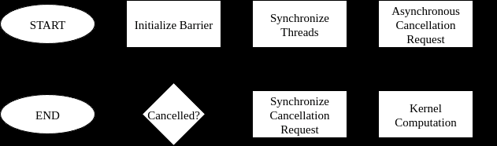

# 4.13 使用集群启动控制的工作窃取

在开发 CUDA 应用程序时，处理可变数据和计算规模的问题至关重要。传统上，CUDA 开发者用两种主要方法确定要启动的核函数线程块数量：每线程块固定工作量和固定线程块数。两种方法各有优缺点。

每线程块固定工作量：在这种方法中，线程块数量由问题规模决定，而每个线程块完成的工作量保持不变。

该方法的主要优点：

- SM 之间的负载均衡

  当线程块运行时间存在差异，和/或线程块数量远大于 GPU 可同时执行的数量（导致低尾效应）时，该方法允许 GPU 调度器在某些 SM 上运行比其他 SM 更多的线程块。

- 抢占

  GPU 调度器可以在低优先级核函数已开始执行后启动更高优先级的核函数：随着低优先级核函数的线程块完成，调度其线程块执行；高优先级核函数执行完毕后，再恢复低优先级核函数的执行。

固定线程块数：在这种方法中（通常实现为线程块步长或网格步长循环），线程块数量不依赖于问题规模。相反，每个线程块完成的工作量是问题规模的函数。通常，线程块数量基于执行核函数的 GPU 上的 SM 数量和期望的占用率。

该方法的主要优点：

- 线程块开销更低

  该方法不仅降低了均摊的线程块启动延迟，还最小化了与所有线程块共享操作相关的计算开销。这些开销可能显著高于启动延迟开销。

  例如，在卷积核函数中，用于计算卷积系数的序言（独立于线程块索引）由于线程块数量固定而只需计算更少的次数，从而减少了冗余计算。

集群启动控制（Cluster Launch Control）是 NVIDIA Blackwell GPU 架构（计算能力 10.0）中引入的特性，旨在结合前两种方法的优点。它让开发者通过允许取消线程块或线程块集群，更好地控制线程块调度。该机制实现了工作窃取。工作窃取是并行计算中的一种动态负载均衡技术：空闲处理器主动从繁忙处理器的队列中"窃取"任务，而不是等待分配工作。



（图 54：集群启动控制流程。）

通过集群启动控制，线程块尝试取消另一个尚未开始执行的线程块的启动。如果取消请求成功，它就用被取消线程块的索引来执行其任务，从而"窃取"了对方的工作。如果没有更多可用的线程块索引，或因其他原因（如调度了更高优先级的核函数），取消会失败。在后一种情况下，如果线程块在取消失败后退出，调度器可以开始执行更高优先级的核函数，之后再继续调度当前核函数剩余的线程块执行。上图展示了该过程的执行流程。

下表总结了三种方法的优缺点：

| | 每线程块固定工作量 | 固定线程块数 | 集群启动控制 |
|---|---|---|---|
| 开销更低 | ✗ | ✓ | ✓ |
| 抢占 | ✓ | ✗ | ✓ |
| 负载均衡 | ✓ | ✗ | ✓ |

## 4.13.1 API 细节

通过集群启动控制 API 取消线程块是异步进行的，并使用共享内存屏障同步，编程模式类似于异步数据拷贝。该 API 通过 libcu++ 提供：

- 请求指令：将编码后的取消结果写入 `__shared__` 变量。
- 解码指令：提取成功/失败状态和被取消的线程块索引。

注意，集群启动控制操作被建模为异步代理操作（async proxy operations，参见"异步线程与异步代理"）。

### 4.13.1.1 线程块取消

使用集群启动控制的首选方式是单线程，即一次一个请求。取消过程包括五个步骤：

- 设置阶段（步骤 1–2）：声明并初始化取消结果和同步变量。
- 工作窃取循环（步骤 3–5）：重复执行以请求、同步和处理取消结果。

1. 为线程块取消声明变量：

    ```cpp
    __shared__ uint4 result; // 请求结果。
    __shared__ uint64_t bar; // 同步屏障。
    int phase = 0;           // 同步屏障阶段。
    ```

2. 用单个到达计数初始化共享内存屏障：

    ```cpp
    if (cg::thread_block::thread_rank() == 0)
        ptx::mbarrier_init(&bar, 1);
    __syncthreads();
    ```

3. 由单个线程提交异步取消请求并设置事务计数：

    ```cpp
    if (cg::thread_block::thread_rank() == 0) {
         cg::invoke_one(cg::coalesced_threads(), [&]()
    {ptx::clusterlaunchcontrol_try_cancel(&result, &bar);});

         ptx::mbarrier_arrive_expect_tx(ptx::sem_relaxed, ptx::scope_cta, ptx::space_shared, &bar, sizeof(uint4));

    }
    ```

    注意：由于线程块取消是统一指令（uniform instruction），建议在 `invoke_one` 线程选择器内部提交。这允许编译器优化掉剥离循环（peeling loop）。

4. 同步（完成）异步取消请求：

    ```cpp
    while (!ptx::mbarrier_try_wait_parity(&bar, phase))
    {}
    phase ^= 1;
    ```

5. 获取取消状态和被取消的线程块索引：

    ```cpp
    bool success = ptx::clusterlaunchcontrol_query_cancel_is_canceled(result);
    if (success) {
         // 对于 1D/2D 线程块不需要全部三个：
         int bx = ptx::clusterlaunchcontrol_query_cancel_get_first_ctaid_x(result);

         int by = ptx::clusterlaunchcontrol_query_cancel_get_first_ctaid_y(result);

         int bz = ptx::clusterlaunchcontrol_query_cancel_get_first_ctaid_z(result);

    }
    ```

6. 确保异步代理与通用代理之间共享内存操作的可见性，并防止工作窃取循环迭代之间的数据竞争。

### 4.13.1.2 线程块取消的约束

这些约束与失败的取消请求有关：

- 在观察到先前失败的请求后提交另一个取消请求是未定义行为。

  在下面两个代码示例中，假设第一次取消请求失败，只有第一个示例表现出未定义行为。第二个示例是正确的，因为两次取消请求之间没有观察：

  无效代码：

    ```cpp
    // 第一次请求：
    ptx::clusterlaunchcontrol_try_cancel(&result0, &bar0);

    // 查询第一次请求：
    [在此处同步 bar0 的代码。]
    bool success0 = ptx::clusterlaunchcontrol_query_cancel_is_canceled(result0);

    assert(!success0); // 观察到失败；第二次取消将无效。

    // 第二次请求 - 下一行是未定义行为：
    ptx::clusterlaunchcontrol_try_cancel(&result1, &bar1);
    ```

  有效代码：

    ```cpp
    // 第一次请求：
    ptx::clusterlaunchcontrol_try_cancel(&result0, &bar0);

    // 第二次请求：
    ptx::clusterlaunchcontrol_try_cancel(&result1, &bar1);

    // 查询第一次请求：
    [在此处同步 bar0 的代码。]
    bool success0 = ptx::clusterlaunchcontrol_query_cancel_is_canceled(result0);

    assert(!success0); // 观察到失败；第二次取消是有效的。
    ```

- 获取失败取消请求的线程块索引是未定义行为。
- 不建议从多个线程提交取消请求。这会导致取消多个线程块，需要小心处理，例如：

  - 每个提交线程必须提供唯一的 `__shared__` 结果指针以避免数据竞争。
  - 如果使用同一屏障同步，必须相应调整到达计数和事务计数。

## 4.13.2 示例：向量-标量乘法

在以下小节中，我们通过集群启动控制演示工作窃取，使用向量-标量乘法核函数。我们展示同一问题的两种变体：一种使用线程块，一种使用线程块集群。

### 4.13.2.1 用例：线程块

以下三个核函数分别展示了每线程块固定工作量、固定线程块数和集群启动控制三种方法在向量-标量乘法 `v := αv` 中的实现。

- 每线程块固定工作量：

    ```cpp
    __global__
    void kernel_fixed_work (float* data, int n)
    {
        // 序言：
        float alpha = compute_scalar();

           // 计算：
           int i = blockIdx.x * blockDim.x + threadIdx.x;
           if (i < n)
               data[i] *= alpha;
    }

    // 启动：kernel_fixed_work<<<(n + 1023) / 1024, 1024>>>(data, n);
    ```

- 固定线程块数：

    ```cpp
    __global__
    void kernel_fixed_blocks (float* data, int n)
    {
        // 序言：
        float alpha = compute_scalar();

           // 计算：
           int i = blockIdx.x * blockDim.x + threadIdx.x;
           while (i < n) {
               data[i] *= alpha;
               i += gridDim.x * blockDim.x;
           }
    }

    // 启动：kernel_fixed_blocks<<<SM_COUNT, 1024>>>(data, n);
    ```

- 集群启动控制：

    ```cpp
    #include <cooperative_groups.h>
    #include <cuda/ptx>

    namespace cg = cooperative_groups;
    namespace ptx = cuda::ptx;

    __global__
    void kernel_cluster_launch_control (float* data, int n)
    {
        // 集群启动控制初始化：
        __shared__ uint4 result;
        __shared__ uint64_t bar;
        int phase = 0;

         if (cg::thread_block::thread_rank() == 0)
             ptx::mbarrier_init(&bar, 1);

        // 序言：
        float alpha = compute_scalar(); // 设备函数未在此代码片段中展示。

         // 工作窃取循环：
         int bx = blockIdx.x; // 假设为 1D x 轴线程块。

         while (true) {
             // 保护 result 不被下一次迭代覆盖，
             // （同时保证第一次迭代时屏障已初始化）：
             __syncthreads();

            // 取消请求：
            if (cg::thread_block::thread_rank() == 0) {
                // 在异步代理中获取 result 的写权限：
                ptx::fence_proxy_async_generic_sync_restrict(ptx::sem_acquire, ptx::space_cluster, ptx::scope_cluster);

                cg::invoke_one(cg::coalesced_threads(), [&]()
    {ptx::clusterlaunchcontrol_try_cancel(&result, &bar);});
                ptx::mbarrier_arrive_expect_tx(ptx::sem_relaxed, ptx::scope_cta, ptx::space_shared, &bar, sizeof(uint4));

            }

             // 计算：
             int i = bx * blockDim.x + threadIdx.x;
             if (i < n)
                 data[i] *= alpha;

            // 取消请求同步：
            while (!ptx::mbarrier_try_wait_parity(ptx::sem_acquire, ptx::scope_cta, &bar, phase))
            {}
            phase ^= 1;

             // 取消请求解码：
             bool success = ptx::clusterlaunchcontrol_query_cancel_is_canceled(result);

             if (!success)
                 break;

                bx = ptx::clusterlaunchcontrol_query_cancel_get_first_ctaid_x<int>(result);

              // 将 result 的读权限释放给异步代理：
              ptx::fence_proxy_async_generic_sync_restrict(ptx::sem_release, ptx::space_shared, ptx::scope_cluster);

          }
     }

     // 启动：kernel_cluster_launch_control<<<(n + 1023) / 1024, 1024>>>(data, n);
    ```

### 4.13.2.2 用例：线程块集群

对于线程块集群的情况，线程块取消步骤与非集群设置相同，只有细微调整。与非集群情况一样，不建议在集群内从多个线程提交取消请求，因为这会尝试取消多个集群。

- 取消由单个集群线程提交。
- 每个集群的线程块的共享内存结果将收到相同的（编码的）被取消线程块索引值（即结果值被组播）。所有线程块收到的结果对应于集群内的本地线程块索引 {0, 0, 0}。因此，集群内的线程块需要加上本地线程块索引。
- 同步由每个集群的线程块使用本地 `__shared__` 内存屏障执行。屏障操作必须使用 `ptx::scope_cluster` 作用域执行。
- 集群情况下的取消要求所有线程块都存在。用户可以使用同步 API 中的 `cg::cluster_group::sync()` 保证所有线程块都在运行。

以下核函数展示了使用线程块集群的集群启动控制方法。

```cpp
#include <cooperative_groups.h>
#include <cuda/ptx>

namespace cg = cooperative_groups;
namespace ptx = cuda::ptx;

__global__ __cluster_dims__(2, 1, 1)
void kernel_cluster_launch_control (float* data, int n)
{
    // 集群启动控制初始化：
    __shared__ uint4 result;
    __shared__ uint64_t bar;
    int phase = 0;

    if (cg::thread_block::thread_rank() == 0) {
        ptx::mbarrier_init(&bar, 1);
        ptx::fence_mbarrier_init(ptx::sem_release, ptx::scope_cluster); // CGA 级别屏障。
    }

    // 序言：
    float alpha = compute_scalar(); // 设备函数未在此代码片段中展示。

       // 工作窃取循环：
       int bx = blockIdx.x; // 假设为 1D x 轴线程块。

       while (true) {
           // 保护 result 不被下一次迭代覆盖，
           // （同时保证第一次迭代时所有线程块都已启动）：
           cg::cluster_group::sync();

        // 由单个集群线程提交取消请求：
        if (cg::cluster_group::thread_rank() == 0) {
            // 在异步代理中获取 result 的写权限：
            ptx::fence_proxy_async_generic_sync_restrict(ptx::sem_acquire, ptx::space_cluster, ptx::scope_cluster);

               cg::invoke_one(cg::coalesced_threads(), [&]()
   {ptx::clusterlaunchcontrol_try_cancel_multicast(&result, &bar);});
           }

        // 每个线程块跟踪取消完成：
        if (cg::thread_block::thread_rank() == 0)
            ptx::mbarrier_arrive_expect_tx(ptx::sem_relaxed, ptx::scope_cluster, ptx::space_shared, &bar, sizeof(uint4));

           // 计算：
           int i = bx * blockDim.x + threadIdx.x;
           if (i < n)
               data[i] *= alpha;

        // 取消请求同步：
        while (!ptx::mbarrier_try_wait_parity(ptx::sem_acquire, ptx::scope_cluster, &bar, phase))
        {}
        phase ^= 1;

        // 取消请求解码：
        bool success = ptx::clusterlaunchcontrol_query_cancel_is_canceled(result);

        if (!success)
            break;

           bx = ptx::clusterlaunchcontrol_query_cancel_get_first_ctaid_x<int>(result);
           bx += cg::cluster_group::block_index().x; // 加上本地偏移。

         // 将 result 的读权限释放给异步代理：
         ptx::fence_proxy_async_generic_sync_restrict(ptx::sem_release, ptx::space_shared, ptx::scope_cluster);

     }
}

// 启动：kernel_cluster_launch_control<<<(n + 1023) / 1024, 1024>>>(data, n);
```
