# 4.2 CUDA Graphs（CUDA 图）

CUDA Graphs（CUDA 图）提供了另一种在 CUDA 中提交工作的模型。图（graph）是一系列操作（如核函数启动、数据移动等）通过依赖关系连接而成。图的定义与其执行是相互独立的。这使得图可以只定义一次，然后反复启动。把图的定义与执行分离带来了若干优化：首先，与流相比，CPU 启动开销降低了，因为大部分设置工作都提前完成了；其次，把完整的工作流呈现给 CUDA，使得那些在流的逐段式工作提交机制下无法实现的优化成为可能。

为了理解图可能带来的优化，可以看看流中发生了什么：当你把一个核函数放入流中时，主机端驱动程序会执行一系列操作，为核函数在 GPU 上的执行做准备。这些为设置和启动核函数所必需的操作是一笔开销成本，每个提交的核函数都要支付。对于执行时间很短的 GPU 核函数，这笔开销成本可能占整体端到端执行时间的相当大比例。通过创建一个覆盖将反复启动的工作流的 CUDA 图，这些开销成本可以在实例化期间为整个图一次性支付，之后图本身就能以极小的开销被反复启动。

## 4.2.1 图结构

一个操作在图中形成一个节点。操作之间的依赖关系是边。这些依赖约束了操作的执行顺序。

一个操作所依赖的节点完成后，它可以在任何时候被调度。调度工作由 CUDA 系统负责。

### 4.2.1.1 节点类型

图节点可以是以下类型之一：

- 核函数
- CPU 函数调用
- 内存拷贝
- memset
- 空节点
- 等待 CUDA 事件
- 记录 CUDA 事件
- 发出外部信号量信号（signalling an external semaphore）
- 等待外部信号量
- 条件节点
- 内存节点
- 子图：执行另一个独立的嵌套图，如下图所示。

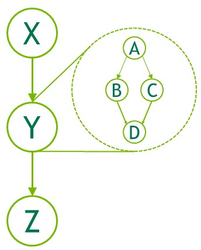

图 24：子图示例。

### 4.2.1.2 边数据

CUDA 12.3 在 CUDA 图中引入了边数据（edge data）。目前，非默认边数据的唯一用途是启用程序化依赖启动（Programmatic Dependent Launch）。

一般来说，边数据修改由边指定的依赖关系，由三部分组成：输出端口（outgoing port）、输入端口（incoming port）和类型。输出端口指定相关联的边何时被触发。输入端口指定节点的哪个部分依赖于相关联的边。类型修改端点之间的关系。

端口的取值与节点类型和方向有关，边类型可能限制在特定节点类型上。在所有情况下，零初始化的边数据表示默认行为。输出端口 0 等待整个任务，输入端口 0 阻塞整个任务，边类型 0 表示带有内存同步行为的完整依赖。

边数据可以在多个图 API 中通过与关联节点并行的数组可选地指定。如果作为输入参数省略，则使用零初始化的数据。如果作为输出（查询）参数省略，API 在被忽略的边数据全部为零初始化时接受调用；如果调用会丢弃信息，则返回 cudaErrorLossyQuery。

边数据也可用于某些流捕获 API：cudaStreamBeginCaptureToGraph()、cudaStreamGetCaptureInfo() 和 cudaStreamUpdateCaptureDependencies()。在这些情况下，尚无下游节点。数据与一条悬空边（半边，half edge）相关联，该边要么连接到将来捕获的节点，要么在流捕获终止时被丢弃。

注意，某些边类型不等待上游节点的完全完成。在判断流捕获是否已完全重新汇入源流时会忽略这些边，且这些边不能在捕获结束时被丢弃。参见"流捕获（Stream Capture）"一节。

没有节点类型定义额外的输入端口，只有核函数节点定义了额外的输出端口。唯一的非默认依赖类型是 cudaGraphDependencyTypeProgrammatic，用于在两个核函数节点之间启用程序化依赖启动。

## 4.2.2 图的构建与运行

使用图进行工作提交分为三个不同阶段：定义、实例化和执行。

- 在定义（或创建）阶段，程序创建图中操作的描述以及它们之间的依赖关系。
- 实例化对图模板做快照、进行校验，并完成大部分工作的设置与初始化，目标是尽量减少启动时需要完成的工作。得到的实例称为可执行图。
- 可执行图可以被启动到流中，类似于任何其他 CUDA 工作。它可以被启动任意多次，无需重复实例化。

### 4.2.2.1 图的创建

图可以通过两种机制创建：使用显式图 API 和通过流捕获。

#### 4.2.2.1.1 图 API

以下是一个创建下图所示图的示例（省略了声明和其他样板代码）。注意使用了 cudaGraphCreate() 创建图，以及 cudaGraphAddNode() 添加核函数节点及其依赖。CUDA Runtime API 文档列出了所有可用于添加节点和依赖的函数。

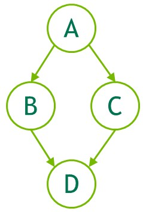

图 25：使用图 API 创建图的示例。

```cpp
// Create the graph - it starts out empty
// 创建图——图刚创建时是空的
cudaGraphCreate(&graph, 0);

// Create the nodes and their dependencies
// 创建节点及其依赖关系
cudaGraphNode_t nodes[4];
cudaGraphNodeParams kParams = { cudaGraphNodeTypeKernel };
kParams.kernel.func          = (void *)kernelName;
kParams.kernel.gridDim.x     = kParams.kernel.gridDim.y = kParams.kernel.gridDim.z  = 1;
kParams.kernel.blockDim.x    = kParams.kernel.blockDim.y = kParams.kernel.blockDim.z = 1;

cudaGraphAddNode(&nodes[0], graph, NULL, NULL, 0, &kParams);
cudaGraphAddNode(&nodes[1], graph, &nodes[0], NULL, 1, &kParams);
cudaGraphAddNode(&nodes[2], graph, &nodes[0], NULL, 1, &kParams);
cudaGraphAddNode(&nodes[3], graph, &nodes[1], NULL, 2, &kParams);
```

上面的示例展示了四个带依赖关系的核函数节点，用于说明一个非常简单的图的创建过程。典型应用还会包括为内存操作（如 memcpy 和 memset）添加的节点。关于添加节点的所有图 API 函数的完整参考，参见 CUDA Runtime API 文档。

> 注：CUDA 图 API 最初为每种不同的节点类型提供了单独的 API 函数，例如 cudaGraphAddKernelNode() 或 cudaGraphAddMemcpyNode()。这些 API 已被统一的、多态的 cudaGraphAddNode() 取代，该函数使用节点参数的 .type 字段来确定要添加的节点类型。非多态 API 将在未来被弃用。cudaGraphAddNode() 是使用 CUDA 图 API 向图添加节点的推荐方式。
#### 4.2.2.1.2 流捕获

流捕获提供了一种从现有基于流的 API 创建图的机制。一段向流中启动工作的代码（包括现有代码），可以用 cudaStreamBeginCapture() 和 cudaStreamEndCapture() 调用括起来。示例如下。

```cpp
cudaGraph_t graph;

cudaStreamBeginCapture(stream);

kernel_A<<< ..., stream >>>(...);
kernel_B<<< ..., stream >>>(...);
libraryCall(stream);
kernel_C<<< ..., stream >>>(...);

cudaStreamEndCapture(stream, &graph);
```

调用 cudaStreamBeginCapture() 会将流置于捕获模式。当流处于捕获状态时，启动到该流中的工作不会被排队执行，而是被追加到一个内部图中，这个图正在被逐步构建。然后调用 cudaStreamEndCapture() 返回这个图，同时也结束该流的捕获模式。流捕获正在构建的图称为捕获图（capture graph）。

流捕获可用于除 cudaStreamLegacy（即"NULL 流"）之外的任何 CUDA 流。注意它可用于 cudaStreamPerThread。如果程序正在使用旧式流，可以把流 0 重定义为每线程流（per-thread stream）而功能不变。参见"阻塞流与非阻塞流及默认流"。

是否正在捕获某个流可以用 cudaStreamIsCapturing() 查询。

使用 cudaStreamBeginCaptureToGraph() 可以把工作捕获到一个已有的图中。与捕获到内部图不同，工作被捕获到用户提供的图中。

##### 4.2.2.1.2.1 跨流依赖与事件

流捕获可以处理用 cudaEventRecord() 和 cudaStreamWaitEvent() 表达的跨流依赖，前提是被等待的事件被记录到了同一个捕获图中。

当事件被记录到处于捕获模式的流中时，会产生一个已捕获事件（captured event）。已捕获事件表示捕获图中的一组节点。

当流等待一个已捕获事件时，如果该流尚未处于捕获模式，就会被置于捕获模式，流中的下一项工作将额外依赖于已捕获事件中的节点。此时这两个流被捕获到同一个捕获图中。

当流捕获中存在跨流依赖时，cudaStreamEndCapture() 仍必须在调用 cudaStreamBeginCapture() 的同一个流中调用；这是源流（origin stream）。由于基于事件的依赖而被捕获到同一个捕获图中的任何其他流，也必须汇回源流。如下例所示。调用 cudaStreamEndCapture() 后，被捕获到同一个捕获图中的所有流都会退出捕获模式。未能汇回源流将导致整个捕获操作失败。

```cpp
// stream1 is the origin stream
// stream1 是源流
cudaStreamBeginCapture(stream1);

kernel_A<<< ..., stream1 >>>(...);

// Fork into stream2
// 分叉到 stream2
cudaEventRecord(event1, stream1);
cudaStreamWaitEvent(stream2, event1);

kernel_B<<< ..., stream1 >>>(...);
kernel_C<<< ..., stream2 >>>(...);

// Join stream2 back to origin stream (stream1)
// 把 stream2 汇回源流（stream1）
cudaEventRecord(event2, stream2);
cudaStreamWaitEvent(stream1, event2);

kernel_D<<< ..., stream1 >>>(...);

// End capture in the origin stream
// 在源流中结束捕获
cudaStreamEndCapture(stream1, &graph);

// stream1 and stream2 no longer in capture mode
// stream1 和 stream2 不再处于捕获模式
```

上述代码返回的图如图 25 所示。

> 注：当流退出捕获模式时，流中下一个非捕获项（如果有）仍将依赖于最近的上一项非捕获项，尽管中间的项已被移除。

##### 4.2.2.1.2.2 禁止的与未处理的操作

对正在被捕获的流或已捕获事件进行同步或查询其执行状态是无效的，因为它们不代表已调度执行的工作。对包含活跃流捕获的更广泛的句柄（例如当任何关联流处于捕获模式时的设备或上下文句柄）查询执行状态或同步也是无效的。

当同一上下文中的任何流正在被捕获，且该流不是用 cudaStreamNonBlocking 创建的，那么任何对旧式流的使用尝试都是无效的。这是因为旧式流句柄始终涵盖这些其他流；向旧式流中排队会创建对正在被捕获的流的依赖，而查询或同步它会查询或同步正在被捕获的流。

因此，在这种情况下调用同步 API 也是无效的。同步 API 的一个例子是 cudaMemcpy()，它向旧式流中排队工作并在返回前在其上同步。

> 注：一般规则是，当依赖关系会把被捕获的东西与未被捕获而是被排队执行的东西连接起来时，CUDA 更倾向于返回错误而不是忽略该依赖。例外情况是把流置入或退出捕获模式；这会切断在模式切换前后紧邻添加到流中的项之间的依赖关系。

等待来自不同捕获图的已捕获事件来合并两个独立的捕获图是无效的：在正在被捕获的流中等待非捕获事件而不指定 cudaEventWaitExternal 标志也是无效的。

少量向流中排队异步操作的 API 目前在图中不受支持，如果用正在被捕获的流调用会返回错误，例如 cudaStreamAttachMemAsync()。

##### 4.2.2.1.2.3 失效

当在流捕获期间尝试无效操作时，任何关联的捕获图都会被失效。当捕获图被失效后，在用 cudaStreamEndCapture() 结束流捕获之前，继续使用正在被捕获的流或与该图关联的已捕获事件都是无效的，会返回错误。该调用会使关联的流退出捕获模式，但也会返回一个错误值和一个 NULL 图。

##### 4.2.2.1.2.4 捕获内省

可以用 cudaStreamGetCaptureInfo() 检查活跃的流捕获操作。这允许用户获取捕获的状态、该捕获在进程内唯一的 ID、底层的图对象，以及流中下一个要被捕获节点的依赖/边数据。

这些依赖信息可用于获取流中最近被捕获节点（一个或多个）的句柄。

#### 4.2.2.1.3 融会贯通

图 25 中的示例是一个简化示例，旨在概念上展示一个小图。在使用 CUDA 图的应用中，无论使用图 API 还是流捕获，都会更加复杂。下面的代码片段并排比较了图 API 和流捕获，展示如何创建 CUDA 图来执行一个简单的两阶段归约（reduction）算法。

图 26 是该 CUDA 图的示意图，是对下面的代码使用 cudaGraphDebugDotPrint 函数生成的（为可读性做了小幅调整），再用 Graphviz 渲染而成。

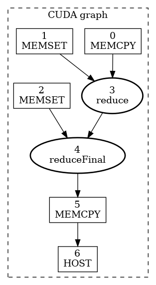

图 26：使用两阶段归约核函数的 CUDA 图示例。

图 API（Graph API）

```cpp
void cudaGraphsManual(float *inputVec_h,
                      float *inputVec_d,
                      double *outputVec_d,
                      double *result_d,
                      size_t inputSize,
                      size_t numOfBlocks)
{
    cudaStream_t                 streamForGraph;
    cudaGraph_t                  graph;
    std::vector<cudaGraphNode_t> nodeDependencies;
    cudaGraphNode_t              memcpyNode, kernelNode;
    double                       result_h = 0.0;

    cudaStreamCreate(&streamForGraph);

    // cudaGraphAddNode is the unified node-creation API: one call for every node type,
    // driven by a cudaGraphNodeParams struct (a .type tag + a union of per-type params).
    // It replaces the previously used cudaGraphAddMemcpyNode/cudaGraphAddKernelNode calls. The struct
    // has reserved fields that must be zero, so it is re-zeroed with "= {}" before each node below.
    // cudaGraphAddNode 是统一的节点创建 API：每种节点类型只需一次调用，
    // 由 cudaGraphNodeParams 结构体驱动（一个 .type 标记 + 每种类型的参数联合体）。
    // 它取代了以前使用的 cudaGraphAddMemcpyNode/cudaGraphAddKernelNode 调用。
    // 该结构体有必须为零的保留字段，因此在下面每个节点之前都用 "= {}" 重新清零。

    cudaGraphNodeParams nodeParams    = {};
    cudaMemcpy3DParms   memcpyParams = {0};

    memcpyParams.srcArray = NULL;
    memcpyParams.srcPos   = make_cudaPos(0, 0, 0);
    memcpyParams.srcPtr   = make_cudaPitchedPtr(inputVec_h, sizeof(float) * inputSize, inputSize, 1);

    memcpyParams.dstArray = NULL;
    memcpyParams.dstPos   = make_cudaPos(0, 0, 0);
    memcpyParams.dstPtr   = make_cudaPitchedPtr(inputVec_d, sizeof(float) * inputSize, inputSize, 1);

    memcpyParams.extent   = make_cudaExtent(sizeof(float) * inputSize, 1, 1);
    memcpyParams.kind     = cudaMemcpyHostToDevice;

    // Create an empty graph; nodes and edges will be added below.
    // 创建一个空图；节点和边将在下面添加。
    cudaGraphCreate(&graph, 0);

    // Node 1: H2D memcpy — no dependencies (NULL, 0), so it can start immediately.
    // For a memcpy node the cudaMemcpy3DParms goes into nodeParams.memcpy.copyParams
    // (the .memcpy union member is a wrapper struct, so the copy descriptor nests one level deeper).
    // 节点 1：H2D memcpy——无依赖（NULL, 0），因此可以立即启动。
    // 对于 memcpy 节点，cudaMemcpy3DParms 放在 nodeParams.memcpy.copyParams 中
    // （.memcpy 联合体成员是一个包装结构体，所以拷贝描述符嵌套在更深一层）。
    nodeParams                    = {};
    nodeParams.type               = cudaGraphNodeTypeMemcpy;
    nodeParams.memcpy.copyParams = memcpyParams;
    cudaGraphAddNode(&memcpyNode, graph, NULL, /*dependencyData=*/NULL, 0, &nodeParams);

    // Make the next node wait for this memcpy to finish before starting.
    // 让下一个节点等待该 memcpy 完成后再启动。
    nodeDependencies.push_back(memcpyNode);

    void *kernelArgs[4] = {(void *)&inputVec_d, (void *)&outputVec_d, &inputSize, &numOfBlocks};

    // Node 2: first reduction kernel — depends on the H2D memcpy completing.
    // Kernel params are set directly on the .kernel union member.
    // 节点 2：第一个归约核函数——依赖于 H2D memcpy 的完成。
    // 核函数参数直接设置在 .kernel 联合体成员上。
    nodeParams                        = {};
    nodeParams.type                   = cudaGraphNodeTypeKernel;
    nodeParams.kernel.func            = (void *)reduce;
    nodeParams.kernel.gridDim        = dim3(numOfBlocks, 1, 1);
    nodeParams.kernel.blockDim       = dim3(THREADS_PER_BLOCK, 1, 1);
    nodeParams.kernel.sharedMemBytes = 0;
    nodeParams.kernel.kernelParams   = (void **)kernelArgs;
    nodeParams.kernel.extra          = NULL;
    cudaGraphAddNode(
        &kernelNode, graph, nodeDependencies.data(), /*dependencyData=*/NULL,
        nodeDependencies.size(), &nodeParams);

    // Move dependency forward: the next node waits for this kernel.
    // 把依赖前移：下一个节点等待该核函数。
    nodeDependencies.clear();
    nodeDependencies.push_back(kernelNode);

    void *kernelArgs2[3] = {(void *)&outputVec_d, (void *)&result_d, &numOfBlocks};

    // Node 3: final reduction kernel — depends on Node 2.
    // 节点 3：最终归约核函数——依赖于节点 2。
    nodeParams                        = {};
    nodeParams.type                   = cudaGraphNodeTypeKernel;
    nodeParams.kernel.func            = (void *)reduceFinal;
    nodeParams.kernel.gridDim         = dim3(1, 1, 1);
    nodeParams.kernel.blockDim        = dim3(THREADS_PER_BLOCK, 1, 1);
    nodeParams.kernel.sharedMemBytes = 0;
    nodeParams.kernel.kernelParams    = kernelArgs2;
    nodeParams.kernel.extra           = NULL;
    cudaGraphAddNode(
        &kernelNode, graph, nodeDependencies.data(), /*dependencyData=*/NULL,
        nodeDependencies.size(), &nodeParams);

    nodeDependencies.clear();
    nodeDependencies.push_back(kernelNode);

    memset(&memcpyParams, 0, sizeof(memcpyParams));

    memcpyParams.srcArray = NULL;
    memcpyParams.srcPos   = make_cudaPos(0, 0, 0);
    memcpyParams.srcPtr   = make_cudaPitchedPtr(result_d, sizeof(double), 1, 1);

    memcpyParams.dstArray = NULL;
    memcpyParams.dstPos   = make_cudaPos(0, 0, 0);
    memcpyParams.dstPtr   = make_cudaPitchedPtr(&result_h, sizeof(double), 1, 1);

    memcpyParams.extent   = make_cudaExtent(sizeof(double), 1, 1);
    memcpyParams.kind     = cudaMemcpyDeviceToHost;

    // Node 4: D2H memcpy — copies the scalar result back to the host.
    // Again the copy descriptor nests in nodeParams.memcpy.copyParams.
    // 节点 4：D2H memcpy——把标量结果拷回主机端。
    // 拷贝描述符同样嵌套在 nodeParams.memcpy.copyParams 中。
    nodeParams                    = {};
    nodeParams.type               = cudaGraphNodeTypeMemcpy;
    nodeParams.memcpy.copyParams = memcpyParams;
    cudaGraphAddNode(&memcpyNode, graph, nodeDependencies.data(),
                     /*dependencyData=*/NULL, nodeDependencies.size(), &nodeParams);

    nodeDependencies.clear();
    nodeDependencies.push_back(memcpyNode);

    cudaGraphNode_t hostNode;
    callBackData_t hostFnData;
    hostFnData.data    = &result_h;
    hostFnData.fn_name = "cudaGraphsManual";

    // Node 5: host callback — runs on the CPU after the D2H copy completes.
    // The .host member is cudaHostNodeParamsV2 (fn + userData, plus a syncMode field
    // left at 0 by the zero-init above).
    // 节点 5：主机端回调——在 D2H 拷贝完成后在 CPU 上运行。
    // .host 成员是 cudaHostNodeParamsV2（fn + userData，外加一个被上面的清零
    // 初始化保留为 0 的 syncMode 字段）。
    nodeParams                = {};
    nodeParams.type           = cudaGraphNodeTypeHost;
    nodeParams.host.fn        = myHostNodeCallback;
    nodeParams.host.userData = &hostFnData;
    cudaGraphAddNode(&hostNode, graph, nodeDependencies.data(),
                     /*dependencyData=*/NULL, nodeDependencies.size(), &nodeParams);

    size_t numNodes = 0;
    cudaGraphGetNodes(graph, NULL, &numNodes);
    printf("Graph node count: %zu\n", numNodes);

    // Instantiate: compile the graph into an executable form (one-time cost).
    // This is where CUDA optimizes the schedule; repeated launches reuse this.
    // 实例化：把图编译为可执行形式（一次性成本）。
    // CUDA 在此优化调度；重复启动都复用这份实例。
    cudaGraphExec_t graphExec;
    cudaGraphInstantiate(&graphExec, graph, NULL, NULL, 0);

    // Demonstrates cudaGraphClone — in practice, cloning is useful when multiple CPU
    // threads need to launch the same graph concurrently, each with its own independent graphExec.
    // 演示 cudaGraphClone——实际中，当多个 CPU 线程需要并发启动同一张图、
    // 每个线程拥有各自独立的 graphExec 时，克隆很有用。
    cudaGraph_t     clonedGraph;
    cudaGraphExec_t clonedGraphExec;
    cudaGraphClone(&clonedGraph, graph);
    cudaGraphInstantiate(&clonedGraphExec, clonedGraph, NULL, NULL, 0);

    // Refill the host input before each launch so the graph's H2D copy processes
    // new data every time — one instantiated graph reused for different data.
    // The per-iteration sync ensures that copy finishes before we overwrite the buffer.
    // 每次启动前重新填充主机端输入，使图的 H2D 拷贝每次都处理新数据——
    // 一张已实例化的图被复用于不同的数据。
    // 每次迭代的同步确保拷贝完成后再覆盖缓冲区。
    for (int i = 0; i < GRAPH_LAUNCH_ITERATIONS; i++) {
        init_input(inputVec_h, inputSize);
        cudaGraphLaunch(graphExec, streamForGraph);
        cudaStreamSynchronize(streamForGraph);
    }

    printf("\nCloned graph:\n");
    for (int i = 0; i < GRAPH_LAUNCH_ITERATIONS; i++) {
        init_input(inputVec_h, inputSize);
        cudaGraphLaunch(clonedGraphExec, streamForGraph);
        cudaStreamSynchronize(streamForGraph);
    }

    cudaGraphExecDestroy(graphExec);
    cudaGraphExecDestroy(clonedGraphExec);
    cudaGraphDestroy(graph);
    cudaGraphDestroy(clonedGraph);
    cudaStreamDestroy(streamForGraph);
}
```

流捕获（Stream Capture）

```cpp
void cudaGraphsUsingStreamCapture(float *inputVec_h,
                                  float *inputVec_d,
                                  double *outputVec_d,
                                  double *result_d,
                                  size_t inputSize,
                                  size_t numOfBlocks)
{
    cudaStream_t stream1, streamForGraph;
    cudaGraph_t graph;
    double       result_h = 0.0;

    cudaStreamCreate(&stream1);
    cudaStreamCreate(&streamForGraph);

    // Begin capture: operations issued to stream1 are recorded, not executed.
    // 开始捕获：发往 stream1 的操作被记录下来，而非执行。
    cudaStreamBeginCapture(stream1, cudaStreamCaptureModeGlobal);

    cudaMemcpyAsync(inputVec_d, inputVec_h, sizeof(float) * inputSize,
                    cudaMemcpyDefault, stream1);

    reduce<<<numOfBlocks, THREADS_PER_BLOCK, 0, stream1>>>(inputVec_d,
                                                           outputVec_d, inputSize, numOfBlocks);

    reduceFinal<<<1, THREADS_PER_BLOCK, 0, stream1>>>(outputVec_d, result_d,
                                                     numOfBlocks);
    cudaMemcpyAsync(&result_h, result_d, sizeof(double), cudaMemcpyDefault,
                    stream1);

    callBackData_t hostFnData = {0};
    hostFnData.data           = &result_h;
    hostFnData.fn_name        = "cudaGraphsUsingStreamCapture";
    cudaLaunchHostFunc(stream1, myHostNodeCallback, &hostFnData);

    // End capture: the runtime builds a graph from everything recorded above.
    // The resulting graph is structurally identical to the one built manually.
    // 结束捕获：运行时根据上面记录的所有内容构建图。
    // 得到的图在结构上与手动构建的那张图完全相同。
    cudaStreamEndCapture(stream1, &graph);

    size_t numNodes = 0;
    cudaGraphGetNodes(graph, NULL, &numNodes);
    printf("Graph node count: %zu\n", numNodes);

    // Instantiate the captured graph into an executable form.
    // 把捕获到的图实例化为可执行形式。
    cudaGraphExec_t graphExec;
    cudaGraphInstantiate(&graphExec, graph, NULL, NULL, 0);

    // Demonstrates cudaGraphClone — in practice, cloning is useful when multiple CPU
    // threads need to launch the same graph concurrently, each with its own independent graphExec.
    // 演示 cudaGraphClone——实际中，当多个 CPU 线程需要并发启动同一张图、
    // 每个线程拥有各自独立的 graphExec 时，克隆很有用。
    cudaGraph_t     clonedGraph;
    cudaGraphExec_t clonedGraphExec;
    cudaGraphClone(&clonedGraph, graph);
    cudaGraphInstantiate(&clonedGraphExec, clonedGraph, NULL, NULL, 0);

    // Refill the host input before each launch so the graph's H2D copy processes
    // new data every time — one instantiated graph reused for different data.
    // The per-iteration sync ensures that copy finishes before we overwrite the buffer.
    // 每次启动前重新填充主机端输入，使图的 H2D 拷贝每次都处理新数据——
    // 一张已实例化的图被复用于不同的数据。
    // 每次迭代的同步确保拷贝完成后再覆盖缓冲区。
    for (int i = 0; i < GRAPH_LAUNCH_ITERATIONS; i++) {
        init_input(inputVec_h, inputSize);
        cudaGraphLaunch(graphExec, streamForGraph);
        cudaStreamSynchronize(streamForGraph);
    }

    printf("\nCloned graph:\n");
    for (int i = 0; i < GRAPH_LAUNCH_ITERATIONS; i++) {
        init_input(inputVec_h, inputSize);
        cudaGraphLaunch(clonedGraphExec, streamForGraph);
        cudaStreamSynchronize(streamForGraph);
    }

    cudaGraphExecDestroy(graphExec);
    cudaGraphExecDestroy(clonedGraphExec);
    cudaGraphDestroy(graph);
    cudaGraphDestroy(clonedGraph);
    cudaStreamDestroy(stream1);
    cudaStreamDestroy(streamForGraph);
}
```

### 4.2.2.2 图实例化

图一旦创建完成（无论是通过图 API 还是流捕获），必须先实例化以创建可执行图，然后才能启动。假设 cudaGraph_t 类型的 graph 已成功创建，下面的代码将实例化该图并创建可执行图 cudaGraphExec_t 类型的 graphExec：

```cpp
cudaGraphExec_t graphExec;
cudaGraphInstantiate(&graphExec, graph, 0);
```

### 4.2.2.3 图执行

图创建并实例化为可执行图之后，就可以启动了。假设 cudaGraphExec_t 类型的 graphExec 已成功创建，下面的代码片段将把图启动到指定的流中：

```cpp
cudaGraphLaunch(graphExec, stream);
```

把上面各步串起来，以 4.2.2.1.2 节的流捕获示例为例，下面的代码片段将创建图、实例化并启动它：

```cpp
cudaGraph_t graph;

cudaStreamBeginCapture(stream);

kernel_A<<< ..., stream >>>(...);
kernel_B<<< ..., stream >>>(...);
libraryCall(stream);
kernel_C<<< ..., stream >>>(...);

cudaStreamEndCapture(stream, &graph);

cudaGraphExec_t graphExec;
cudaGraphInstantiate(&graphExec, graph, 0);
cudaGraphLaunch(graphExec, stream);
```

## 4.2.3 更新已实例化的图

当工作流发生变化时，图就会过时，必须修改。对图结构的重大更改（如拓扑或节点类型）需要重新实例化，因为与拓扑相关的优化必须重新应用。但常见的情况是只有节点参数（如核函数参数和内存地址）发生变化，而图拓扑保持不变。针对这种情况，CUDA 提供了轻量级的"图更新"机制，允许原地修改某些节点参数而无需重建整个图，这比重新实例化高效得多。

更新在图下一次启动时生效，因此不会影响之前的图启动，即使更新时之前的启动仍在运行。图可以反复更新和重新启动，多个更新/启动可以排队到流上。

CUDA 提供了两种更新已实例化图参数的机制：整图更新和逐节点更新。整图更新允许用户提供一个拓扑完全相同的 cudaGraph_t 对象，其节点中包含更新后的参数。逐节点更新允许用户显式更新单个节点的参数。当更新的节点数量很多，或者调用者不知道图的拓扑（即图是对库调用进行流捕获得到的）时，使用更新后的 cudaGraph_t 更方便。当更改数量少且用户持有需要更新的节点的句柄时，逐节点更新更合适。逐节点更新会跳过未更改节点的拓扑检查与比较，因此在很多情况下效率更高。

CUDA 还提供了启用和禁用单个节点的机制，而不影响它们当前的参数。

下面几节将更详细地介绍每种方法。

### 4.2.3.1 整图更新

cudaGraphExecUpdate() 允许用一个拓扑完全相同的图（"更新图"）的参数更新已实例化的图（"原始图"）。更新图的拓扑必须与实例化 cudaGraphExec_t 时使用的原始图的拓扑完全相同。此外，指定依赖的顺序必须匹配。最后，CUDA 需要对汇节点（没有依赖的节点）进行一致的排序。CUDA 依靠特定 API 调用的顺序来实现一致的汇节点排序。

更明确地说，遵循以下规则将使 cudaGraphExecUpdate() 确定性地配对原始图和更新图中的节点：

1. 对于任何捕获流，对该流操作的 API 调用必须按相同顺序发出，包括事件等待和其他不直接对应节点创建的 API 调用。
2. 直接操作给定图节点入边（incoming edges）的 API 调用（包括捕获的流 API、节点添加 API 以及边的添加/移除 API）必须按相同顺序发出。此外，当依赖通过数组指定给这些 API 时，数组内部指定依赖的顺序必须匹配。
3. 汇节点必须一致排序。汇节点是指在调用 cudaGraphExecUpdate() 时最终图中没有被依赖节点/出边（outgoing edges）的节点。以下操作（如果存在）会影响汇节点排序（作为组合集合），必须按相同顺序执行：
   - 产生汇节点的节点添加 API。
   - 使某个节点成为汇节点的边移除操作。
   - cudaStreamUpdateCaptureDependencies()，如果它从捕获流的依赖集合中移除了一个汇节点。
   - cudaStreamEndCapture()。

下面的示例展示了如何使用该 API 更新已实例化的图：

```cpp
cudaGraphExec_t graphExec = NULL;

for (int i = 0; i < 10; i++) {
    cudaGraph_t graph;
    cudaGraphExecUpdateResult updateResult;
    cudaGraphNode_t errorNode;

    // In this example we use stream capture to create the graph.
    // You can also use the Graph API to produce a graph.
    // 本示例用流捕获创建图，也可以用图 API 生成图。
    cudaStreamBeginCapture(stream, cudaStreamCaptureModeGlobal);

    // Call a user-defined, stream based workload, for example
    // 调用一个用户定义的、基于流的工作负载，例如
    do_cuda_work(stream);

    cudaStreamEndCapture(stream, &graph);

    // If we've already instantiated the graph, try to update it directly
    // and avoid the instantiation overhead
    // 如果已经实例化过图，直接尝试更新它，避免实例化开销
    if (graphExec != NULL) {
        // If the graph fails to update, errorNode will be set to the
        // node causing the failure and updateResult will be set to a
        // reason code.
        // 如果图更新失败，errorNode 会被设为导致失败的节点，
        // updateResult 会被设为原因码。
        cudaGraphExecUpdate(graphExec, graph, &errorNode, &updateResult);
    }

    // Instantiate during the first iteration or whenever the update
    // fails for any reason
    // 在第一次迭代或更新因任何原因失败时实例化
    if (graphExec == NULL || updateResult != cudaGraphExecUpdateSuccess) {

        // If a previous update failed, destroy the cudaGraphExec_t
        // before re-instantiating it
        // 如果上一次更新失败，在重新实例化之前先销毁 cudaGraphExec_t
        if (graphExec != NULL) {
            cudaGraphExecDestroy(graphExec);
        }
        // Instantiate graphExec from graph. The error node and
        // error message parameters are unused here.
        // 从 graph 实例化 graphExec。这里不使用错误节点和错误信息参数。
        cudaGraphInstantiate(&graphExec, graph, 0);
    }

    cudaGraphDestroy(graph);
    cudaGraphLaunch(graphExec, stream);
    cudaStreamSynchronize(stream);
}
```

典型的工作流程是：先用流捕获或图 API 创建初始的 cudaGraph_t。然后像往常一样实例化并启动 cudaGraph_t。首次启动后，用与创建初始图相同的方法创建一个新的 cudaGraph_t，并调用 cudaGraphExecUpdate()。如果图更新成功（以上面示例中的 updateResult 参数指示），则启动更新后的 cudaGraphExec_t。如果更新因任何原因失败，则调用 cudaGraphExecDestroy() 和 cudaGraphInstantiate() 销毁原来的 cudaGraphExec_t 并实例化一个新的。

也可以直接更新 cudaGraph_t 的节点（即使用 cudaGraphKernelNodeSetParams()），随后更新 cudaGraphExec_t，但使用下一节介绍的显式节点更新 API 效率更高。

条件句柄（conditional handle）标志和默认值会作为图更新的一部分被更新。

关于用法和当前限制的更多信息，请参见图 API（Graph API）。
### 4.2.3.2 逐节点更新

可以直接更新已实例化图的节点参数。这既消除了实例化的开销，也消除了创建新 cudaGraph_t 的开销。如果需要更新的节点数量相对于图中总节点数量较小，最好逐个更新节点。以下方法可用于更新 cudaGraphExec_t 的节点：

表 8：逐节点更新 API

| API | 节点类型 |
|---|---|
| cudaGraphExecKernelNodeSetParams() | 核函数节点 |
| cudaGraphExecMemcpyNodeSetParams() | 内存拷贝节点 |
| cudaGraphExecMemsetNodeSetParams() | 内存设置节点 |
| cudaGraphExecHostNodeSetParams() | 主机端节点 |
| cudaGraphExecChildGraphNodeSetParams() | 子图节点 |
| cudaGraphExecEventRecordNodeSetEvent() | 事件记录节点 |
| cudaGraphExecEventWaitNodeSetEvent() | 事件等待节点 |
| cudaGraphExecExternalSemaphoresSignalNodeSetParams() | 外部信号量发出信号节点 |
| cudaGraphExecExternalSemaphoresWaitNodeSetParams() | 外部信号量等待节点 |

关于用法和当前限制的更多信息，请参见图 API（Graph API）。

### 4.2.3.3 逐节点启用

已实例化图中的核函数、memset 和 memcpy 节点可以用 cudaGraphNodeSetEnabled() API 启用或禁用。这允许创建一个包含所需功能超集的图，并为每次启动定制。可以用 cudaGraphNodeGetEnabled() API 查询节点的启用状态。

禁用的节点在功能上等同于空节点，直到它被重新启用。启用/禁用节点不影响节点参数。启用状态不受逐节点更新或 cudaGraphExecUpdate() 整图更新的影响。节点被禁用期间的参数更新会在节点重新启用时生效。

关于用法和当前限制的更多信息，请参见图 API（Graph API）。

### 4.2.3.4 图更新限制

核函数节点：

- 函数所属的上下文不能改变。
- 原来不使用 CUDA 动态并行（dynamic parallelism）的函数的节点，不能更新为使用 CUDA 动态并行（dynamic parallelism）的函数。

cudaMemset 和 cudaMemcpy 节点：

- 操作数所分配/映射到的 CUDA 设备不能改变。
- 源/目标内存必须与原始源/目标内存从同一个上下文分配。
- 只有一维（1D）cudaMemset/cudaMemcpy 节点可以更改。

memcpy 节点的额外限制：

- 不支持更改源或目标内存类型（即 cudaPitchedPtr、cudaArray_t 等）或传输类型（即 cudaMemcpyKind）。

外部信号量等待节点和记录节点：

- 不支持更改信号量数量。

条件节点：

- 句柄的创建和赋值顺序在两个图之间必须匹配。
- 不支持更改节点参数（即条件中的图数量、节点上下文等）。
- 更改条件体图内节点的参数遵循上面的规则。

内存节点：

- 如果 cudaGraph_t 当前已被实例化为另一个不同的 cudaGraphExec_t，就不能用该 cudaGraph_t 更新 cudaGraphExec_t。

主机端节点、事件记录节点和事件等待节点的更新没有限制。

## 4.2.4 条件图节点

条件节点允许对条件节点内的图进行条件执行和循环执行。这使得动态和迭代的工作流可以完全在图内部表示，并让主机端 CPU 并行地去做其他工作。

条件值的求值在条件节点的依赖被满足后于设备端进行。条件节点可以是以下类型之一：

- 条件 IF 节点：当节点执行时条件值非零，执行其体图一次。可以提供可选的第二个体图，当节点执行时条件值为零时执行该体图一次。
- 条件 WHILE 节点：当节点执行时条件值非零，执行其体图，并持续执行其体图直到条件值为零。
- 条件 SWITCH 节点：如果条件值等于 n，执行零索引的第 n 个体图一次。如果条件值不对应任何体图，则不启动任何体图。

条件值通过条件句柄（conditional handle）访问，句柄必须在节点创建之前创建。条件值可以用 cudaGraphSetConditional() 在设备端代码中设置。创建句柄时还可以指定默认值，在每次图启动时应用。

创建条件节点时，会创建一个空图并把句柄返回给用户，以便用户填充该图。这个条件体图可以用图 API 或 cudaStreamBeginCaptureToGraph() 填充。

条件节点可以嵌套。

### 4.2.4.1 条件句柄

条件值由 cudaGraphConditionalHandle 表示，通过 cudaGraphConditionalHandleCreate() 创建。

句柄必须与单个条件节点关联。句柄不能被销毁，因此无需跟踪它们。

如果在创建句柄时指定了 cudaGraphCondAssignDefault，则在每次图执行开始时条件值会被初始化为指定的默认值。如果不提供该标志，条件值在每次图执行开始时是未定义的，代码不应假设条件值在多次执行之间保持不变。

与句柄关联的默认值和标志会在整图更新期间被更新。

### 4.2.4.2 条件节点体图要求

通用要求：

- 图的所有节点必须位于单个设备上。
- 图只能包含核函数节点、空节点、memcpy 节点、memset 节点、子图节点和条件节点。

核函数节点：

- 图中的核函数不允许使用 CUDA 动态并行（Dynamic Parallelism）或设备端图启动（Device Graph Launch）。
- 只要不使用 MPS，协作式启动（cooperative launches）是允许的。

Memcpy/Memset 节点：

- 只允许涉及设备内存和/或固定的（pinned）设备映射主机内存的拷贝/memset。
- 不允许涉及 CUDA 数组的拷贝/memset。
- 在实例化时，两个操作数必须能从当前设备访问。注意拷贝操作将从图所在的设备执行，即使它针对的是另一个设备上的内存。

### 4.2.4.3 条件 IF 节点

当节点执行时条件非零，IF 节点的体图将被执行一次。下图描绘了一个 3 节点图，其中中间节点 B 是条件节点：

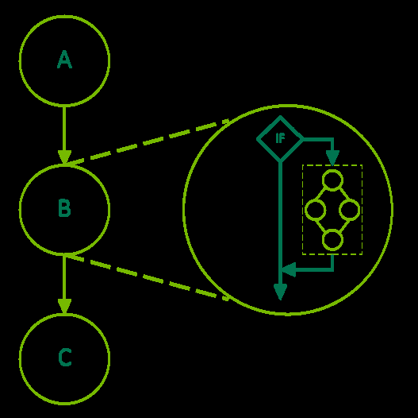

图 27：条件 IF 节点。

下面的代码展示了创建包含 IF 条件节点的图。条件值的默认值由上游核函数设置。条件的体图用图 API 填充。

```cpp
__global__ void setHandle(cudaGraphConditionalHandle handle, int value)
{
    ...
    // Set the condition value to the value passed to the kernel
    // 把条件值设为传给核函数的值
    cudaGraphSetConditional(handle, value);
    ...
}

void graphSetup() {
    cudaGraph_t graph;
    cudaGraphExec_t graphExec;
    cudaGraphNode_t node;
    void *kernelArgs[2];
    int value = 1;

    // Create the graph
    // 创建图
    cudaGraphCreate(&graph, 0);

    // Create the conditional handle; because no default value is provided,
    // the condition value is undefined at the start of each graph execution
    // 创建条件句柄；因为没有提供默认值，
    // 条件值在每次图执行开始时是未定义的
    cudaGraphConditionalHandle handle;
    cudaGraphConditionalHandleCreate(&handle, graph);

    // Use a kernel upstream of the conditional to set the handle value
    // 用条件上游的核函数设置句柄值
    cudaGraphNodeParams params = { cudaGraphNodeTypeKernel };
    params.kernel.func = (void *)setHandle;
    params.kernel.gridDim.x = params.kernel.gridDim.y = params.kernel.gridDim.z = 1;
    params.kernel.blockDim.x = params.kernel.blockDim.y = params.kernel.blockDim.z = 1;
    params.kernel.kernelParams = kernelArgs;
    kernelArgs[0] = &handle;
    kernelArgs[1] = &value;
    cudaGraphAddNode(&node, graph, nullptr, nullptr, 0, &params);

    // Create and add the conditional node
    // 创建并添加条件节点
    cudaGraphNodeParams cParams = { cudaGraphNodeTypeConditional };
    cParams.conditional.handle = handle;
    cParams.conditional.type    = cudaGraphCondTypeIf;
    cParams.conditional.size    = 1; // There is only an "if" body graph
                                    // 只有一个 "if" 体图
    cudaGraphAddNode(&node, graph, &node, nullptr, 1, &cParams);

    // Get the body graph of the conditional node
    // 获取条件节点的体图
    cudaGraph_t bodyGraph = cParams.conditional.phGraph_out[0];

    // Populate the body graph of the IF conditional node
    // 填充 IF 条件节点的体图
    ...
    cudaGraphAddNode(&node, bodyGraph, nullptr, nullptr, 0, &params);

    // Instantiate and launch the graph
    // 实例化并启动图
    cudaGraphInstantiate(&graphExec, graph, 0);
    cudaGraphLaunch(graphExec, 0);
    cudaDeviceSynchronize();

    // Clean up
    // 清理
    cudaGraphExecDestroy(graphExec);
    cudaGraphDestroy(graph);
}
```

IF 节点还可以有一个可选的第二个体图，当节点执行时条件值为零时执行一次。

```cpp
void graphSetup() {
    cudaGraph_t graph;
    cudaGraphExec_t graphExec;
    cudaGraphNode_t node;
    void *kernelArgs[2];
    int value = 1;

    // Create the graph
    // 创建图
    cudaGraphCreate(&graph, 0);

    // Create the conditional handle; because no default value is provided,
    // the condition value is undefined at the start of each graph execution
    // 创建条件句柄；因为没有提供默认值，
    // 条件值在每次图执行开始时是未定义的
    cudaGraphConditionalHandle handle;
    cudaGraphConditionalHandleCreate(&handle, graph);

    // Use a kernel upstream of the conditional to set the handle value
    // 用条件上游的核函数设置句柄值
    cudaGraphNodeParams params = { cudaGraphNodeTypeKernel };
    params.kernel.func = (void *)setHandle;
    params.kernel.gridDim.x = params.kernel.gridDim.y = params.kernel.gridDim.z = 1;
    params.kernel.blockDim.x = params.kernel.blockDim.y = params.kernel.blockDim.z = 1;
    params.kernel.kernelParams = kernelArgs;
    kernelArgs[0] = &handle;
    kernelArgs[1] = &value;
    cudaGraphAddNode(&node, graph, nullptr, nullptr, 0, &params);

    // Create and add the IF conditional node
    // 创建并添加 IF 条件节点
    cudaGraphNodeParams cParams = { cudaGraphNodeTypeConditional };
    cParams.conditional.handle = handle;
    cParams.conditional.type    = cudaGraphCondTypeIf;
    cParams.conditional.size    = 2; // There is both an "if" and an "else" body graph
                                    // 既有 "if" 体图也有 "else" 体图
    cudaGraphAddNode(&node, graph, &node, nullptr, 1, &cParams);

    // Get the body graphs of the conditional node
    // 获取条件节点的体图
    cudaGraph_t ifBodyGraph = cParams.conditional.phGraph_out[0];
    cudaGraph_t elseBodyGraph = cParams.conditional.phGraph_out[1];

    // Populate the body graphs of the IF conditional node
    // 填充 IF 条件节点的体图
    ...
    cudaGraphAddNode(&node, ifBodyGraph, nullptr, nullptr, 0, &params);
    ...
    cudaGraphAddNode(&node, elseBodyGraph, nullptr, nullptr, 0, &params);

    // Instantiate and launch the graph
    // 实例化并启动图
    cudaGraphInstantiate(&graphExec, graph, 0);
    cudaGraphLaunch(graphExec, 0);
    cudaDeviceSynchronize();

    // Clean up
    // 清理
    cudaGraphExecDestroy(graphExec);
    cudaGraphDestroy(graph);
}
```
### 4.2.4.4 条件 WHILE 节点

只要条件非零，WHILE 节点的体图就会被执行。条件在节点执行时以及体图完成后进行求值。下图描绘了一个 3 节点图，其中中间节点 B 是条件节点：

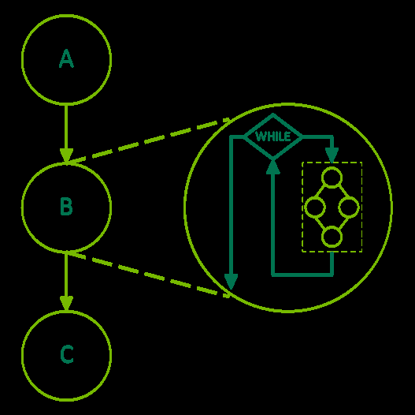

图 28：条件 WHILE 节点。

下面的代码展示了创建包含 WHILE 条件节点的图。句柄用 cudaGraphCondAssignDefault 创建，以避免需要上游核函数。条件的体图用图 API 填充。

```cpp
__global__ void loopKernel(cudaGraphConditionalHandle handle, char *dPtr)
{
    // Decrement the value of dPtr and set the condition value to 0 once dPtr is 0
    // 递减 dPtr 的值，一旦 dPtr 为 0 就把条件值设为 0
    if (--(*dPtr) == 0) {
        cudaGraphSetConditional(handle, 0);
    }
}

void graphSetup() {
    cudaGraph_t graph;
    cudaGraphExec_t graphExec;
    cudaGraphNode_t node;
    void *kernelArgs[2];

    // Allocate a byte of device memory to use as input
    // 分配一个字节的设备内存用作输入
    char *dPtr;
    cudaMalloc((void **)&dPtr, 1);

    // Create the graph
    // 创建图
    cudaGraphCreate(&graph, 0);

    // Create the conditional handle with a default value of 1
    // 创建条件句柄，默认值为 1
    cudaGraphConditionalHandle handle;
    cudaGraphConditionalHandleCreate(&handle, graph, 1, cudaGraphCondAssignDefault);

    // Create and add the WHILE conditional node
    // 创建并添加 WHILE 条件节点
    cudaGraphNodeParams cParams = { cudaGraphNodeTypeConditional };
    cParams.conditional.handle = handle;
    cParams.conditional.type    = cudaGraphCondTypeWhile;
    cParams.conditional.size    = 1;
    cudaGraphAddNode(&node, graph, nullptr, nullptr, 0, &cParams);

    // Get the body graph of the conditional node
    // 获取条件节点的体图
    cudaGraph_t bodyGraph = cParams.conditional.phGraph_out[0];

    // Populate the body graph of the conditional node
    // 填充条件节点的体图
    cudaGraphNodeParams params = { cudaGraphNodeTypeKernel };
    params.kernel.func = (void *)loopKernel;
    params.kernel.gridDim.x = params.kernel.gridDim.y = params.kernel.gridDim.z = 1;
    params.kernel.blockDim.x = params.kernel.blockDim.y = params.kernel.blockDim.z = 1;
    params.kernel.kernelParams = kernelArgs;
    kernelArgs[0] = &handle;
    kernelArgs[1] = &dPtr;
    cudaGraphAddNode(&node, bodyGraph, nullptr, nullptr, 0, &params);

    // Initialize device memory, instantiate, and launch the graph
    // 初始化设备内存，实例化并启动图
    cudaMemset(dPtr, 10, 1); // Set dPtr to 10; the loop will run until dPtr is 0
                             // 把 dPtr 设为 10；循环将运行直到 dPtr 为 0
    cudaGraphInstantiate(&graphExec, graph, 0);
    cudaGraphLaunch(graphExec, 0);
    cudaDeviceSynchronize();

    // Clean up
    // 清理
    cudaGraphExecDestroy(graphExec);
    cudaGraphDestroy(graph);
    cudaFree(dPtr);
}
```

### 4.2.4.5 条件 SWITCH 节点

当节点执行时，如果条件值等于 n，SWITCH 节点的零索引第 n 个体图将被执行一次。下图描绘了一个 3 节点图，其中中间节点 B 是条件节点：

下面的代码展示了创建包含 SWITCH 条件节点的图。条件值用上游核函数设置。条件的体图用图 API 填充。

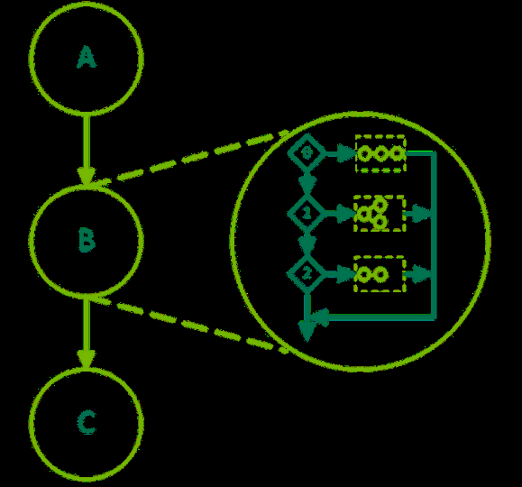

图 29：条件 SWITCH 节点。

```cpp
__global__ void setHandle(cudaGraphConditionalHandle handle, int value)
{
    ...
    // Set the condition value to the value passed to the kernel
    // 把条件值设为传给核函数的值
    cudaGraphSetConditional(handle, value);
    ...
}

void graphSetup() {
    cudaGraph_t graph;
    cudaGraphExec_t graphExec;
    cudaGraphNode_t node;
    void *kernelArgs[2];
    int value = 1;

    // Create the graph
    // 创建图
    cudaGraphCreate(&graph, 0);

    // Create the conditional handle; because no default value is provided,
    // the condition value is undefined at the start of each graph execution
    // 创建条件句柄；因为没有提供默认值，
    // 条件值在每次图执行开始时是未定义的
    cudaGraphConditionalHandle handle;
    cudaGraphConditionalHandleCreate(&handle, graph);

    // Use a kernel upstream of the conditional to set the handle value
    // 用条件上游的核函数设置句柄值
    cudaGraphNodeParams params = { cudaGraphNodeTypeKernel };
    params.kernel.func = (void *)setHandle;
    params.kernel.gridDim.x = params.kernel.gridDim.y = params.kernel.gridDim.z = 1;
    params.kernel.blockDim.x = params.kernel.blockDim.y = params.kernel.blockDim.z = 1;
    params.kernel.kernelParams = kernelArgs;
    kernelArgs[0] = &handle;
    kernelArgs[1] = &value;
    cudaGraphAddNode(&node, graph, nullptr, nullptr, 0, &params);

    // Create and add the conditional SWITCH node
    // 创建并添加条件 SWITCH 节点
    cudaGraphNodeParams cParams = { cudaGraphNodeTypeConditional };
    cParams.conditional.handle = handle;
    cParams.conditional.type    = cudaGraphCondTypeSwitch;
    cParams.conditional.size    = 5;
    cudaGraphAddNode(&node, graph, &node, nullptr, 1, &cParams);

    // Get the body graphs of the conditional node
    // 获取条件节点的体图
    cudaGraph_t *bodyGraphs = cParams.conditional.phGraph_out;

    // Populate the body graphs of the SWITCH conditional node
    // 填充 SWITCH 条件节点的体图
    ...
    cudaGraphAddNode(&node, bodyGraphs[0], nullptr, nullptr, 0, &params);
    ...
    cudaGraphAddNode(&node, bodyGraphs[4], NULL, 0, &params);

    // Instantiate and launch the graph
    // 实例化并启动图
    cudaGraphInstantiate(&graphExec, graph, 0);
    cudaGraphLaunch(graphExec, 0);
    cudaDeviceSynchronize();

    // Clean up
    // 清理
    cudaGraphExecDestroy(graphExec);
    cudaGraphDestroy(graph);
}
```

## 4.2.5 图内存节点

### 4.2.5.1 介绍

图内存节点允许图创建并拥有内存分配。图内存节点具有 GPU 有序生命周期语义，规定了内存何时允许在设备端被访问。这些 GPU 有序生命周期语义使驱动程序管理的内存复用成为可能，与流有序分配 API cudaMallocAsync 和 cudaFreeAsync 的语义一致（创建图时可以捕获这两个 API）。

图分配在图的整个生命周期内地址固定，包括重复的实例化和启动。这允许图中的其他操作直接引用该内存，无需图更新，即使 CUDA 更换了底层的物理内存。在一个图内，图有序生命周期不重叠的分配可以使用相同的底层物理内存。

CUDA 可以在多个图之间复用相同的物理内存，根据 GPU 有序生命周期语义对虚拟地址映射做别名（aliasing）。例如，当不同的图被启动到同一个流中时，CUDA 可以把相同的物理内存虚拟映射别名化，以满足那些单图生命周期的分配的需求。

### 4.2.5.2 API 基础

图内存节点是表示内存分配或释放动作的图节点。简而言之，分配内存的节点称为分配节点（allocation node）。同样，释放内存的节点称为释放节点（free node）。分配节点创建的分配称为图分配（graph allocation）。CUDA 在节点创建时为图分配指派虚拟地址。虽然这些虚拟地址在分配节点的生命周期内是固定的，但分配的内容在释放操作之后不保证保留，可能会被引用其他分配的访问覆盖。

图分配被视为每次图运行时重新创建。图分配的生命周期（不同于节点的生命周期）从 GPU 执行到达分配图节点时开始，到以下任一情况发生时结束：

- GPU 执行到达释放图节点
- GPU 执行到达释放的 cudaFreeAsync() 流调用
- 调用 cudaFree() 释放时立即结束

> 注：销毁图不会自动释放任何存活的图分配内存，即使它结束了分配节点的生命周期。该分配必须随后在另一个图中释放，或用 cudaFreeAsync()/cudaFree() 释放。

与其他图结构一样，图内存节点在图内按依赖边排序。程序必须保证访问图内存的操作：

- 排序在分配节点之后
- 排序在释放内存的操作之前

图分配的生命周期通常根据 GPU 执行开始和结束（而非 API 调用）。GPU 排序是指工作在 GPU 上运行的顺序，而不是工作排队或被描述的顺序。因此，图分配被认为是"GPU 有序"的。

#### 4.2.5.2.1 图节点 API

图内存节点可以用节点创建 API cudaGraphAddNode 显式创建。添加 cudaGraphNodeTypeMemAlloc 节点时分配的地址，通过传入的 cudaGraphNodeParams 结构体的 alloc::dptr 字段返回给用户。分配图内部使用图分配的所有操作必须排序在分配节点之后。同样，任何释放节点必须排序在图内对该分配的所有使用之后。释放节点用 cudaGraphAddNode 和 cudaGraphNodeTypeMemFree 节点类型创建。

下图中有一个带分配节点和释放节点的示例图。核函数节点 a、b、c 排序在分配节点之后、释放节点之前，因此这些核函数可以访问该分配。核函数节点 e 没有排序在分配节点之后，因此不能安全地访问该内存。核函数节点 d 没有排序在释放节点之前，因此不能安全地访问该内存。

下面的代码片段建立了图中的结构：

```cpp
// Create the graph - it starts out empty
// 创建图——图刚创建时是空的
cudaGraphCreate(&graph, 0);

// parameters for a basic allocation
// 基本分配的参数
cudaGraphNodeParams params = { cudaGraphNodeTypeMemAlloc };
params.alloc.poolProps.allocType = cudaMemAllocationTypePinned;
params.alloc.poolProps.location.type = cudaMemLocationTypeDevice;
// specify device 0 as the resident device
// 指定设备 0 为驻留设备
params.alloc.poolProps.location.id = 0;
params.alloc.bytesize = size;

cudaGraphAddNode(&allocNode, graph, NULL, NULL, 0, &params);

// create a kernel node that uses the graph allocation
// 创建一个使用图分配的核函数节点
cudaGraphNodeParams nodeParams = { cudaGraphNodeTypeKernel };
nodeParams.kernel.kernelParams[0] = params.alloc.dptr;
// ...set other kernel node parameters...
// ...设置其他核函数节点参数...

// add the kernel node to the graph
// 把核函数节点添加到图中
cudaGraphAddNode(&a, graph, &allocNode, NULL, 1, &nodeParams);
cudaGraphAddNode(&b, graph, &a, NULL, 1, &nodeParams);
cudaGraphAddNode(&c, graph, &a, NULL, 1, &nodeParams);
cudaGraphNode_t dependencies[2];
// kernel nodes b and c are using the graph allocation, so the freeing node must depend on them.
// Since the dependency of node b on node a establishes an indirect dependency,
// the free node does not need to explicitly depend on node a.
// 核函数节点 b 和 c 使用图分配，因此释放节点必须依赖它们。
// 由于节点 b 对节点 a 的依赖建立了间接依赖，
// 释放节点不需要显式依赖节点 a。
dependencies[0] = b;
dependencies[1] = c;
cudaGraphNodeParams freeNodeParams = { cudaGraphNodeTypeMemFree };
freeNodeParams.free.dptr = params.alloc.dptr;
cudaGraphAddNode(&freeNode, graph, dependencies, NULL, 2, freeNodeParams);
// free node does not depend on kernel node d, so it must not access the freed graph allocation.
// 释放节点不依赖核函数节点 d，因此它不得访问已被释放的图分配。
cudaGraphAddNode(&d, graph, &c, NULL, 1, &nodeParams);

// node e does not depend on the allocation node, so it must not access the allocation.
// This would be true even if the freeNode depended on kernel node e.
// 节点 e 不依赖分配节点，因此不得访问该分配。
// 即使 freeNode 依赖核函数节点 e，这一点仍然成立。
cudaGraphAddNode(&e, graph, NULL, NULL, 0, &nodeParams);
```

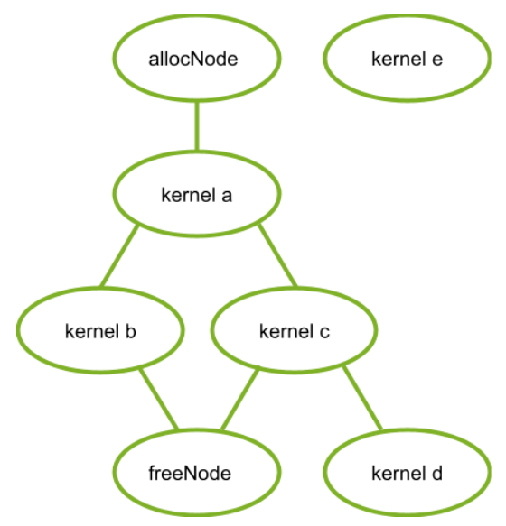

图 30：核函数节点。

#### 4.2.5.2.2 流捕获

图内存节点可以通过捕获对应的流有序分配和释放调用 cudaMallocAsync 和 cudaFreeAsync 来创建。在这种情况下，被捕获的分配 API 返回的虚拟地址可以被图中的其他操作使用。由于流有序依赖会被捕获到图中，流有序分配 API 的排序要求保证了图内存节点与被捕获的流操作之间正确排序（对于编写正确的流代码）。

为清晰起见忽略核函数节点 d 和 e，下面的代码片段展示了如何用流捕获创建上一节图中的结构：

```cpp
cudaMallocAsync(&dptr, size, stream1);
kernel_A<<< ..., stream1 >>>(dptr, ...);

// Fork into stream2
// 分叉到 stream2
cudaEventRecord(event1, stream1);
cudaStreamWaitEvent(stream2, event1);

kernel_B<<< ..., stream1 >>>(dptr, ...);
// event dependencies translated into graph dependencies, so the kernel node created by
// the capture of kernel C will depend on the allocation node created by capturing the cudaMallocAsync call.
// 事件依赖被转换为图依赖，因此捕获核函数 C 创建的核函数节点将依赖于
// 捕获 cudaMallocAsync 调用创建的分配节点。
kernel_C<<< ..., stream2 >>>(dptr, ...);

// Join stream2 back to origin stream (stream1)
// 把 stream2 汇回源流（stream1）
cudaEventRecord(event2, stream2);
cudaStreamWaitEvent(stream1, event2);

// Free depends on all work accessing the memory.
// 释放依赖于所有访问该内存的工作。
cudaFreeAsync(dptr, stream1);

// End capture in the origin stream
// 在源流中结束捕获
cudaStreamEndCapture(stream1, &graph);
```

#### 4.2.5.2.3 在分配图之外访问和释放图内存

图分配不一定非要由分配图释放。当图不释放分配时，该分配在图的执行之后仍然存在，可以被后续的 CUDA 操作访问。只要访问操作通过 CUDA 事件和其他流排序机制排序在分配之后，这些分配就可以在另一个图中被访问，或直接用流操作访问。分配随后可以用常规的 cudaFree、cudaFreeAsync 调用释放，或用另一个带对应释放节点的图的启动释放，也可以用分配图（如果它是用 cudaGraphInstantiateFlagAutoFreeOnLaunch 标志实例化的）的后续启动释放。在内存被释放后访问它是违法的——释放操作必须通过图依赖、CUDA 事件和其他流排序机制排序在所有访问内存的操作之后。

> 注：由于图分配可能共享底层物理内存，释放操作必须排序在所有设备端操作完成之后。带外同步（如计算核函数内的基于内存的同步）不足以建立内存写入与释放操作之间的排序。更多信息，请参见与一致性和连贯性相关的虚拟别名支持规则。

下面三个代码片段演示在分配图之外访问图分配，并分别用以下方式正确建立排序：使用单个流、在流之间使用事件，以及在分配图和释放图中使用内建事件。

第一种：用单个流建立排序：

```cpp
// Contents of allocating graph
// 分配图的内容
void *dptr;
cudaGraphNodeParams params = { cudaGraphNodeTypeMemAlloc };
params.alloc.poolProps.allocType = cudaMemAllocationTypePinned;
params.alloc.poolProps.location.type = cudaMemLocationTypeDevice;
params.alloc.bytesize = size;
cudaGraphAddNode(&allocNode, allocGraph, NULL, NULL, 0, &params);
dptr = params.alloc.dptr;

cudaGraphInstantiate(&allocGraphExec, allocGraph, 0);

cudaGraphLaunch(allocGraphExec, stream);
kernel<<< ..., stream >>>(dptr, ...);
cudaFreeAsync(dptr, stream);
```

第二种：用记录和等待 CUDA 事件建立排序：

```cpp
// Contents of allocating graph
// 分配图的内容
void *dptr;

cudaGraphAddNode(&allocNode, allocGraph, NULL, NULL, 0, &allocNodeParams);
dptr = allocNodeParams.alloc.dptr;

// contents of consuming/freeing graph
// 消费/释放图的内容
kernelNodeParams.kernel.kernelParams[0] = allocNodeParams.alloc.dptr;
cudaGraphAddNode(&freeNode, freeGraph, NULL, NULL, 1, dptr);

cudaGraphInstantiate(&allocGraphExec, allocGraph, 0);
cudaGraphInstantiate(&freeGraphExec, freeGraph, 0);

cudaGraphLaunch(allocGraphExec, allocStream);

// establish the dependency of stream2 on the allocation node
// note: the dependency could also have been established with a stream synchronize operation
// 建立 stream2 对分配节点的依赖
// 注：该依赖也可以用流同步操作建立
cudaEventRecord(allocEvent, allocStream);
cudaStreamWaitEvent(stream2, allocEvent);

kernel<<< ..., stream2 >>> (dptr, ...);

// establish the dependency between the stream 3 and the allocation use
// 建立 stream3 与分配使用之间的依赖
cudaStreamRecordEvent(streamUseDoneEvent, stream2);
cudaStreamWaitEvent(stream3, streamUseDoneEvent);

// it is now safe to launch the freeing graph, which may also access the memory
// 现在可以安全地启动释放图，它也可以访问该内存
cudaGraphLaunch(freeGraphExec, stream3);
```

第三种：用图外部事件节点建立排序：

```cpp
// Contents of allocating graph
// 分配图的内容
void *dptr;
cudaEvent_t allocEvent; // event indicating when the allocation will be ready for use.
                        // 指示分配何时就绪可用的事件。
cudaEvent_t streamUseDoneEvent; // event indicating when the stream operations are done with the allocation.
                                // 指示流操作何时用完分配的事件。

// Contents of allocating graph with event record node
// 带事件记录节点的分配图的内容
cudaGraphAddNode(&allocNode, allocGraph, NULL, NULL, 0, &allocNodeParams);
dptr = allocNodeParams.alloc.dptr;
// note: this event record node depends on the alloc node
// 注：该事件记录节点依赖于分配节点
cudaGraphNodeParams allocEventNodeParams = { cudaGraphNodeTypeEventRecord };
allocEventNodeParams.eventRecord.event = allocEvent;
cudaGraphAddNode(&recordNode, allocGraph, &allocNode, NULL, 1, allocEventNodeParams);

cudaGraphInstantiate(&allocGraphExec, allocGraph, 0);

// contents of consuming/freeing graph with event wait nodes
// 带事件等待节点的消费/释放图的内容
cudaGraphNodeParams streamWaitEventNodeParams = { cudaGraphNodeTypeEventWait };
streamWaitEventNodeParams.eventWait.event = streamUseDoneEvent;
cudaGraphAddNode(&streamUseDoneEventNode, waitAndFreeGraph, NULL, NULL, 0,
                 streamWaitEventNodeParams);

cudaGraphNodeParams allocWaitEventNodeParams = { cudaGraphNodeTypeEventWait };
allocWaitEventNodeParams.eventWait.event = allocEvent;
cudaGraphAddNode(&allocReadyEventNode, waitAndFreeGraph, NULL, NULL, 0,
                 allocWaitEventNodeParams);

kernelNodeParams->kernelParams[0] = allocNodeParams.alloc.dptr;

// The allocReadyEventNode provides ordering with the alloc node for use in a consuming graph.
// allocReadyEventNode 为消费图中的使用提供与分配节点的排序。
cudaGraphAddNode(&kernelNode, waitAndFreeGraph, &allocReadyEventNode, NULL, 1,
                 &kernelNodeParams);

// The free node has to be ordered after both external and internal users.
// Thus the node must depend on both the kernelNode and the streamUseDoneEventNode.
// 释放节点必须排序在外部和内部使用者之后。
// 因此该节点必须同时依赖 kernelNode 和 streamUseDoneEventNode。
dependencies[0] = kernelNode;
dependencies[1] = streamUseDoneEventNode;

cudaGraphNodeParams freeNodeParams = { cudaGraphNodeTypeMemFree };
freeNodeParams.free.dptr = dptr;
cudaGraphAddNode(&freeNode, waitAndFreeGraph, &dependencies, NULL, 2, freeNodeParams);

cudaGraphInstantiate(&waitAndFreeGraphExec, waitAndFreeGraph, 0);

cudaGraphLaunch(allocGraphExec, allocStream);

// establish the dependency of stream2 on the event node satisfies the ordering requirement
// 建立 stream2 对事件节点的依赖，满足排序要求
cudaStreamWaitEvent(stream2, allocEvent);
kernel<<< ..., stream2 >>> (dptr, ...);
cudaStreamRecordEvent(streamUseDoneEvent, stream2);

// the event wait node in the waitAndFreeGraphExec establishes the dependency on the "readyForFreeEvent"
// that is needed to prevent the kernel running in stream two from accessing the allocation after
// the free node in execution order.
// waitAndFreeGraphExec 中的事件等待节点建立了对 "readyForFreeEvent" 的依赖，
// 这是防止在执行顺序上运行在流二中的核函数在释放节点之后访问该分配所必需的。
cudaGraphLaunch(waitAndFreeGraphExec, stream3);
```

#### 4.2.5.2.4 cudaGraphInstantiateFlagAutoFreeOnLaunch

正常情况下，如果图有未释放的内存分配，CUDA 会阻止该图被重新启动，因为在相同地址上的多次分配会泄漏内存。用 cudaGraphInstantiateFlagAutoFreeOnLaunch 标志实例化图允许图在仍有未释放分配的情况下被重新启动。此时，启动会自动插入对未释放分配的异步释放。

启动时自动释放在单生产者多消费者算法中很有用。在每次迭代中，生产者图创建多个分配，根据运行时条件，数量不定的消费者访问这些分配。这种可变的执行顺序意味着消费者不能释放这些分配，因为后续的消费者可能还需要访问。启动时自动释放意味着启动循环不需要跟踪生产者的分配——这些信息只保留在生产者的创建和销毁逻辑中。一般来说，启动时自动释放简化了那些原本需要在每次重新启动前释放图拥有的所有分配的算法。

> 注：cudaGraphInstantiateFlagAutoFreeOnLaunch 标志不改变图销毁的行为。即使图是用该标志实例化的，应用程序也必须显式释放未释放的内存以避免内存泄漏。下面的代码展示了用 cudaGraphInstantiateFlagAutoFreeOnLaunch 简化单生产者/多消费者算法：

```cpp
// Create producer graph which allocates memory and populates it with data
// 创建分配内存并填充数据的生产者图
cudaStreamBeginCapture(cudaStreamPerThread, cudaStreamCaptureModeGlobal);
cudaMallocAsync(&data1, blocks * threads, cudaStreamPerThread);
cudaMallocAsync(&data2, blocks * threads, cudaStreamPerThread);
produce<<<blocks, threads, 0, cudaStreamPerThread>>>(data1, data2);
...
cudaStreamEndCapture(cudaStreamPerThread, &graph);
cudaGraphInstantiateWithFlags(&producer,
                               graph,
                               cudaGraphInstantiateFlagAutoFreeOnLaunch);
cudaGraphDestroy(graph);

// Create first consumer graph by capturing an asynchronous library call
// 通过捕获异步库调用创建第一个消费者图
cudaStreamBeginCapture(cudaStreamPerThread, cudaStreamCaptureModeGlobal);
consumerFromLibrary(data1, cudaStreamPerThread);
cudaStreamEndCapture(cudaStreamPerThread, &graph);
cudaGraphInstantiateWithFlags(&consumer1, graph, 0); //regular instantiation
                                                    //常规实例化
cudaGraphDestroy(graph);

// Create second consumer graph
// 创建第二个消费者图
cudaStreamBeginCapture(cudaStreamPerThread, cudaStreamCaptureModeGlobal);
consume2<<<blocks, threads, 0, cudaStreamPerThread>>>(data2);
...
cudaStreamEndCapture(cudaStreamPerThread, &graph);
cudaGraphInstantiateWithFlags(&consumer2, graph, 0);
cudaGraphDestroy(graph);

// Launch in a loop
// 在循环中启动
bool launchConsumer2 = false;
do {
     cudaGraphLaunch(producer, myStream);
     cudaGraphLaunch(consumer1, myStream);
     if (launchConsumer2) {
         cudaGraphLaunch(consumer2, myStream);
     }
} while (determineAction(&launchConsumer2));

cudaFreeAsync(data1, myStream);
cudaFreeAsync(data2, myStream);

cudaGraphExecDestroy(producer);
cudaGraphExecDestroy(consumer1);
cudaGraphExecDestroy(consumer2);
```

#### 4.2.5.2.5 子图中的内存节点

CUDA 12.9 引入了把子图所有权移交给父图的能力。被移交的子图允许包含内存分配和释放节点。这使得包含分配或释放节点的子图可以在被添加到父图之前独立构建。

被移交后，子图适用以下限制：

- 不能被独立实例化或销毁。
- 不能作为另一个父图的子图添加。
- 不能用作 cuGraphExecUpdate 的参数。
- 不能再添加内存分配或释放节点。

```cpp
// Create the child graph
// 创建子图
cudaGraphCreate(&child, 0);

// parameters for a basic allocation
// 基本分配的参数
cudaGraphNodeParams allocNodeParams = { cudaGraphNodeTypeMemAlloc };
allocNodeParams.alloc.poolProps.allocType = cudaMemAllocationTypePinned;
allocNodeParams.alloc.poolProps.location.type = cudaMemLocationTypeDevice;
// specify device 0 as the resident device
// 指定设备 0 为驻留设备
allocNodeParams.alloc.poolProps.location.id = 0;
allocNodeParams.alloc.bytesize = size;

cudaGraphAddNode(&allocNode, child, NULL, NULL, 0, &allocNodeParams);
// Additional nodes using the allocation could be added here
// 使用该分配的其他节点可以加在这里
cudaGraphNodeParams freeNodeParams = { cudaGraphNodeTypeMemFree };
freeNodeParams.free.dptr = allocNodeParams.alloc.dptr;
cudaGraphAddNode(&freeNode, child, &allocNode, NULL, 1, freeNodeParams);

// Create the parent graph
// 创建父图
cudaGraphCreate(&parent, 0);

// Move the child graph to the parent graph
// 把子图移交给父图
cudaGraphNodeParams childNodeParams = { cudaGraphNodeTypeGraph };
childNodeParams.graph.graph = child;
childNodeParams.graph.ownership = cudaGraphChildGraphOwnershipMove;
cudaGraphAddNode(&parentNode, parent, NULL, NULL, 0, &childNodeParams);
```

### 4.2.5.3 优化的内存复用

CUDA 通过两种方式复用内存：

- 图内的虚拟和物理内存复用基于虚拟地址指派，与流有序分配器相同。
- 图之间的物理内存复用通过虚拟别名实现：不同的图可以把相同的物理内存映射到各自唯一的虚拟地址。

#### 4.2.5.3.1 图内的地址复用

CUDA 可以在图内复用内存，为生命周期不重叠的不同分配指派相同的虚拟地址范围。由于虚拟地址可能被复用，指向生命周期不相交的不同分配的指针不保证唯一。

下图展示了添加一个新的分配节点（2），它可以复用被依赖节点（1）释放的地址。

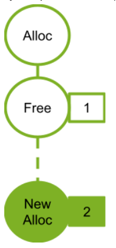

图 31：添加新分配节点 2。

下图展示了添加一个新的分配节点（4）。新分配节点不依赖释放节点（2），因此不能复用关联的分配节点（2）的地址。如果分配节点（2）使用了被释放节点（1）释放的地址，那么新的分配节点 3 就需要一个新地址。

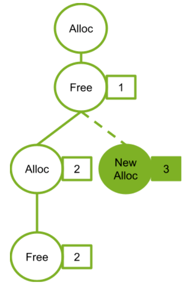

图 32：添加新分配节点 3。

#### 4.2.5.3.2 物理内存管理与共享

CUDA 负责在 GPU 执行顺序上到达分配节点之前，把物理内存映射到虚拟地址。作为内存占用和映射开销方面的优化，如果多个图不会同时运行，它们可以使用相同的物理内存进行不同的分配；但是，如果物理页同时绑定到多个正在执行的图，或绑定到保持未释放的图分配，就不能复用。

CUDA 可以在图实例化、启动或执行期间的任何时候更新物理内存映射。CUDA 也可能在未来的图启动之间引入同步，以防止存活的图分配引用相同的物理内存。与任何分配-释放-再分配模式一样，如果程序在分配的生命周期之外访问指针，错误的访问可能静默地读取或写入属于另一个分配的存活数据（即使该分配的虚拟地址是唯一的）。使用计算消毒工具（compute sanitizer）可以捕获这类错误。

下图展示了在同一个流中顺序启动的图。在本例中，每个图释放了它分配的所有内存。由于同一流中的图永远不会并发运行，CUDA 可以也应该使用相同的物理内存满足所有分配。

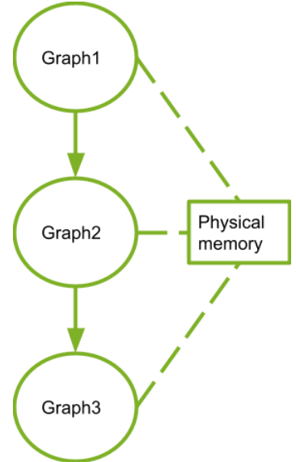

图 33：顺序启动的图。

### 4.2.5.4 性能考量

当多个图被启动到同一个流中时，CUDA 会尝试把相同的物理内存分配给它们，因为这些图的执行不可能重叠。图的物理映射在多次启动之间保留，作为避免重新映射成本的优化。如果之后其中一个图被启动到可能与其他图执行重叠的位置（例如被启动到不同的流中），CUDA 必须执行一些重新映射，因为并发的图需要不同的内存以避免数据损坏。

一般来说，CUDA 中的图内存重新映射可能由以下操作引起：

- 改变图被启动到的流
- 对图内存池的整理（trim）操作，它显式释放未使用的内存（在"物理内存占用"中讨论）
- 在另一个图的未释放分配映射到相同内存时重新启动图，会在重新启动前导致内存重新映射

重新映射必须按执行顺序发生，但在该图的任何前次执行完成之后（否则仍在使用的内存可能被取消映射）。由于这种排序依赖，以及映射操作是操作系统调用，映射操作可能相对昂贵。应用程序可以通过始终把包含分配内存节点的图启动到同一个流中来避免这笔成本。

#### 4.2.5.4.1 首次启动 / cudaGraphUpload

由于图将执行的流在实例化时未知，物理内存不能在图实例化期间分配或映射。映射在图启动期间完成。调用 cudaGraphUpload 可以把分配成本从启动中分离出来：立即为该图执行所有映射，并把图与上传流关联。如果图随后被启动到同一个流中，启动时不会有额外的重新映射。

对图上传和图启动使用不同的流，其行为类似于切换流，很可能导致重新映射操作。此外，无关的内存池管理被允许从空闲流中抽走内存，这可能抵消上传的效果。

### 4.2.5.5 物理内存占用

异步分配的池管理行为意味着，销毁包含内存节点的图（即使其分配已被释放）不会立即把物理内存归还给操作系统供其他进程使用。要显式地把内存释放回操作系统，应用程序应使用 cudaDeviceGraphMemTrim API。

cudaDeviceGraphMemTrim 会取消映射并释放图内存节点保留的、当前未被积极使用的任何物理内存。尚未释放的分配以及已调度或正在运行的图被视为正在积极使用物理内存，不受影响。使用整理 API 会使物理内存可供其他分配 API 以及其他应用或进程使用，但当被整理的图下次启动时，CUDA 会重新分配和重新映射内存。注意 cudaDeviceGraphMemTrim 操作的是与 cudaMemPoolTrimTo() 不同的池。图内存池不对流有序内存分配器暴露。CUDA 允许应用程序通过 cudaDeviceGetGraphMemAttribute API 查询其图内存占用。查询 cudaGraphMemAttrReservedMemCurrent 属性返回驱动程序在当前进程中为图分配保留的物理内存量。查询 cudaGraphMemAttrUsedMemCurrent 属性返回当前至少被一张图映射的物理内存量。这两个属性都可以用来跟踪 CUDA 何时为分配图获取新的物理内存。这两个属性都有助于检查共享机制节省了多少内存。

### 4.2.5.6 对等访问

图分配可以配置为从多个 GPU 访问，此时 CUDA 会根据需要把分配映射到对等 GPU 上。CUDA 允许需要不同映射的图分配复用相同的虚拟地址。当这种情况发生时，地址范围被映射到不同分配所需的所有 GPU 上。这意味着分配有时可能允许比创建时请求更多的对等访问；但是，依赖这些额外的映射仍然是错误的。

#### 4.2.5.6.1 用图节点 API 实现对等访问

cudaGraphAddNode API 在分配节点参数结构体的 accessDescs 数组字段中接受映射请求。嵌入的 poolProps.location 结构指定分配的驻留设备。访问分配 GPU 被假定为必需，因此应用程序不需要在 accessDescs 数组中为驻留设备指定条目。

```cpp
cudaGraphNodeParams allocNodeParams = { cudaGraphNodeTypeMemAlloc };
allocNodeParams.alloc.poolProps.allocType = cudaMemAllocationTypePinned;
allocNodeParams.alloc.poolProps.location.type = cudaMemLocationTypeDevice;
// specify device 1 as the resident device
// 指定设备 1 为驻留设备
allocNodeParams.alloc.poolProps.location.id = 1;
allocNodeParams.alloc.bytesize = size;

// allocate an allocation resident on device 1 accessible from device 1
// 分配一个驻留在设备 1、可从设备 1 访问的分配
cudaGraphAddNode(&allocNode, graph, NULL, NULL, 0, &allocNodeParams);

cudaMemAccessDesc accessDescs[2];
// boilerplate for the access descs (only ReadWrite and Device access supported by the add node api)
// access descs 的样板代码（add node api 仅支持 ReadWrite 和 Device 访问）
accessDescs[0].flags = cudaMemAccessFlagsProtReadWrite;
accessDescs[0].location.type = cudaMemLocationTypeDevice;
accessDescs[1].flags = cudaMemAccessFlagsProtReadWrite;
accessDescs[1].location.type = cudaMemLocationTypeDevice;

// access being requested for device 0 & 2. Device 1 access requirement left implicit.
// 为设备 0 和 2 请求访问。设备 1 的访问需求保持隐含。
accessDescs[0].location.id = 0;
accessDescs[1].location.id = 2;

// access request array has 2 entries.
// 访问请求数组有 2 个条目。
allocNodeParams.accessDescCount = 2;
allocNodeParams.accessDescs = accessDescs;

// allocate an allocation resident on device 1 accessible from devices 0, 1 and 2.
// (0 & 2 from the descriptors, 1 from it being the resident device).
// 分配一个驻留在设备 1、可从设备 0、1 和 2 访问的分配。
// （0 和 2 来自描述符，1 来自它是驻留设备。）
cudaGraphAddNode(&allocNode, graph, NULL, NULL, 0, &allocNodeParams);
```

#### 4.2.5.6.2 用流捕获实现对等访问

对于流捕获，分配节点记录捕获时分配池的对等可访问性。在 cudaMallocFromPoolAsync 调用被捕获之后更改分配池的对等可访问性，不会影响图为该分配建立的映射。

```cpp
// boilerplate for the access descs (only ReadWrite and Device access supported by the add node api)
// access desc 的样板代码（add node api 仅支持 ReadWrite 和 Device 访问）
accessDesc.flags = cudaMemAccessFlagsProtReadWrite;
accessDesc.location.type = cudaMemLocationTypeDevice;
accessDesc.location.id = 1;

// let memPool be resident and accessible on device 0
// 让 memPool 驻留并可访问于设备 0
cudaStreamBeginCapture(stream);
cudaMallocFromPoolAsync(&dptr1, size, memPool, stream);
cudaStreamEndCapture(stream, &graph1);

cudaMemPoolSetAccess(memPool, &accessDesc, 1);

cudaStreamBeginCapture(stream);
cudaMallocFromPoolAsync(&dptr2, size, memPool, stream);
cudaStreamEndCapture(stream, &graph2);

//The graph node allocating dptr1 would only have the device 0 accessibility
//even though memPool now has device 1 accessibility.
//分配 dptr1 的图节点只会具有设备 0 的可访问性，
//即使 memPool 现在具有设备 1 的可访问性。

//The graph node allocating dptr2 will have device 0 and device 1 accessibility,
// since that was the pool accessibility at the time of the cudaMallocFromPoolAsync call.
//分配 dptr2 的图节点将具有设备 0 和设备 1 的可访问性，
//因为那是 cudaMallocFromPoolAsync 调用时池的可访问性。
```
## 4.2.6 设备端图启动

有许多工作流需要在运行时做出数据相关的决策，并根据这些决策执行不同的操作。与其把决策过程交给主机端（这可能需要一次设备往返），不如在设备端完成。CUDA 为此提供了从设备端启动图的机制。

设备端图启动提供了一种便捷的方式来从设备端执行动态控制流，可以像循环这样简单，也可以像设备端工作调度器这样复杂。

可以从设备端启动的图下文称为设备图（device graph），不能从设备端启动的图称为主机图（host graph）。

设备图可以从主机端和设备端启动，而主机图只能从主机端启动。与主机端启动不同，在前一次启动仍在运行时从设备端启动设备图会出错，返回 cudaErrorInvalidValue；因此，设备图不能同时从设备端被启动两次。从主机端和设备端同时启动设备图会导致未定义行为。

### 4.2.6.1 设备图创建

要使图可以从设备端启动，必须显式地为设备端启动实例化它。这通过向 cudaGraphInstantiate() 调用传递 cudaGraphInstantiateFlagDeviceLaunch 标志实现。与主机图一样，设备图的结构在实例化时固定，未经重新实例化不能更新，且实例化只能在主机端进行。要使图能够为设备端启动而实例化，它必须满足多项要求。

#### 4.2.6.1.1 设备图要求

通用要求：

- 图的所有节点必须位于单个设备上。
- 图只能包含核函数节点、memcpy 节点、memset 节点和子图节点。

核函数节点：

- 图中的核函数不允许使用 CUDA 动态并行。
- 只要不使用 MPS，协作式启动是允许的。

Memcpy 节点：

- 只允许涉及设备内存和/或固定的设备映射主机内存的拷贝。
- 不允许涉及 CUDA 数组的拷贝。
- 在实例化时，两个操作数必须能从当前设备访问。注意拷贝操作将从图所在的设备执行，即使它针对的是另一个设备上的内存。

#### 4.2.6.1.2 设备图上传

要在设备端启动图，必须先把它上传到设备以填充必需的设备端资源。有两种方式实现。

第一，可以显式上传，通过 cudaGraphUpload()，或通过 cudaGraphInstantiateWithParams() 把上传作为实例化的一部分请求。

第二，可以先从主机端启动图，上传步骤会作为启动的一部分隐式完成。

下面是三种方法的示例：

```cpp
// Explicit upload after instantiation
// 实例化后显式上传
cudaGraphInstantiate(&deviceGraphExec1, deviceGraph1,
                     cudaGraphInstantiateFlagDeviceLaunch);

cudaGraphUpload(deviceGraphExec1, stream);

// Explicit upload as part of instantiation
// 作为实例化的一部分显式上传
cudaGraphInstantiateParams instantiateParams = {0};
instantiateParams.flags = cudaGraphInstantiateFlagDeviceLaunch |
                          cudaGraphInstantiateFlagUpload;

instantiateParams.uploadStream = stream;
cudaGraphInstantiateWithParams(&deviceGraphExec2, deviceGraph2,
                               &instantiateParams);

// Implicit upload via host launch
// 通过主机端启动隐式上传
cudaGraphInstantiate(&deviceGraphExec3, deviceGraph3,
                     cudaGraphInstantiateFlagDeviceLaunch);

cudaGraphLaunch(deviceGraphExec3, stream);
```

#### 4.2.6.1.3 设备图更新

设备图只能从主机端更新，且在可执行图更新后必须重新上传到设备，更改才会生效。可以用 4.2.6.1.2 节（设备图上传）概述的相同方法实现。与主机图不同，在应用更新期间从设备端启动设备图会导致未定义行为。

### 4.2.6.2 设备端启动

设备图可以从主机端和设备端通过 cudaGraphLaunch() 启动，该函数在设备端的签名与主机端相同。设备图在主机端和设备端用同一个句柄启动。设备图从设备端启动时必须从另一个图内部启动。

设备端图启动是按线程的（per-thread），多个线程可能同时启动，因此用户需要选择单个线程来启动给定的图。

与主机端启动不同，设备图不能被启动到常规 CUDA 流中，只能被启动到不同的命名流中，每个命名流表示一种特定的启动模式。下表列出了可用的启动模式。

表 9：仅设备端图启动流

| 流 | 启动模式 |
|---|---|
| cudaStreamGraphFireAndForget | 发射后不管（fire and forget）启动 |
| cudaStreamGraphTailLaunch | 尾启动 |
| cudaStreamGraphFireAndForgetAsSibling | 兄弟启动 |

#### 4.2.6.2.1 发射后不管启动

顾名思义，发射后不管（fire and forget）启动会立即提交到 GPU，并独立于启动图运行。在发射后不管场景中，启动图是父图，被启动的图是子图。

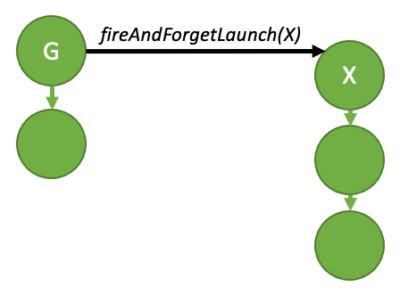

图 34：发射后不管启动。

上面的图可以用下面的示例代码生成：

```cpp
__global__ void launchFireAndForgetGraph(cudaGraphExec_t graph) {
    cudaGraphLaunch(graph, cudaStreamGraphFireAndForget);
}

void graphSetup() {
    cudaGraphExec_t gExec1, gExec2;
    cudaGraph_t g1, g2;

    // Create, instantiate, and upload the device graph.
    // 创建、实例化并上传设备图。
    create_graph(&g2);
    cudaGraphInstantiate(&gExec2, g2, cudaGraphInstantiateFlagDeviceLaunch);
    cudaGraphUpload(gExec2, stream);

    // Create and instantiate the launching graph.
    // 创建并实例化启动图。
    cudaStreamBeginCapture(stream, cudaStreamCaptureModeGlobal);
    launchFireAndForgetGraph<<<1, 1, 0, stream>>>(gExec2);
    cudaStreamEndCapture(stream, &g1);
    cudaGraphInstantiate(&gExec1, g1, 0);

    // Launch the host graph, which will in turn launch the device graph.
    // 启动主机图，它进而启动设备图。
    cudaGraphLaunch(gExec1, stream);
}
```

一张图在执行期间最多可以有 120 个发射后不管图。该总数在同一父图的多次启动之间重置。

##### 4.2.6.2.1.1 图执行环境

要完全理解设备端同步模型，首先需要理解执行环境（execution environment）的概念。

当图从设备端启动时，它被启动到自己的执行环境中。给定图的执行环境封装了图中的所有工作以及所有产生的发射后不管工作。当图已完成执行且所有生成的子工作都完成时，该图被视为完成。

下图展示了上一节发射后不管示例代码会产生的环境封装。

这些环境也是分层的，因此图环境可以包含来自发射后不管启动的多层子环境。

当图从主机端启动时，存在一个流环境，它是被启动图的执行环境的父环境。流环境封装了作为整体启动一部分生成的所有工作。当整体流环境被标记为完成时，流启动完成（即下游依赖的工作现在可以运行）。

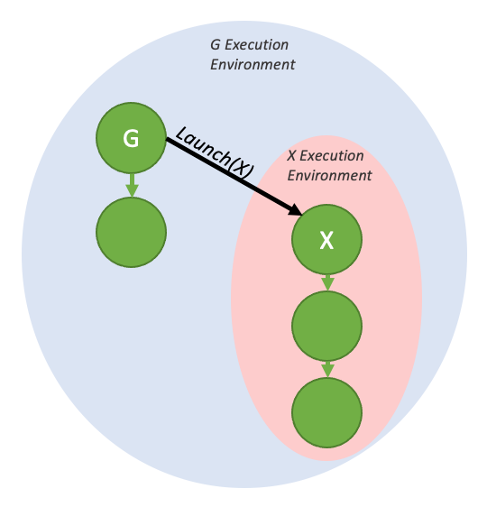

图 35：发射后不管启动及执行环境。

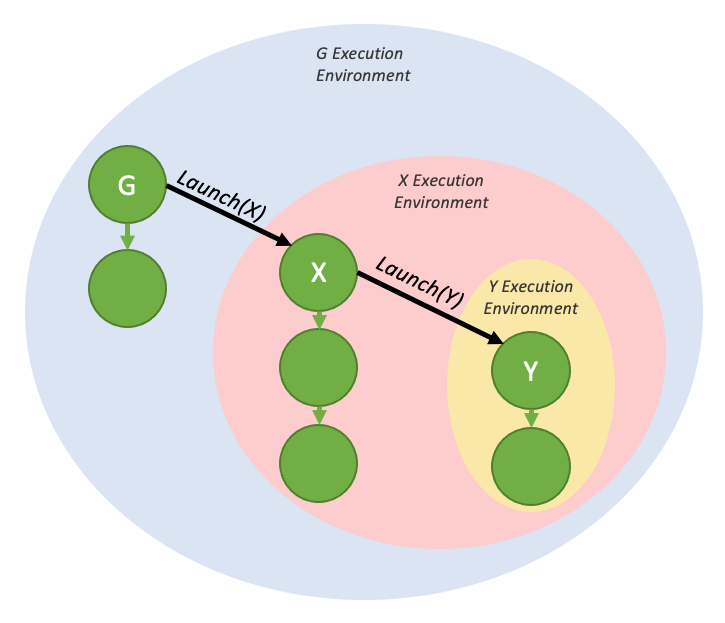

图 36：嵌套的发射后不管环境。

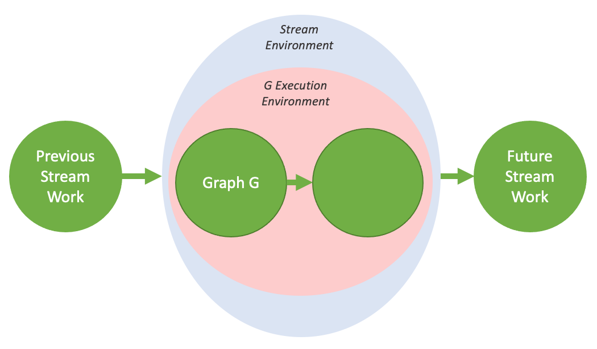

图 37：流环境示意图。

#### 4.2.6.2.2 尾启动

与主机端不同，无法从 GPU 通过传统方法（如 cudaDeviceSynchronize() 或 cudaStreamSynchronize()）与设备图同步。因此，为支持串行工作依赖，提供了一种不同的启动模式——尾启动（tail launch），以提供类似的功能。

尾启动在图的执行环境被视为完成时执行——即图及其所有子图完成时。当图完成时，尾启动列表中下一个图的环境将取代已完成的环境，成为父环境的子环境。与发射后不管启动一样，一张图可以排队多个尾启动图。

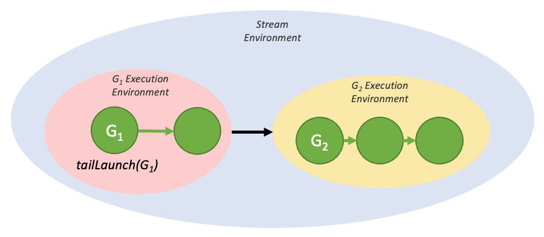

图 38：简单的尾启动。

上面的执行流可以用下面的代码生成：

```cpp
__global__ void launchTailGraph(cudaGraphExec_t graph) {
    cudaGraphLaunch(graph, cudaStreamGraphTailLaunch);
}

void graphSetup() {
    cudaGraphExec_t gExec1, gExec2;
    cudaGraph_t g1, g2;

    // Create, instantiate, and upload the device graph.
    // 创建、实例化并上传设备图。
    create_graph(&g2);
    cudaGraphInstantiate(&gExec2, g2, cudaGraphInstantiateFlagDeviceLaunch);
    cudaGraphUpload(gExec2, stream);

    // Create and instantiate the launching graph.
    // 创建并实例化启动图。
    cudaStreamBeginCapture(stream, cudaStreamCaptureModeGlobal);
    launchTailGraph<<<1, 1, 0, stream>>>(gExec2);
    cudaStreamEndCapture(stream, &g1);
    cudaGraphInstantiate(&gExec1, g1, 0);

    // Launch the host graph, which will in turn launch the device graph.
    // 启动主机图，它进而启动设备图。
    cudaGraphLaunch(gExec1, stream);
}
```

给定图排队的尾启动将按排队顺序一次执行一个。因此，第一个排队的图先运行，然后是第二个，依此类推。

尾图排队的尾启动将在尾启动列表中之前的图排队的尾启动之前执行。这些新的尾启动按排队顺序执行。

一张图最多可以有 255 个待处理的尾启动。

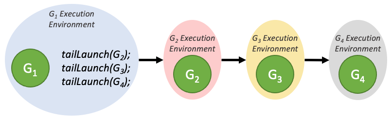

图 39：尾启动顺序。

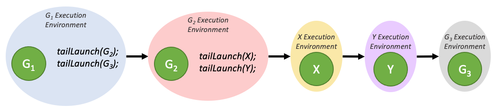

图 40：从多个图排队时的尾启动顺序。

##### 4.2.6.2.2.1 尾自启动

设备图可以把自己排队为尾启动，但给定图一次只能有一个自启动排队。为了查询当前运行的设备图以便重新启动它，新增了一个设备端函数：

```cpp
cudaGraphExec_t cudaGetCurrentGraphExec();
```

如果当前运行的是设备图，该函数返回当前运行图的句柄。如果当前执行的核函数不是设备图内的节点，该函数返回 NULL。

下面是使用该函数实现重新启动循环的示例代码：

```cpp
__device__ int relaunchCount = 0;

__global__ void relaunchSelf() {
    int relaunchMax = 100;

    if (threadIdx.x == 0) {
        if (relaunchCount < relaunchMax) {
            cudaGraphLaunch(cudaGetCurrentGraphExec(),
                            cudaStreamGraphTailLaunch);
        }

        relaunchCount++;
    }
}
```

#### 4.2.6.2.3 兄弟启动

兄弟启动（sibling launch）是发射后不管启动的一种变体：图不是被启动为启动图的执行环境的子图，而是被启动为启动图的父环境的子图。兄弟启动等同于从启动图的父环境进行的发射后不管启动。

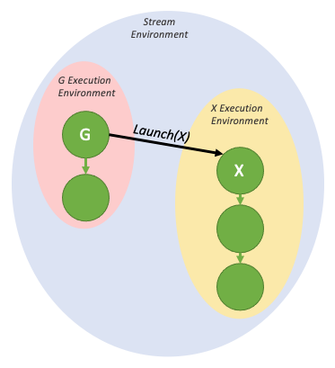

图 41：简单的兄弟启动。

上面的图可以用下面的示例代码生成：

```cpp
__global__ void launchSiblingGraph(cudaGraphExec_t graph) {
    cudaGraphLaunch(graph, cudaStreamGraphFireAndForgetAsSibling);
}

void graphSetup() {
    cudaGraphExec_t gExec1, gExec2;
    cudaGraph_t g1, g2;

    // Create, instantiate, and upload the device graph.
    // 创建、实例化并上传设备图。
    create_graph(&g2);
    cudaGraphInstantiate(&gExec2, g2, cudaGraphInstantiateFlagDeviceLaunch);
    cudaGraphUpload(gExec2, stream);

    // Create and instantiate the launching graph.
    // 创建并实例化启动图。
    cudaStreamBeginCapture(stream, cudaStreamCaptureModeGlobal);
    launchSiblingGraph<<<1, 1, 0, stream>>>(gExec2);
    cudaStreamEndCapture(stream, &g1);
    cudaGraphInstantiate(&gExec1, g1, 0);

    // Launch the host graph, which will in turn launch the device graph.
    // 启动主机图，它进而启动设备图。
    cudaGraphLaunch(gExec1, stream);
}
```

由于兄弟启动不是启动到启动图的执行环境中，它们不会阻挡（gate）启动图排队的尾启动。

## 4.2.7 使用图 API

cudaGraph_t 对象不是线程安全的。用户有责任确保多个线程不并发访问同一个 cudaGraph_t。

cudaGraphExec_t 不能与自身并发运行。cudaGraphExec_t 的启动将排序在同一可执行图的之前启动之后。

图执行在流中进行，以便与其他异步工作排序。但是，流仅用于排序；它不约束图的内部并行度，也不影响图节点在哪里执行。

参见图 API（Graph API）。

## 4.2.8 CUDA 用户对象

CUDA 用户对象（CUDA User Objects）可用于帮助管理 CUDA 中异步工作使用的资源的生命周期。该特性尤其适用于 CUDA 图和流捕获。

多种资源管理方案与 CUDA 图不兼容。例如基于事件的池，或同步创建、异步销毁的方案。

```cpp
// Library API with pool allocation
// 使用池分配的库 API
void libraryWork(cudaStream_t stream) {
    auto &resource = pool.claimTemporaryResource();
    resource.waitOnReadyEventInStream(stream);
    launchWork(stream, resource);
    resource.recordReadyEvent(stream);
}

// Library API with asynchronous resource deletion
// 异步删除资源的库 API
void libraryWork(cudaStream_t stream) {
    Resource *resource = new Resource(...);
    launchWork(stream, resource);
    cudaLaunchHostFunc(
        stream,
        [](void *resource) {
             delete static_cast<Resource *>(resource);
         },
         resource,
         0);
     // Error handling considerations not shown
     // 未展示错误处理方面的考虑
}
```

这些方案在 CUDA 图中很困难，因为资源的非固定指针或句柄需要间接层或图更新，而且每次提交工作都需要同步的 CPU 代码。如果库调用者看不到这些考虑，它们也无法与流捕获配合使用，还因为在捕获期间使用了不允许的 API。存在多种解决方案，例如把资源暴露给调用者。CUDA 用户对象是另一种方法。

CUDA 用户对象把用户指定的析构回调与内部引用计数关联起来，类似于 C++ 的 shared_ptr。引用可以由 CPU 上的用户代码持有，也可以由 CUDA 图持有。注意，与 C++ 智能指针不同，用户持有的引用没有代表该引用的对象；用户必须手动跟踪用户持有的引用。典型用例是创建用户对象后立即把唯一的、用户持有的引用转移到 CUDA 图。

当引用与 CUDA 图关联时，CUDA 会自动管理图操作。克隆的 cudaGraph_t 保留源 cudaGraph_t 拥有的每个引用的副本，数量相同。实例化的 cudaGraphExec_t 保留源 cudaGraph_t 中每个引用的副本。当 cudaGraphExec_t 在未同步的情况下被销毁时，引用会被保留直到执行完成。

下面是一个使用示例。

```cpp
cudaGraph_t graph;        // Preexisting graph
                          // 已存在的图

Object *object = new Object; // C++ object with possibly nontrivial destructor
                              // 可能有非平凡析构函数的 C++ 对象
cudaUserObject_t cuObject;
cudaUserObjectCreate(
     &cuObject,
     object, // Here we use a CUDA-provided template wrapper for this API,
               // which supplies a callback to delete the C++ object pointer
               // 这里我们使用 CUDA 为该 API 提供的模板包装，
               // 它提供了一个删除 C++ 对象指针的回调
     1, // Initial refcount
        // 初始引用计数
     cudaUserObjectNoDestructorSync // Acknowledge that the callback cannot be
                                       // waited on via CUDA
                                       // 确认该回调不能通过 CUDA 等待
);
cudaGraphRetainUserObject(
     graph,
     cuObject,
     1, // Number of references
        // 引用数量
     cudaGraphUserObjectMove // Transfer a reference owned by the caller (do
                               // not modify the total reference count)
                               // 转移调用者拥有的引用（不修改总引用计数）
);
// No more references owned by this thread; no need to call release API
// 本线程不再持有引用；无需调用 release API
cudaGraphExec_t graphExec;
cudaGraphInstantiate(&graphExec, graph, 0); // Will retain a
                                                                  // new reference
                                                                  // 将保留一个新的引用

cudaGraphDestroy(graph); // graphExec still owns a reference
                         // graphExec 仍持有一个引用
cudaGraphLaunch(graphExec, 0); // Async launch has access to the user objects
                               // 异步启动可以访问用户对象
cudaGraphExecDestroy(graphExec); // Launch is not synchronized; the release
                                   // will be deferred if needed
                                   // 启动未同步；如有需要，释放将被推迟
cudaStreamSynchronize(0);   // After the launch is synchronized, the remaining
                            // reference is released and the destructor will
                            // execute. Note this happens asynchronously.
                            // 启动同步后，剩余的引用被释放，析构函数将执行。
                            // 注意这是异步发生的。
// If the destructor callback had signaled a synchronization object, it would
// be safe to wait on it at this point.
// 如果析构回调发出过某个同步对象的信号，此时等待它是安全的。
```

子图节点中的图所拥有的引用关联到子图，而非父图。如果子图被更新或删除，引用相应改变。如果可执行图或子图用 cudaGraphExecUpdate 或 cudaGraphExecChildGraphNodeSetParams 更新，新源图中的引用被克隆并替换目标图中的引用。两种情况下，如果之前的启动未同步，任何将被释放的引用都会被保留，直到启动执行完毕。

目前没有机制通过 CUDA API 等待用户对象析构。用户可以在析构代码中手动发出某个同步对象的信号。此外，在析构函数中调用 CUDA API 是不合法的，这与 cudaLaunchHostFunc 的限制类似。这是为了避免阻塞 CUDA 内部共享线程、阻止前向推进。如果依赖是单向的，且执行调用的线程不会阻塞 CUDA 工作的前向推进，那么发出信号让另一个线程执行 API 调用是合法的。

用户对象用 cudaUserObjectCreate 创建，这是浏览相关 API 的好起点。
