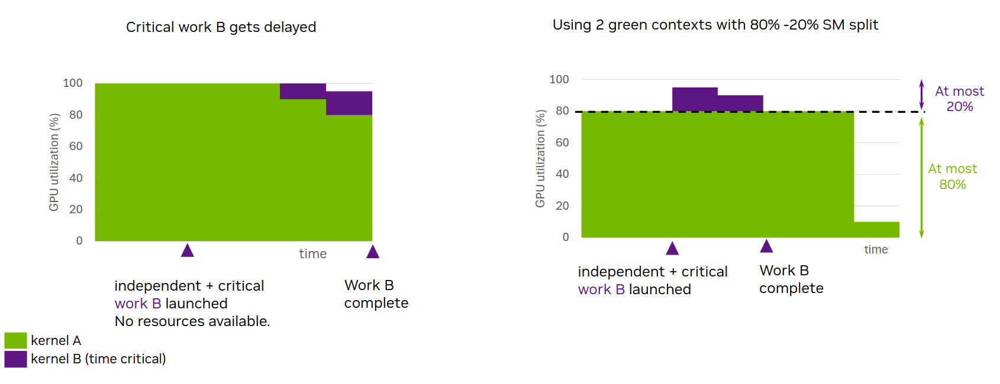
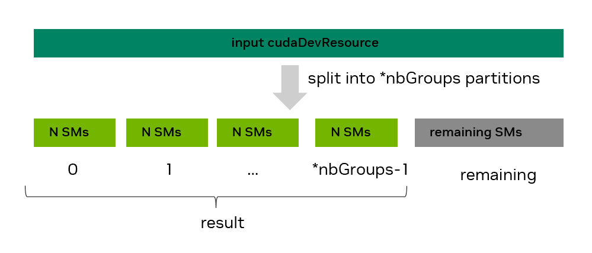
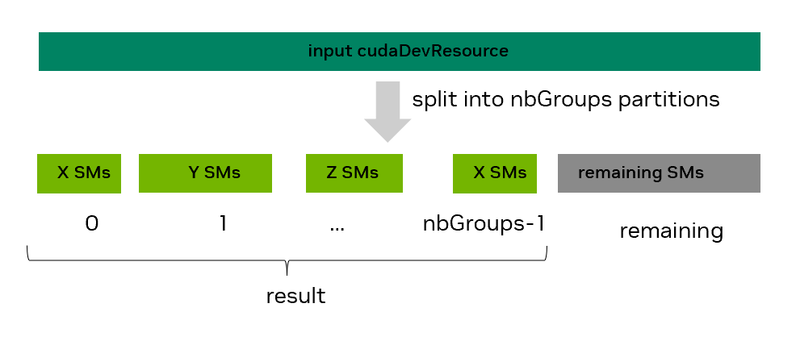
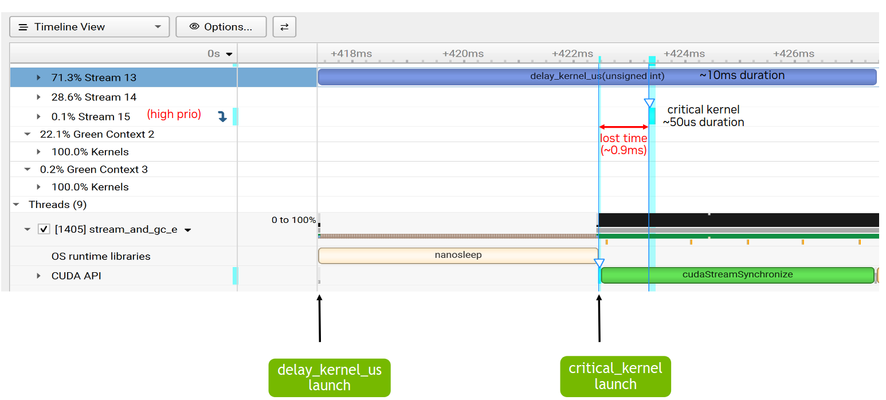
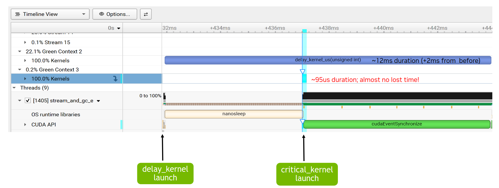

# 4.6 Green Contexts（绿色上下文）

绿色上下文（GC）是一种轻量级上下文，自创建之时起便与一组特定的 GPU 资源相关联。用户可以在创建绿色上下文时对 GPU 资源（目前包括流多处理器（Streaming Multiprocessor，SM）和工作队列（WQ））进行分区，从而使面向该绿色上下文的 GPU 工作只能使用为其分配的 SM 和工作队列。这样做有助于减少或更好地控制因共享资源的使用而产生的干扰。一个应用程序可以拥有多个绿色上下文。

使用绿色上下文无需修改任何 GPU 代码（核函数），只需对主机端做少量改动（例如创建绿色上下文、为该绿色上下文创建流）。绿色上下文功能适用于多种场景。例如，它可以在无其他约束的情况下，确保总有部分 SM 可用，以便延迟敏感型核函数能开始执行；或者提供一种快捷方式，在不修改任何核函数的前提下测试使用更少 SM 的效果。

绿色上下文支持最初通过 CUDA Driver API 提供。从 CUDA 13.1 开始，上下文通过执行上下文（EC）抽象在 CUDA 运行时中公开。目前，一个执行上下文可以对应主上下文（runtime API 用户一直隐式交互的那个上下文）或绿色上下文。本节在使用执行上下文和绿色上下文指代绿色上下文时，将两者混用。

随着绿色上下文在运行时中公开，强烈建议直接使用 CUDA runtime API。本节也将仅使用 CUDA runtime API。

本节其余部分组织如下：4.6.1 给出一个示例说明使用动机，4.6.2 强调易用性，4.6.3 介绍设备资源和资源描述符结构体。4.6.4 说明如何创建绿色上下文，4.6.5 说明如何启动面向它的工作，4.6.6 介绍一些额外的绿色上下文 API。最后，4.6.7 以一个完整示例收尾。

## 4.6.1 Motivation / When to Use（动机 / 适用场景）

启动 CUDA 核函数时，用户无法直接控制该核函数将在多少个 SM 上执行。用户只能间接影响这一点，比如改变核函数的启动配置，或改变任何能影响该核函数每个 SM 上最大活跃线程块数的因素。此外，当多个核函数在 GPU 上并行执行（运行在不同的 CUDA 流上，或作为 CUDA 图的一部分）时，它们也可能争用相同的 SM 资源。

然而，有些用例需要用户确保总有 GPU 资源可用，以便延迟敏感型工作能够尽快开始并尽快完成。绿色上下文通过分区 SM 资源提供了一种实现途径：给定的绿色上下文只能使用特定的 SM（创建时为其分配的那些 SM）。

图 45 展示了这样一个示例。假设一个应用中，两个独立的核函数 A 和 B 运行在两个不同的非阻塞 CUDA 流上。核函数 A 先启动并开始执行，占据所有可用的 SM 资源。之后，延迟敏感型核函数 B 启动时，已没有可用的 SM 资源。因此，核函数 B 只能等到核函数 A 减速之后（即核函数 A 的线程块执行完毕之后）才能开始执行。第一张图展示了这一场景：关键工作 B 被延迟了。Y 轴表示被占用的 SM 百分比，X 轴表示时间。



图 45：动机——GC 的静态资源分区让延迟敏感型工作 B 更早开始、更早完成。

使用绿色上下文，可以对 GPU 的 SM 进行分区：面向核函数 A 的绿色上下文 A 可以访问 GPU 的部分 SM，而面向核函数 B 的绿色上下文 B 可以访问其余的 SM。在这种配置下，无论启动配置如何，核函数 A 都只能使用分配给绿色上下文 A 的 SM。因此，当关键核函数 B 启动时，只要没有其他资源约束，可以保证有可用 SM 让它立即开始执行。正如第图 45 中的第二张图所示，即便核函数 A 的持续时间可能会增加，延迟敏感型工作 B 也不再因没有可用 SM 而被延迟。图中绿色上下文 A 被分配了相当于 GPU 80% SM 数量的 SM，仅用于示意。

要实现这一行为，无需对核函数 A 和 B 做任何代码修改，只需确保它们在属于相应绿色上下文的 CUDA 流上启动即可。每个绿色上下文能访问多少 SM，应在创建时由用户根据具体情况决定。

**工作队列（Work Queues）：**
流多处理器是可为绿色上下文分配的资源类型之一，另一种资源类型是工作队列。可以把工作队列看作一种黑盒资源抽象，它与其他因素一起，会影响 GPU 工作的执行并发度。如果独立的 GPU 工作任务（例如在不同 CUDA 流上提交的核函数）映射到同一个工作队列，这些任务之间可能会引入伪依赖，导致它们串行执行。用户可以通过 `CUDA_DEVICE_MAX_CONNECTIONS` 环境变量影响 GPU 上工作队列的数量上限（参见 5.2 节、3.1 节）。

接上一个例子，假设工作 B 映射到与工作 A 相同的工作队列。那么，即使 SM 资源可用（绿色上下文场景），工作 B 仍可能需要等到工作 A 完全执行完才能开始。与 SM 类似，用户无法直接控制底层实际使用的工作队列。但绿色上下文允许用户以“预期的并发流有序工作负载数量”来表达期望的最大并发度。驱动程序可以把这个值作为提示，尽量避免不同执行上下文的工作使用相同的工作队列，从而防止跨执行上下文的不期望干扰。

> **注意**
>
> 即使每个绿色上下文分配了不同的 SM 资源和工作队列，独立 GPU 工作的并发执行也不保证一定发生。最好把绿色上下文一节中介绍的所有技术理解为消除阻碍并发执行的因素（即减少潜在干扰）。

**绿色上下文与 MIG 或 MPS 的对比**
为完整起见，本节简要对比绿色上下文与另外两种资源分区机制：MIG（多实例 GPU）和 MPS（多进程服务）。

MIG 将一块支持 MIG 的 GPU 静态分区为多个 MIG 实例（"更小的 GPU"）。这种分区必须在应用启动之前完成，不同应用可以使用不同的 MIG 实例。对于那些持续无法充分利用 GPU 资源的应用（GPU 越大这个问题越突出），MIG 很有帮助：用户可以在不同的 MIG 实例上运行这些应用，从而提高 GPU 利用率。MIG 对云服务提供商（CSP）不仅因提高了这类应用的 GPU 利用率而有吸引力，还因其能在运行在不同 MIG 实例上的客户端之间提供服务质量（QoS）和隔离。请参考上文链接的 MIG 文档了解更多细节。

但 MIG 无法解决前面描述的问题场景：关键工作 B 因所有 SM 资源被同一应用的其他 GPU 工作占据而被延迟。这个问题即使对运行在单个 MIG 实例上的应用仍然存在。要解决它，可以将绿色上下文与 MIG 结合使用。在这种情况下，可供分区的 SM 资源就是给定 MIG 实例的资源。

MPS 主要面向不同的进程（例如 MPI 程序），使它们能同时在 GPU 上运行而无需时间片切换。它要求在应用启动前运行一个 MPS 守护进程。默认情况下，MPS 客户端会争用 GPU 或其所在 MIG 实例的所有可用 SM 资源。在这种多客户端进程场景下，MPS 支持使用活跃线程百分比（active thread percentage）选项动态分区 SM 资源：它对 MPS 客户端进程能使用的 SM 百分比设上限。与绿色上下文不同，活跃线程百分比分区发生在进程级别，该百分比通常在应用启动前通过环境变量指定。MPS 活跃线程百分比表示给定客户端应用使用的 SM 不能超过 GPU SM 的 x%，设为 N 个 SM。但这 N 个 SM 可以是 GPU 上的任意 N 个 SM，且可能随时间变化。相比之下，创建时分配了 N 个 SM 的绿色上下文只能使用这特定的 N 个 SM。

从 CUDA 13.1 开始，MPS 在启动 MPS 控制守护进程时如果显式启用，也支持静态分区。使用静态分区时，用户在应用启动时指定 MPS 客户端进程可用的静态分区。此时不再适用活跃线程百分比的动态共享。MPS 静态分区模式与绿色上下文的一个关键区别在于：MPS 面向不同进程，而绿色上下文在一个进程内同样适用。还有，与绿色上下文相反，静态分区的 MPS 不允许 SM 资源超分配（oversubscription）。

在 MPS 下，通过带执行亲和性（execution affinity）的 `cuCtxCreate` driver API 创建 CUDA 上下文，也可以程序化分区 SM 资源。这种程序化分区允许来自一个或多个进程的不同客户端 CUDA 上下文各使用最多指定数量的 SM。与活跃线程百分比分区一样，这些 SM 可以是 GPU 上的任意 SM 且可随时间变化，不同于绿色上下文。即使存在静态 MPS 分区，这种方式也可用。请注意，创建绿色上下文比创建 MPS 上下文轻量得多，因为许多底层结构由主上下文拥有并共享。

## 4.6.2 Green Contexts: Ease of use（绿色上下文：易用性）

为展示绿色上下文有多易用，假设有以下代码片段：创建两个 CUDA 流，然后调用一个函数，在这些 CUDA 流上通过 `<<<>>>` 启动核函数。如前所述，除了改变核函数的启动配置外，用户无法影响这些核函数能使用多少 SM。

```cpp
int gpu_device_index = 0; // GPU ordinal
CUDA_CHECK(cudaSetDevice(gpu_device_index));

cudaStream_t strm1, strm2;
CUDA_CHECK(cudaStreamCreateWithFlags(&strm1, cudaStreamNonBlocking));
CUDA_CHECK(cudaStreamCreateWithFlags(&strm2, cudaStreamNonBlocking));

// No control over how many SMs kernel(s) running on each stream can use
code_that_launches_kernels_on_streams(strm1, strm2); // what is abstracted in
                                                    // this function + the kernels is the vast majority of your code

// cleanup code not shown
```

从 CUDA 13.1 开始，用户可以使用绿色上下文来控制给定核函数可访问的 SM 数量。下面的代码片段展示了这是多么简单：只需几行额外代码，且无需任何核函数修改，就能控制在这些不同流上启动的核函数能使用的 SM 资源。

```cpp
int gpu_device_index = 0; // GPU ordinal
CUDA_CHECK(cudaSetDevice(gpu_device_index));

/* ------------------ Code required to create green contexts ------------------------ */

// Get all available GPU SM resources
cudaDevResource initial_GPU_SM_resources {};
CUDA_CHECK(cudaDeviceGetDevResource(gpu_device_index, &initial_GPU_SM_resources, cudaDevResourceTypeSm));

// Split SM resources. This example creates one group with 16 SMs and one with 8.
// Assuming your GPU has >= 24 SMs
cudaDevSmResource result[2] {{}, {}};
cudaDevSmResourceGroupParams group_params[2] = {
         {.smCount=16, .coscheduledSmCount=0, .preferredCoscheduledSmCount=0, .flags=0},
         {.smCount=8, .coscheduledSmCount=0, .preferredCoscheduledSmCount=0, .flags=0}};

CUDA_CHECK(cudaDevSmResourceSplit(&result[0], 2, &initial_GPU_SM_resources, nullptr, 0, &group_params[0]));

// Generate resource descriptors for each resource
cudaDevResourceDesc_t resource_desc1 {};
cudaDevResourceDesc_t resource_desc2 {};
CUDA_CHECK(cudaDevResourceGenerateDesc(&resource_desc1, &result[0], 1));
CUDA_CHECK(cudaDevResourceGenerateDesc(&resource_desc2, &result[1], 1));

// Create green contexts
cudaExecutionContext_t my_green_ctx1 {};
cudaExecutionContext_t my_green_ctx2 {};
CUDA_CHECK(cudaGreenCtxCreate(&my_green_ctx1, resource_desc1, gpu_device_index, 0));
CUDA_CHECK(cudaGreenCtxCreate(&my_green_ctx2, resource_desc2, gpu_device_index, 0));

/* ------------------ Modified code --------------------------- */

// You just need to use a different CUDA API to create the streams
cudaStream_t strm1, strm2;
CUDA_CHECK(cudaExecutionCtxStreamCreate(&strm1, my_green_ctx1, cudaStreamDefault, 0));
CUDA_CHECK(cudaExecutionCtxStreamCreate(&strm2, my_green_ctx2, cudaStreamDefault, 0));

/* ------------------ Unchanged code --------------------------- */

// No need to modify any code in this function or in your kernel(s).
// Reminder: what is abstracted in this function + kernels is the vast majority of your code

// Now kernel(s) running on stream strm1 will use at most 16 SMs and kernel(s) on strm2 at most 8 SMs.
code_that_launches_kernels_on_streams(strm1, strm2);

// cleanup code not shown
```

前一个示例中展示的某些执行上下文 API 以显式的 `cudaExecutionContext_t` 句柄为参数，因此会忽略调用线程当前的上下文。此前，没有使用 Driver API 的 CUDA runtime 用户默认只会与通过 `cudaSetDevice()` 隐式设为调用线程当前的主上下文交互。向显式基于上下文的编程转变带来更易理解的语义，与之前依赖线程局部存储（TLS）的隐式基于上下文的编程相比还可能有额外好处。

下面几节将详细解释前一个代码片段中展示的所有步骤。

## 4.6.3 Green Contexts: Device Resource and Resource Descriptor（绿色上下文：设备资源与资源描述符）

绿色上下文的核心是与特定 GPU 设备绑定的设备资源（`cudaDevResource`）。资源可以组合并封装成描述符（`cudaDevResourceDesc_t`）。绿色上下文只能访问封装在其创建所用描述符中的资源。

目前 `cudaDevResource` 数据结构定义如下：

```c
struct {
     enum cudaDevResourceType type;
     union {
         struct cudaDevSmResource sm;
         struct cudaDevWorkqueueConfigResource wqConfig;
         struct cudaDevWorkqueueResource wq;
     };
 };
```

支持的有效资源类型为 `cudaDevResourceTypeSm`、`cudaDevResourceTypeWorkqueueConfig` 和 `cudaDevResourceTypeWorkqueue`，而 `cudaDevResourceTypeInvalid` 表示无效资源类型。

一个有效的设备资源可关联：
- 一组特定的流多处理器（SM）（资源类型 `cudaDevResourceTypeSm`），
- 一个特定的工作队列配置（资源类型 `cudaDevResourceTypeWorkqueueConfig`），或
- 一个已存在的工作队列资源（资源类型 `cudaDevResourceTypeWorkqueue`）。

可以使用 `cudaExecutionCtxGetDevResource` 和 `cudaStreamGetDevResource` API 分别查询给定的执行上下文或 CUDA 流是否关联了某给定类型的 `cudaDevResource` 资源。执行上下文也可以同时关联不同类型的设备资源（例如 SM 和工作队列），而流只能关联 SM 类型的资源。

给定 GPU 设备默认具有全部三种设备资源类型：涵盖 GPU 所有 SM 的 SM 类型资源、涵盖所有可用工作队列及其对应工作队列资源的工作队列配置资源。这些资源可以通过 `cudaDeviceGetDevResource` API 获取。

**相关设备资源结构体概览**

不同资源类型结构体的字段要么由用户显式设置，要么由相关 CUDA API 调用设置。建议将所有设备资源结构体清零初始化。

- SM 类型设备资源（`cudaDevSmResource`）有以下相关字段：
  - `unsigned int smCount`：该资源中的可用 SM 数量。
  - `unsigned int minSmPartitionSize`：分区该资源所需的最小 SM 数量。
  - `unsigned int smCoscheduledAlignment`：保证在同一 GPU 处理集群上协同调度的 SM 数量，与线程块簇相关。当 flags 为零时，smCount 是该值的倍数。
  - `unsigned int flags`：支持的标志为 0（默认）、`cudaDevSmResourceGroupBackfill` 和 `cudaDevSmResourceGroupLocalityDomainId`（参见 `cudaDevSmResourceGroup` flags）。

  上述字段将通过创建该 SM 类型资源的相应 split API（`cudaDevSmResourceSplitByCount` 或 `cudaDevSmResourceSplit`）设置，或由获取给定 GPU 设备 SM 资源的 `cudaDeviceGetDevResource` API 填充。用户永远不应直接设置这些字段。更多细节见下一节。
- 工作队列配置设备资源（`cudaDevWorkqueueConfigResource`）有以下相关字段：
  - `int device`：工作队列资源可用的设备。
  - `unsigned int wqConcurrencyLimit`：期望避免伪依赖的并发流有序工作负载数量。
  - `enum cudaDevWorkqueueConfigScope sharingScope`：工作队列资源的共享范围。支持的值为：`cudaDevWorkqueueConfigScopeDeviceCtx`（默认）和 `cudaDevWorkqueueConfigScopeGreenCtxBalanced`。默认选项下，所有工作队列资源在所有上下文间共享；balanced 选项下，驱动程序会尽量在绿色上下文之间使用不重叠的工作队列资源，并在可能的情况下以用户指定的 `wqConcurrencyLimit` 作为提示。

  这些字段需要由用户设置。没有类似 split API 那样的 CUDA API 可以生成工作队列配置资源，唯一例外是 `cudaDeviceGetDevResource` API 填充的工作队列配置资源。该 API 可获取给定 GPU 设备的工作队列配置资源。
- 最后，已存在的工作队列资源（`cudaDevResourceTypeWorkqueue`）没有任何可由用户设置的字段。与其他资源类型一样，`cudaDevGetDevResource` 可获取给定 GPU 设备的已存在工作队列资源。

## 4.6.4 Green Context Creation Example（绿色上下文创建示例）

创建绿色上下文有四个主要步骤：
- 步骤 1：从一组初始资源开始，例如获取 GPU 的可用资源。
- 步骤 2：将 SM 资源分区为一个或多个分区（使用任一可用的 split API）。
- 步骤 3：创建组合了所需不同资源的资源描述符。
- 步骤 4：从描述符创建绿色上下文，为其分配资源。

绿色上下文创建后，可以为其创建属于该绿色上下文的 CUDA 流。之后在这样的流上启动的 GPU 工作（例如通过 `<<<>>>` 启动的核函数）只能访问该绿色上下文分配到的资源。库也可以轻松利用绿色上下文，只要用户向其传入属于绿色上下文的流即可。更多细节见绿色上下文 - 启动工作。

### 4.6.4.1 Step 1: Get available GPU resources（步骤 1：获取可用的 GPU 资源）

创建绿色上下文的第一步是获取可用的设备资源并填充 `cudaDevResource` 结构体。目前有三种可能的起点：设备、执行上下文或 CUDA 流。

相关 CUDA runtime API 函数签名如下：
- 对于设备：`cudaError_t cudaDeviceGetDevResource(int device, cudaDevResource* resource, cudaDevResourceType type)`
- 对于执行上下文：`cudaError_t cudaExecutionCtxGetDevResource(cudaExecutionContext_t ctx, cudaDevResource* resource, cudaDevResourceType type)`
- 对于流：`cudaError_t cudaStreamGetDevResource(cudaStream_t hStream, cudaDevResource* resource, cudaDevResourceType type)`

除 `cudaStreamGetDevResource`（仅支持 SM 类型资源）外，每个 API 都允许所有有效的 `cudaDevResourceType` 类型。

通常起点是 GPU 设备。下面的代码片段展示如何获取给定 GPU 设备的可用 SM 资源。`cudaDeviceGetDevResource` 调用成功后，用户可以查看该资源中的可用 SM 数量。

```cpp
int current_device = 0; // assume device ordinal of 0
CUDA_CHECK(cudaSetDevice(current_device));

cudaDevResource initial_SM_resources = {};
CUDA_CHECK(cudaDeviceGetDevResource(current_device /* GPU device */,
                                   &initial_SM_resources /* device resource to populate */,
                                   cudaDevResourceTypeSm /* resource type*/));

std::cout << "Initial SM resources: " << initial_SM_resources.sm.smCount << " SMs" << std::endl; // number of available SMs

// Special fields relevant for partitioning (see Step 3 below)
std::cout << "Min. SM partition size: " << initial_SM_resources.sm.minSmPartitionSize << " SMs" << std::endl;
std::cout << "SM co-scheduled alignment: " << initial_SM_resources.sm.smCoscheduledAlignment << " SMs" << std::endl;
```

也可以获取可用的工作队列配置资源，如下面的代码片段所示。

```cpp
int current_device = 0; // assume device ordinal of 0
CUDA_CHECK(cudaSetDevice(current_device));

cudaDevResource initial_WQ_config_resources = {};
CUDA_CHECK(cudaDeviceGetDevResource(current_device /* GPU device */,
                                   &initial_WQ_config_resources /* device resource to populate */,
                                   cudaDevResourceTypeWorkqueueConfig /* resource type*/));

std::cout << "Initial WQ config. resources: " << std::endl;
std::cout << " - WQ concurrency limit: " << initial_WQ_config_resources.wqConfig.wqConcurrencyLimit << std::endl;
std::cout << " - WQ sharing scope: " << initial_WQ_config_resources.wqConfig.sharingScope << std::endl;
```

`cudaDeviceGetDevResource` 调用成功后，用户可以查看该资源的 `wqConcurrencyLimit`。当起点是 GPU 设备时，`wqConcurrencyLimit` 将与 `CUDA_DEVICE_MAX_CONNECTIONS` 环境变量的值或其默认值一致。

### 4.6.4.2 Step 2: Partition SM resources（步骤 2：分区 SM 资源）

创建绿色上下文的第二步是静态地将可用的 `cudaDevResource` SM 资源切分为一个或多个分区，可能还有一个剩余分区留有部分 SM。这可以通过 `cudaDevSmResourceSplitByCount()` 或 `cudaDevSmResourceSplit()` API 实现。`cudaDevSmResourceSplitByCount()` API 只能创建同构分区（再加一个可能的剩余分区），而 `cudaDevSmResourceSplit()` API 还可以创建异构分区（再加一个可能的剩余分区）。下面几节将详细描述两个 API 的功能。两个 API 仅适用于 SM 类型设备资源。

**cudaDevSmResourceSplitByCount API**

`cudaDevSmResourceSplitByCount` runtime API 签名如下：

```c
cudaError_t cudaDevSmResourceSplitByCount(cudaDevResource* result, unsigned
int* nbGroups, const cudaDevResource* input, cudaDevResource* remaining, un-
signed int useFlags, unsigned int minCount)
```

如图 46 所示，用户请求将输入的 SM 类型设备资源切分为 `*nbGroups` 个同构分组，每组 `minCount` 个 SM。但最终结果可能包含更新后的 `*nbGroups` 个同构分组，每组 N 个 SM。更新后的 `*nbGroups` 会小于或等于最初请求的数量，而 N 会等于或大于 `minCount`。由于一些架构相关的粒度与对齐要求，可能发生这些调整。



图 46：使用 cudaDevSmResourceSplitByCount API 切分 SM 资源。

表 30 列出了在默认 `useFlags=0` 情况下当前所有支持的计算能力对应的最小 SM 分区尺寸和 SM 协同调度对齐，如 4.6.4.1 节所示，这些值也可以通过 `cudaDevSmResource` 的 `minSmPartitionSize` 和 `smCoscheduledAlignment` 字段获取。其中一些要求可以通过不同的 `useFlags` 值降低。表 14 给出了一些相关示例，展示了请求与最终结果的差异及解释。该表聚焦计算能力 9.0（CC 9.0）：当 `useFlags` 为零时，每个分区的最小 SM 数量为 8，SM 数量必须是 8 的倍数。

表 14：切分功能

| 请求的 *nbGroups | 请求的 minCount | useFlags | 实际（以有 132 个 SM 的 GH200 为例）：*nbGroups，每组 N 个 SM | 剩余 SM | 原因 |
|---|---|---|---|---|---|
| 2 | 72 | 0 | 1 组，每组 72 个 SM | 60 | 不能超过 132 个 SM |
| 6 | 11 | 0 | 6 组，每组 16 个 SM | 36 | 8 的倍数要求 |
| 6 | 11 | CU_DEV_SM_RESOURCE_SPLIT_IGNORE_SM_COSCHEDULING | 6 组，每组 12 个 SM | 60 | 降低为 2 的倍数要求 |
| 2 | 1 | 0 | 2 组，每组 8 个 SM | 116 | 最少 8 个 SM 要求 |

以下是请求将可用 SM 资源切分为 5 个每组 8 个 SM 的分组的代码片段：

```cpp
cudaDevResource avail_resources = {};
// Code that has populated avail_resources not shown

unsigned int min_SM_count = 8;
unsigned int actual_split_groups = 5; // may be updated

cudaDevResource actual_split_result[5] = {{}, {}, {}, {}, {}};
cudaDevResource remaining_partition = {};

CUDA_CHECK(cudaDevSmResourceSplitByCount(&actual_split_result[0],
                                         &actual_split_groups,
                                         &avail_resources,
                                         &remaining_partition,
                                         0 /*useFlags */,
                                         min_SM_count));

std::cout << "Split " << avail_resources.sm.smCount << " SMs into " << actual_split_groups << " groups "
           << "with " << actual_split_result[0].sm.smCount << " each "
           << "and a remaining group with " << remaining_partition.sm.smCount << " SMs" << std::endl;
```

请注意：
- 可以用 `result=nullptr` 查询将创建的分组数量；
- 如果不关心剩余分区的 SM，可以设 `remaining=nullptr`；
- 剩余（剩料）分区不具备与 `result` 中同构分组相同的功能或性能保证；
- `useFlags` 默认应为 0，但也支持 `cudaDevSmResourceSplitIgnoreSmCoscheduling` 和 `cudaDevSmResourceSplitMaxPotentialClusterSize`；
- 任何生成的 `cudaDevResource` 在完成下面的步骤 3 和 4（先创建资源描述符和绿色上下文）之前都不能重新分区。

更多细节请参考 `cudaDevSmResourceSplitByCount` runtime API 参考文档。

**cudaDevSmResourceSplit API**

如前所述，一次 `cudaDevSmResourceSplitByCount` API 调用只能创建同构分区（即 SM 数量相同的分区）再加剩余分区。这对异构工作负载可能受限——在不同绿色上下文上运行的工作有不同的 SM 数量需求。要用 split-by-count API 实现异构分区，通常需要重复步骤 1–4 重新分区（多次）。或者，在某些情况下，可以在步骤 2 中创建 SM 数量等于所有异构分区 SM 数量的最大公约数（GCD）的同构分区，然后在步骤 3 中把所需数量的分区合并。但不推荐后一种做法，因为如果在请求时就给出更大的尺寸，CUDA 驱动程序可能能创建出更好的分区。

`cudaDevSmResourceSplit` API 旨在解决这些限制：允许用户在一次调用中创建不重叠的异构分区。`cudaDevSmResourceSplit` runtime API 签名如下：

```c
cudaError_t   cudaDevSmResourceSplit(cudaDevResource* result,  unsigned  int
nbGroups, const cudaDevResource* input, cudaDevResource* remainder, unsigned
int flags, cudaDevSmResourceGroupParams* groupParams)
```

该 API 将尝试根据 `groupParams` 数组中为每个分组指定的要求，把输入的 SM 类型资源切分为 `nbGroups` 个有效的设备资源（分组），存入 `result` 数组。还可以选择创建一个剩余分区。成功切分时，如图 47 所示，`result` 中的每个资源可以有不同的 SM 数量，但都不为零。



图 47：使用 cudaDevSmResourceSplit API 切分 SM 资源。

请求异构切分时，需要为 `result` 中的每个资源指定 SM 数量（对应 `groupParams` 条目的 `smCount` 字段）。该 SM 数量应始终为 2 的倍数。在上图的场景中，`groupParams[0].smCount` 为 X，`groupParams[1].smCount` 为 Y，依此类推。但如果应用使用线程块簇，仅指定 SM 数量还不够。由于簇的所有线程块保证被协同调度，用户还需指定给定资源分组应支持的最大簇尺寸（如果有），可通过对应 `groupParams` 条目的 `coscheduledSmCount` 字段实现。对于计算能力 10.0 及以上（CC 10.0+）的 GPU，簇还可以有优选维度，它是其默认簇维度的倍数。在受支持系统上的单次核函数启动期间，如果可用，尽量使用这个更大的优选簇维度，否则使用较小的默认簇维度。用户可以通过对应 `groupParams` 条目的 `preferredCoscheduledSmCount` 字段表达这个优选簇维度的提示。最后，在某些情况下，用户可能想放宽 SM 数量要求，把更多可用 SM 拉进给定分组；用户可将对应 `groupParams` 条目的 `flags` 字段设为其非默认值来表达这种回填（backfill）选项。

该 API 允许分组指定本地化域（locality domain）。在 `cudaDevSmResourceGroupParams.flags` 字段中设置 `cudaDevSmResourceGroupLocalityDomainId`，并将 `cudaDevSmResourceGroupParams.localityDomainId` 设为有效的本地化域 ID，`cudaDevSmResourceSplit` 将从该本地化域中选择 SM。如果同时设置了 `cudaDevSmResourceGroupBackfill`，CUDA 在先用完目标域后，可从目标本地化域之外的 SM 来回填该分组。

关于整体编程模型，参见本地化域（Locality Domains）。

为了更灵活，`cudaDevSmResourceSplit` API 还有一个发现模式：当一个或多个分组的精确 SM 数量事先未知时使用。例如，用户可能想创建一个拥有尽可能多 SM、同时满足某些协同调度要求（例如支持尺寸为 4 的簇）的设备资源。要使用这种发现模式，用户可以将对应 `groupParams` 条目（或多个条目）的 `smCount` 字段设为零。`cudaDevSmResourceSplit` 调用成功后，`groupParams` 的 `smCount` 字段将被填充为有效的非零值；我们称之为实际 smCount 值。如果 `result` 非空（即不是试运行），那么 `result` 中的对应分组的 smCount 也将被设为相同值。`nbGroups` 个 `groupParams` 条目的顺序很重要——它们按从左（索引 0）到右（索引 nbGroups-1）的顺序依次评估。

表 15 给出了 `cudaDevSmResourceSplit` API 支持的参数概览。

表 15：cudaDevSmResourceSplit 切分 API 概览

| result | nbGroups | input | remainder | flags | groupParams 数组；展示条目 i（i 在 [0, nbGroups) 范围内）——smCount | coscheduledSmCount | preferredCoscheduledSmCount | flags |
|---|---|---|---|---|---|---|---|---|
| 用于探索的试运行设为 nullptr，否则为非空指针 | 要切分的分组数 | 要切分的源资源 | 如果不需要剩余分组设为 nullptr | 0 | 0 为发现模式，或其他有效 smCount 值 | 0（默认）或有效的协同调度 SM 数量 | 0（默认）或有效的优选协同调度 SM 数量（提示） | 0（默认）、cudaDevSmResourceGroupBackfill 或 cudaDevSmResourceGroupLocalityDomainId |

注意：
1) `cudaDevSmResourceSplit` API 的返回值取决于 `result`：
   - `result != nullptr`：仅当切分成功且创建了满足指定要求的 `nbGroups` 个有效 `cudaDevResource` 分组时，API 才返回 `cudaSuccess`；否则返回错误。由于不同类型的错误可能返回相同的错误码（例如 `cudaErrorInvalidResourceConfiguration`），建议在开发期间使用 `CUDA_LOG_FILE` 环境变量获取更丰富的错误描述。
   - `result == nullptr`：即使某个分组的结果 smCount 为零（用非空 `result` 会返回错误），该 API 也可能返回 `cudaSuccess`。可以把这种模式看作试运行测试，用于在探索支持情况时使用，尤其在发现模式下。
2) 在 `result != nullptr` 的成功调用中，`result[i]`（i 在 [0, nbGroups) 范围内）设备资源将是 `cudaDevResourceTypeSm` 类型，且 `result[i].sm.smCount` 将是用户指定的非零 `groupParams[i].smCount` 值或发现的值。两种情况下，`result[i].sm.smCount` 都满足以下所有约束：
   - 为 2 的倍数；
   - 在 [2, input.sm.smCount] 范围内；
   - 未设置 `cudaDevSmResourceGroupBackfill` 时为 `groupParams[i].coscheduledSmCount` 的倍数，设置了 backfill 时大于或等于该值。
3) 将 `coscheduledSmCount` 和 `preferredCoscheduledSmCount` 的任意字段设为零，表示使用这些字段的默认值；默认值因 GPU 而异。这两个默认值都等于通过给定设备的 `cudaDeviceGetDevResource` API 获取的 SM 资源的 `smCoscheduledAlignment`（而不是任意 SM 资源的）。要查看这些默认值，可以在初始设为 0 并成功调用 `cudaDevSmResourceSplit` 后，检查对应 `groupParams` 条目中更新后的值；如下所示。

```cpp
int gpu_device_index = 0;
cudaDevResource initial_GPU_SM_resources {};
CUDA_CHECK(cudaDeviceGetDevResource(gpu_device_index, &initial_GPU_SM_resources, cudaDevResourceTypeSm));

std::cout << "Default value will be equal to " << initial_GPU_SM_resources.sm.smCoscheduledAlignment << std::endl;

int default_split_flags = 0;
cudaDevSmResourceGroupParams group_params_tmp = {.smCount=0, .coscheduledSmCount=0, .preferredCoscheduledSmCount=0, .flags=0};

CUDA_CHECK(cudaDevSmResourceSplit(nullptr, 1, &initial_GPU_SM_resources, nullptr /*remainder*/, default_split_flags, &group_params_tmp));

std::cout << "coscheduledSmcount default value: " << group_params_tmp.coscheduledSmCount << std::endl;
std::cout << "preferredCoscheduledSmcount default value: " << group_params_tmp.preferredCoscheduledSmCount << std::endl;
```

4) 剩余分组（如果存在）对其 SM 数量或协同调度要求没有任何约束；由用户自行探索。

在介绍 `cudaDevSmResourceGroupParams` 各字段的详细信息之前，表 16 展示了一些示例用例下这些字段的取值。假设 `initial_GPU_SM_resources` 设备资源已按前一个代码片段填充，并将作为切分的资源。表中每行都有相同的起点。为简单起见，该表只展示可用于如下代码片段的 `nbGroups` 值和每用例的 `groupParams` 字段。

```cpp
int nbGroups = 2; // update as needed
unsigned int default_split_flags = 0;
cudaDevResource remainder {}; // update as needed
cudaDevResource result_use_case[2] = {{}, {}}; // Update depending on number of groups planned. Increase size if you plan to also use a workqueue resource

cudaDevSmResourceGroupParams group_params_use_case[2] = {{.smCount = X, .coscheduledSmCount=0, .preferredCoscheduledSmCount = 0, .flags = 0},
                                                         {.smCount = Y, .coscheduledSmCount=0, .preferredCoscheduledSmCount = 0, .flags = 0}}

CUDA_CHECK(cudaDevSmResourceSplit(&result_use_case[0], nbGroups, &initial_GPU_SM_resources, remainder, default_split_flags, &group_params_use_case[0]));
```

表 16：split API 用例

| # | 目标 / 用例 | nbGroups | remainder | groupParams[i] 字段（i 升序，见最后一列）— smCount | coscheduledSmCount | preferredCoscheduledSmCount | flags |
|---|---|---|---|---|---|---|---|
| 1 | 一个有 16 个 SM 的资源。不关心剩余 SM。可以使用簇。 | 1 | nullptr | 16 | 0 | 0 | 0 |
| 2a | 一个 16 个 SM 的资源和一个包含其余所有 SM 的资源。不使用簇。（注：展示两种选项：在选项 (2a) 中，第二个资源是 remainder；在选项 (2b) 中，它是 result_use_case[1]。） | 1 (2a) | 非 nullptr (2a) | 16 | 2 | 2 | 0 |
| 2b | 同上。 | 2 (2b) | nullptr | 16；0 | 2；4 | 2；4 | 0；cudaDevSmResourceGroupBackfill |
| 3 | 两个分别有 28 和 32 个 SM 的资源。使用尺寸为 4 的簇。 | 2 | nullptr | 28；32 | 4；4 | 4；4 | 0；0 |
| 4 | 一个有尽可能多 SM、能运行尺寸为 8 的簇的资源，和一个剩余分区。 | 1 | 非 nullptr | 0 | 8 | 8 | 0 |
| 5 | 一个有尽可能多 SM、能运行尺寸为 4 的簇的资源，和一个 8 个 SM 的资源。（注：顺序很重要！交换 groupParams 数组中条目的顺序可能导致 8-SM 分组没有 SM 可分。） | 2 | nullptr | 8；0 | 2；4 | 2；4 | 0；0 |

关于 `cudaDevSmResourceGroupParams` 结构体各字段的详细信息：

**smCount：**
- 控制 `result` 中对应分组的 SM 数量。
- 取值：0（发现模式）或有效非零值（非发现模式）。
- 有效非零 smCount 值的条件：（2 的倍数）且在 [2, input->sm.smCount] 范围内，且 ((flags == 0) ? 为实际 coscheduledSmCount 的倍数 : 大于或等于 coscheduledSmCount)。
- 用例：当 SM 数量未知/不固定时用发现模式探索可能性；请求特定 SM 数量时用非发现模式。
- 注：在发现模式下，`result` 非空的成功切分调用后，实际 SM 数量将满足有效非零值要求。

**coscheduledSmCount：**
- 控制分组在一起（"协同调度"）以支持在计算能力 9.0+ 上启动不同簇的 SM 数量。因此会影响结果分组的 SM 数量以及它们能支持的簇尺寸。
- 取值：0（当前架构的默认值）或有效非零值。
- 有效非零值的要求：（2 的倍数），最高到最大上限。
- 用例：使用默认值或手动选择一个值用于簇，同时注意给定架构上的最大可移植簇尺寸。如果代码不使用簇，可以用最小支持值 2 或默认值。
- 注：使用默认值时，成功切分调用后的实际 coscheduledSmCount 也将满足有效非零值要求。如果 flags 非零，结果 smCount 将 >= coscheduledSmCount。可以把 coscheduledSmCount 理解为给有效结果分组提供某种有保证的底层"结构"（即该分组在最坏情况下至少能运行一个 coscheduledSmCount 尺寸的簇）。这种结构保证不适用于剩余分组；剩余分组能启动的簇尺寸由用户自行探索。

**preferredCoscheduledSmCount：**
- 提示驱动程序尽量把实际 coscheduledSmCount 个 SM 的分组合并为更大的 preferredCoscheduledSmCount 个 SM 的分组（如果可能）。这样做可以让代码利用计算能力 10.0 及以上设备上可用的优选簇维度特性。参见 `cudaLaunchAttributeValue::preferredClusterDim`。
- 取值：0（当前架构的默认值）或有效非零值。
- 有效非零值的要求：（实际 coscheduledSmCount 的倍数）。
- 用例：如果使用优选簇且在计算能力 10.0（Blackwell）或更高版本的设备上，手动选择大于 2 的值。如果不使用簇，选择与 coscheduledSmCount 相同的值：选择最小支持值 2 或两者都用 0。
- 注：使用默认值时，成功切分调用后的实际 preferredCoscheduledSmCount 也将满足有效非零值要求。

**flags：**
- 控制结果分组的 SM 数量是实际协同调度 SM 数量的倍数（默认），还是可以向该分组回填 SM（backfill）。在回填情况下，结果 SM 数量（`result[i].sm.smCount`）将大于或等于指定的 `groupParams[i].smCount`。
- 取值：0（默认）或 `cudaDevSmResourceGroupBackfill`。
- 用例：用零（默认）使结果分组具有支持多个 coScheduledSmCount 尺寸簇的有保证的灵活性。如果想在分组中获得尽可能多的 SM，用回填选项，其中部分 SM（回填进来的）不提供任何协同调度保证。
- 注：带回填标志创建的分组仍可支持簇（例如，它保证至少支持一个 coscheduledSmCount 尺寸的簇）。

### 4.6.4.3 Step 2 (continued): Add workqueue resources（步骤 2（续）：添加工作队列资源）

如果还想指定工作队列资源，则需要显式操作。下面的示例展示如何为特定设备创建一个工作队列配置资源，共享范围为 balanced，并发限制为 4。

```cpp
cudaDevResource split_result[2] = {{}, {}};
// code to populate split_result[0] not shown; used split API with nbGroups=1

// The last resource will be a workqueue resource.
split_result[1].type = cudaDevResourceTypeWorkqueueConfig;
split_result[1].wqConfig.device = 0; // assume device ordinal of 0
split_result[1].wqConfig.sharingScope = cudaDevWorkqueueConfigScopeGreenCtxBalanced;
split_result[1].wqConfig.wqConcurrencyLimit = 4;
```

工作队列并发限制为 4 是提示驱动程序：用户期望最多有四个并发的流有序工作负载。驱动程序将尽量遵循该提示来分配工作队列（如果可能）。

### 4.6.4.4 Step 3: Create a Resource Descriptor（步骤 3：创建资源描述符）

资源切分后的下一步，是使用 `cudaDevResourceGenerateDesc` API 为绿色上下文期望拥有的所有资源生成资源描述符。相关 CUDA runtime API 函数签名如下：

```c
cudaError_t cudaDevResourceGenerateDesc(cudaDevResourceDesc_t *phDesc, cudaDevResource *resources, unsigned int nbResources)
```

可以将多个 `cudaDevResource` 资源组合起来。例如，下面的代码片段展示如何生成封装三组资源的资源描述符。只需确保这些资源在 `resources` 数组中连续分配。

```cpp
cudaDevResource actual_split_result[5] = {};
// code to populate actual_split_result not shown

// Generate resource desc. to encapsulate 3 resources: actual_split_result[2] to [4]
cudaDevResourceDesc_t resource_desc;
CUDA_CHECK(cudaDevResourceGenerateDesc(&resource_desc, &actual_split_result[2], 3));
```

也支持组合不同类型的资源。例如，可以生成一个同时包含 SM 和工作队列资源的描述符。

要使 `cudaDevResourceGenerateDesc` 调用成功：
- 所有 `nbResources` 个资源应属于同一 GPU 设备。
- 如果组合了多个 SM 类型资源，它们应来自同一次 split API 调用，且具有相同的 `coscheduledSmCount` 值（剩余分区的资源除外）。
- 最多只能存在一个工作队列配置或工作队列类型的资源。

### 4.6.4.5 Step 4: Create a Green Context（步骤 4：创建绿色上下文）

最后一步是使用 `cudaGreenCtxCreate` API 从资源描述符创建绿色上下文。该绿色上下文只能访问创建时指定的资源描述符中封装的资源（例如 SM、工作队列）。这些资源将在这一步分配。

相关 CUDA runtime API 函数签名如下：

```c
cudaError_t   cudaGreenCtxCreate(cudaExecutionContext_t *phCtx,      cudaDevResourceDesc_t desc, int device, unsigned int flags)
```

`flags` 参数应设为 0。还建议在创建绿色上下文前，通过 `cudaInitDevice` API 或 `cudaSetDevice` API 显式初始化设备的主上下文（后者也会将主上下文设为调用线程的当前上下文）。这样可确保绿色上下文创建期间不会有额外的主上下文初始化开销。代码片段如下。

```cpp
int current_device = 0; // assume single GPU
CUDA_CHECK(cudaSetDevice(current_device)); // Or cudaInitDevice

cudaDevResourceDesc_t resource_desc {};
// Code to generate resource_desc not shown

// Create a green_ctx on GPU with current_device ID with access to resources from resource_desc
cudaExecutionContext_t green_ctx {};
CUDA_CHECK(cudaGreenCtxCreate(&green_ctx, resource_desc, current_device, 0));
```

绿色上下文创建成功后，用户可以通过对该执行上下文按每种资源类型调用 `cudaExecutionCtxGetDevResource` 来验证其资源。

**创建多个绿色上下文**

一个应用可以有多个绿色上下文，此时需要重复上面的某些步骤。对大多数用例，这些绿色上下文将各自拥有互不重叠的分配 SM 集合。例如，对于五个同构 `cudaDevResource` 分组（`actual_split_result` 数组）的情况，一个绿色上下文的描述符可封装 `actual_split_result[2]` 到 `[4]`，而另一个绿色上下文的描述符可封装 `actual_split_result[0]` 到 `[1]`。这种情况下，每个 SM 只会被分配给该应用的两个绿色上下文中的一个。

SM 超分配也是可能的，在某些情况下可能有用。例如，第二个绿色上下文的描述符封装 `actual_split_result[0]` 到 `[2]` 是可接受的。这种情况下，`actual_split_resource[2]` 这个 `cudaDevResource` 的所有 SM 都被超分配，即同时分配给两个绿色上下文，而 `actual_split_resource[0]` 到 `[1]` 和 `actual_split_resource[3]` 到 `[4]` 的资源只能被两个绿色上下文中的一个使用。SM 超分配应根据具体情况谨慎使用。

## 4.6.5 Green Contexts - Launching work（绿色上下文 - 启动工作）

要在面向按前述步骤创建的绿色上下文的流上启动核函数，首先需要用 `cudaExecutionCtxStreamCreate` API 为该绿色上下文创建一个流。在该流上用 `<<< >>>` 或 `cudaLaunchKernel` API 启动核函数，将确保核函数只能使用通过其执行上下文分配给该流的资源（SM、工作队列）。例如：

```cpp
// Create green_ctx_stream CUDA stream for previously created green_ctx green context
cudaStream_t green_ctx_stream;
int priority = 0;
CUDA_CHECK(cudaExecutionCtxStreamCreate(&green_ctx_stream,
                                         green_ctx,
                                         cudaStreamDefault,
                                         priority));

// Kernel my_kernel will only use the resources (SMs, work queues, as applicable) available to green_ctx_stream's execution context
my_kernel<<<grid_dim, block_dim, 0, green_ctx_stream>>>();
CUDA_CHECK(cudaGetLastError());
```

传给上述流创建 API 的默认流创建标志等价于 `cudaStreamNonBlocking`（因为 `green_ctx` 是绿色上下文）。

**CUDA 图（CUDA graphs）**

对于作为 CUDA 图一部分启动的核函数（参见 CUDA 图），还有一些额外的细节。与核函数不同，启动 CUDA 图所用的 CUDA 流不决定使用的 SM 资源——该流仅用于依赖跟踪。

核节点（以及其他适用的节点类型）将执行的执行上下文在节点创建时设定。如果 CUDA 图将通过流捕获创建，那么参与捕获的流的执行上下文将决定相关图节点的执行上下文。如果图将使用图 API 创建，那么用户应为每个相关节点显式设置执行上下文。例如，要添加核节点，用户应使用多态的 `cudaGraphAddNode` API（节点类型为 `cudaGraphNodeTypeKernel`），并显式指定 `cudaKernelNodeParamsV2` 结构体内 `.kernel` 下的 `.ctx` 字段。`cudaGraphAddKernelNode` 不允许用户指定执行上下文，因此应避免使用。请注意，一个图中的不同图节点可以属于不同的执行上下文。

为了验证，可以使用 Nsight Systems 的节点跟踪模式（`--cuda-graph-trace node`）观察特定图节点将在哪个绿色上下文上执行。注意，在默认的图跟踪模式下，整个图将显示在启动它的流的绿色上下文下，但如前所述，这不提供关于各图节点执行上下文的任何信息。

要编程验证，可以使用 CUDA driver API 的 `cuGraphKernelNodeGetParams(graph_node, &node_params)`，并将 `node_params.ctx` 上下文句柄字段与该图节点的预期上下文句柄比较。鉴于 `CUgraphNode` 和 `cudaGraphNode_t` 可以互换，使用 driver API 是可行的，但用户需要包含相关的 `cuda.h` 头文件并直接链接驱动（`-lcuda`）。

**线程块簇（Thread Block Clusters）**

带线程块簇的核函数（参见 1.2.2.1.1 节）也可以像其他核函数一样在绿色上下文流上启动，从而使用该绿色上下文分配的资源。4.6.4.2 节展示了在切分设备资源时如何指定需要协同调度的 SM 数量以支持簇。但与任何使用簇的核函数一样，用户应使用相关的占用率 API 来确定核函数的最大潜在簇尺寸（通过 `cudaOccupancyMaxPotentialClusterSize`），以及必要时确定最大活跃簇数量（`cudaOccupancyMaxActiveClusters`）。如果用户将绿色上下文流指定为相关 `cudaLaunchConfig` 的 `stream` 字段，那么这些占用率 API 将考虑该绿色上下文分配的 SM 资源。这种用例对库尤其相关——库可能从用户处接收到绿色上下文 CUDA 流，也适用于绿色上下文从剩余设备资源创建的情况。

下面的代码片段展示了如何使用这些 API。

```cpp
// Assume cudaStream_t gc_stream          has already been created and a __global__ void cluster_kernel exists.

// Uncomment to support non portable cluster size, if possible
// CUDA_CHECK(cudaFuncSetAttribute(cluster_kernel, cudaFuncAttributeNonPortableClusterSizeAllowed, 1))

cudaLaunchConfig_t config = {0};
config.gridDim          = grid_dim; // has to be a multiple of cluster dim.
config.blockDim         = block_dim;
config.dynamicSmemBytes = expected_dynamic_shared_mem;

cudaLaunchAttribute attribute[1];
attribute[0].id = cudaLaunchAttributeClusterDimension;
attribute[0].val.clusterDim.x = 1;
attribute[0].val.clusterDim.y = 1;
attribute[0].val.clusterDim.z = 1;
config.attrs = attribute;
config.numAttrs = 1;

config.stream=gc_stream; // Need to pass the CUDA stream that will be used for that kernel

int max_potential_cluster_size = 0;
// the next call will ignore cluster dims in launch config
CUDA_CHECK(cudaOccupancyMaxPotentialClusterSize(&max_potential_cluster_size, cluster_kernel, &config));

std::cout << "max potential cluster size is " << max_potential_cluster_size << " for CUDA stream gc_stream" << std::endl;

// Could choose to update launch config's clusterDim with max_potential_cluster_size.
// Doing so would result in a successful cudaLaunchKernelEx call for the same kernel and launch config.

int num_clusters= 0;
CUDA_CHECK(cudaOccupancyMaxActiveClusters(&num_clusters, cluster_kernel, &config));

std::cout << "Potential max. active clusters count is " << num_clusters << std::endl;
```

**验证绿色上下文的使用**

除了根据受绿色上下文分配影响的核函数执行时间进行经验性观察外，用户还可以利用 Nsight Systems 或 Nsight Compute CUDA 开发者工具在一定程度上验证绿色上下文的正确使用。

例如，在不同绿色上下文的 CUDA 流上启动的核函数，在 Nsight Systems 报告的 CUDA HW 时间线部分的"Green Context"行下会出现在不同的行。Nsight Compute 在会话（Session）页面提供绿色上下文资源概览，在详情（Details）部分的启动统计（Launch Statistics）中提供更新后的 SM 数量。前者提供分配资源的直观位图。这在应用使用不同绿色上下文时特别有用：用户可以确认跨 GC 的预期重叠情况（无重叠，或如果 SM 超分配则有预期的非零重叠）。

图 48 展示了两个分别分配了 112 和 16 个 SM、无 SM 重叠的绿色上下文示例的资源。提供的视图可以帮助用户验证每个绿色上下文的分配 SM 资源数量。它还有助于确认没有 SM 被超分配——没有任何一个框在两个绿色上下文下都被标记为绿色（分配给该 GC）。


图 48：Nsight Compute 中的绿色上下文资源部分。

启动统计部分还明确列出了为该绿色上下文分配的 SM 数量，因此该核函数可以使用这些 SM。请注意，这些是给定核函数在执行期间可访问的 SM，而不是该核函数实际运行的 SM 数量。前面的资源概览也是如此。核函数实际使用的 SM 数量取决于多种因素，包括核函数本身（启动配置等）、GPU 上同时运行的其他工作等。

## 4.6.6 Additional Execution Contexts APIs（额外的执行上下文 API）

本节介绍一些额外的绿色上下文 API。完整列表请参考相关的 CUDA runtime API 章节。

对于使用 CUDA 事件的同步，可以利用 `cudaError_t cudaExecutionCtxRecordEvent(cudaExecutionContext_t ctx, cudaEvent_t event)` 和 `cudaError_t cudaExecutionCtxWaitEvent(cudaExecutionContext_t ctx, cudaEvent_t event)` API。`cudaExecutionCtxRecordEvent` 记录一个 CUDA 事件，捕获调用时该执行上下文的所有工作/活动，而 `cudaExecutionCtxWaitEvent` 使提交到该执行上下文的所有未来工作等待指定事件捕获的工作。

如果执行上下文有多个 CUDA 流，使用 `cudaExecutionCtxRecordEvent` 比 `cudaEventRecord` 更方便。要在不使用这个执行上下文 API 的情况下实现等效行为，需要在执行上下文的每个流上通过 `cudaEventRecord` 记录单独的 CUDA 事件，然后让依赖工作分别等待所有这些事件。同样，如果需要执行上下文的所有流都等待一个事件完成，`cudaExecutionCtxWaitEvent` 比 `cudaStreamWaitEvent` 更方便。替代方案是对该执行上下文中的每个流分别调用 `cudaStreamWaitEvent`。

对于 CPU 端的阻塞同步，可以使用 `cudaError_t cudaExecutionCtxSynchronize(cudaExecutionContext_t ctx)`。该调用将阻塞，直到指定执行上下文完成其所有工作。如果指定的执行上下文不是通过 `cudaGreenCtxCreate` 创建的，而是通过 `cudaDeviceGetExecutionCtx` 获取的，因而是设备的主上下文，那么调用该函数也将同步在同一设备上创建的所有绿色上下文。

要获取给定执行上下文关联的设备，可以使用 `cudaExecutionCtxGetDevice`。要获取给定执行上下文的唯一标识符，可以使用 `cudaExecutionCtxGetId`。

最后，显式创建的执行上下文可以通过 `cudaError_t cudaExecutionCtxDestroy(cudaExecutionContext_t ctx)` API 销毁。

## 4.6.7 Green Contexts Example（绿色上下文示例）

本节展示绿色上下文如何让关键工作更早开始、更早完成。与 4.6.1 节的场景类似，应用有两个核函数，将运行在两个不同的非阻塞 CUDA 流上。从 CPU 端看的时间线如下：一个长时间运行的核函数（`delay_kernel_us`，在整个 GPU 上需要多轮执行）首先在 CUDA 流 strm1 上启动。然后在短暂等待（少于该核函数的持续时间）后，一个较短但关键的核函数（`critical_kernel`）在流 strm2 上启动。测量两个核函数的 GPU 持续时间以及从 CPU 启动到完成的时间。

作为长时间运行核函数的替代，使用一个延迟核函数：每个线程块运行固定的微秒数，且线程块数量超过 GPU 的可用 SM。

起初不使用绿色上下文，但关键核函数在优先级高于长运行核函数的 CUDA 流上启动。由于其高优先级流，关键核函数可以在长运行核函数的部分线程块完成后就开始执行。但它仍需等待一些可能长时间运行的线程块完成，这会延迟它的执行开始。

图 49 在 Nsight Systems 报告中展示了这一场景。长运行核函数在流 13 上启动，而短但关键的核函数在流 14 上启动，后者流优先级更高。如图所示，关键核函数在开始执行前等待了 0.9ms（在这个例子中）。如果两个流的优先级相同，关键核函数会执行得晚得多。



图 49：无绿色上下文的 Nsight Systems 时间线。

为了利用绿色上下文特性，创建两个绿色上下文，每个分配一组互不重叠的 SM。在这个例子中，H100 有 132 个 SM，为示意选择了如下确切的 SM 切分：关键核函数 16 个 SM（绿色上下文 3），长运行核函数 112 个 SM（绿色上下文 2）。如图 50 所示，关键核函数现在几乎可以瞬间启动，因为只有绿色上下文 3 能使用这些 SM。

与单独运行时相比，短核函数的持续时间可能增加，因为它能使用的 SM 数量受限。长运行核函数也是如此——它不能再使用 GPU 的所有 SM，而是受其绿色上下文分配资源的约束。但关键结果是，关键核函数工作现在能比以前显著更早地开始和完成。当然，这要排除其他限制因素，如前所述，并行执行无法得到保证。



图 50：使用绿色上下文的 Nsight Systems 时间线。

在所有情况下，确切的 SM 切分都应在试验后根据具体情况决定。
