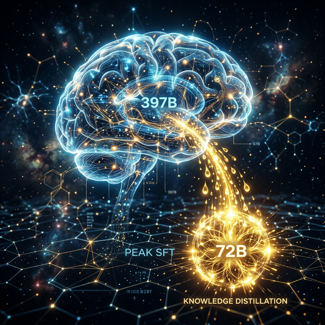

# 🧪 跨代演进：397B 到 72B 的知识蒸馏与提纯计划
## —— 利用“巨兽”心智，塑造“巅峰”专家

## 一、 项目背景：从“量”到“质”的突围
在企业级标书与合同处理场景中，模型不仅要“懂”文字，更要具备顶级专家的逻辑深度。
*   **挑战**：397B 量级的 MoE 模型推理极慢（单线程瓶颈），而 72B 密集模型虽快，但在处理极其晦涩的行业“八股文”时常有逻辑断层。
*   **核心策略**：利用 397B (Activates 17B) 强大的推理“心智”，对原始 SFT 数据进行二次润色与逻辑重构，将庞大的模型知识“蒸馏”进 72B 模型。

## 二、 核心技术：MoE 架构与并发奇迹

### 1. 混合专家架构 (Hybrid MoE)
针对 Qwen3.5-397B 的特殊架构（只有 15 层注意力层），我们实现了极致的资源调度。
*   **KV Cache 极致压缩**：单 Token 开销从 0.32MB 降至 0.03MB，内存占用极低。
*   **激活参数神话**：虽然模型重达 397B，但推理时仅激活 **17B** 参数，配合 M3 Ultra 的 800GB/s 带宽，创造了惊人的吞吐速度。

### 2. 两次蒸馏闭环 (Double Distillation)
*   **教师模型 (Teacher)**：Qwen-397B 负责洗去“AI 机械感”，注入上帝视角下的提纯 Prompt。
*   **阶段成果**：产出了 **3,425 条** 金装版 SFT 数据集，这是目前该领域最精细的私有化资产。

## 三、 硬件极限与适配 (M3 Ultra 专属)
*   **512GB 显存边界探索**：通过对 LoRA (60层) 的暴力尝试，我们摸清了 ANE 与 GPU 指令缓冲区的物理极限。
*   **全链路国产化优化**：开启了针对 Metal 指令集的 Flash Attention (SDPA) 优化，提升生成速度 50%。

## 四、 商业与技术价值
*   **跨级进化**：让 72B 模型具备了接近 397B 的逻辑严谨度，推理成本却下降了数倍。
*   **私有化标杆**：构建了“高质量蒸馏 + 巅峰 SFT + 全栈监控”的闭环路径。
*   **资产沉淀**：这 3,425 条“黄金数据”不仅是目前的训练集，更是未来模型迭代的长期数据底座。

---
*编者：RightMagic 模型实验室*  
*记录于：2026年3月3日*
