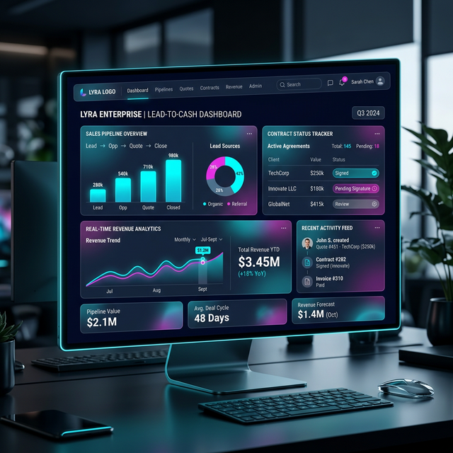

# 💰 Lead-to-Cash (L2C) 企业内部运营中枢：打通价值链的最后一步

## 一、 项目背景：碎片化管理的“终结者”

对于快速成长的科技企业，业务流程的支离破碎是最大的效率杀手。很多公司在寻找商机时用表单，准备标书时用 Word，项目交付时用群聊，最终回款时才发现账目对不上。L2C 系统正是为了将这些碎片化的环节缝合成一条完整的“黄金链条”。

## 二、 核心功能模块

### 1. 商机管理 (Lead & Opportunity)
不再是简单的备注。系统引入了基于权重的“赢单预测模型”，自动识别高价值商机，并可视化展示在销售漏斗中。

### 2. 招投标自动化 (Bidding Control)
集成了企业核心标书库。投标员可以直接调取历史成功案例，结合当前项目的特殊参数，快速生成合规且具有竞争力的应标初稿。

### 3. 项目与项目管理 (Project Delivery)
商机转合同后，系统自动同步里程碑任务。从人员指派到关键交付物审核，确保项目执行与合同条款完全一致。

### 4. 收款与财务闭环 (Cash Management)
这是 L2C 的核心。系统根据合同节点自动触发收款提醒，实时监控回款率，解决“有订单没现金”的财务隐患。

## 三、 技术亮点：数据驱动决策

*   **实时仪表盘**：通过交互式图表，管理者可以实时看到“商机总额”、“已赢单总额”以及“平均赢单率”。
*   **销售能力雷达**：根据历史数据自动生成的销售画像，直观展示每位销售在“风控能力”、“创新指数”和“客户满意度”上的表现。
*   **全流程可追溯**：从最初的一个线索到最后一笔款项到账，每一个动作都记录在案，实现了完美的审计闭环。

## 四、 业务成果
L2C 系统的上线，将原本分散在各部门的协同效率提升了 40%。通过精准的商机过滤与项目回款分析，显著降低了坏账风险，确保了企业运营现金流的健康与透明。
