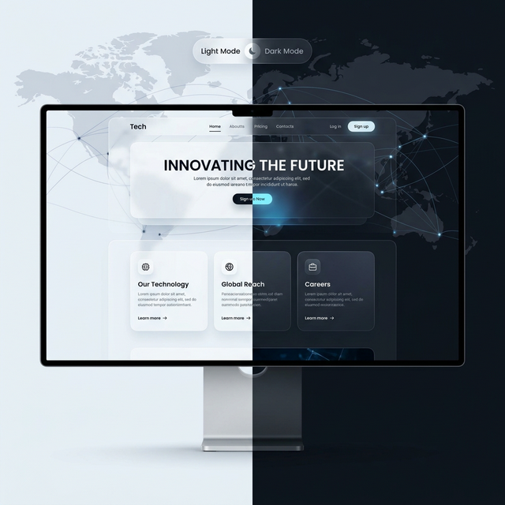

# 🌐 RightMagic 全球数字化门户：构建瞬时感知的数字身份

## 一、 项目背景：全球视野下的品牌挑战

在数字化竞争日益激烈的今天，企业的官方网站不仅是信息的载体，更是品牌技术实力与服务深度的第一窗口。RightMagic 作为一家面向全球的科技企业，面临着跨文化表达、跨地域访问速度以及统一品牌视觉的多重挑战。

## 二、 核心痛点
*   **访问瓶颈**：全球多中心部署环境下的首屏加载延迟。
*   **多语种断层**：传统翻译模式无法兼顾中、英、美等多地区文化语境的细微差别。
*   **设计单一**：固定的 UI 风格难以适配从“严谨金融”到“活力科技”的不同客户群审美。

## 三、 技术攻坚：极致性能与艺术的融合

### 1. 现代架构体系
基于 **Next.js 16 (App Router)** 架构，利用服务器组件 (RSC) 与边缘函数 (Edge Functions)，我们将全球页面的首屏感知速度降到了毫秒级。
*   **全栈 SEO**：通过动态元数据生成与 JSON-LD 结构化数据，确保了产品在全球搜索引擎中的高权重。
*   **Tailwind v4 驱动**：利用最新的 CSS 引擎实现了极致的玻璃态 (Glassmorphism) 视觉效果，且编译体积大幅缩减。

### 2. 无缝的国际化体验
不仅仅是翻译，更是“本地化落地”。通过 `next-intl` 实现多域名的智能路由分发：
*   中国区：`rightmagic.cn/zh`
*   英国区：`rightmagic.uk/zh`
*   美国区：`rightmagic.us/zh`
*   实验室：`rightnovalabs.com`
通过 Vercel 的全球边缘网络，实现了地理位置感知的智能定向。

### 3. 多元化视觉系统 (Theming System)
内置 8 种精美主题（4 款深色 + 4 款浅色），支持持久化存储用户审美偏好，配合 Framer Motion 的弹性动效，让每一次点击都充满交互的张力。

## 四、 业务价值
该系统成功构建了 RightMagic 的线上数字化基石。它不仅是一个入口，更是一个集成了 **ZeroCraft 零代码平台演示** 与 **Gamium AI 演武场入口** 的综合生态门户，为全球数百个潜在客户提供了“触手可及”的技术信任感。
