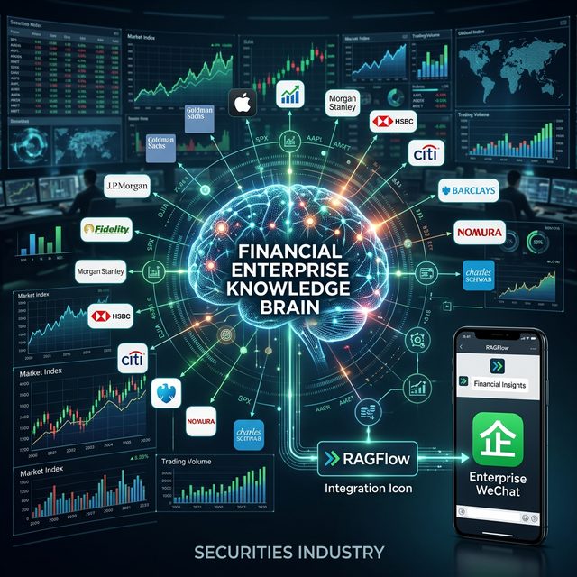

# 🏛️ 金融级企业知识大脑：证券智能运维 POC 实战
## —— RAGFlow + 企业微信：让万卷文档触手可及

## 一、 项目背景：证券运维的“信息孤岛”
在高度合规且瞬息万变的证券行业，运维（IT O&M）面临着极大的知识碎片化挑战。
*   **痛点**：数百份技术手册、合规文档和历史故障单分散在各个系统，甚至 PDF 扫描件中。
*   **诉求**：运维人员需要在巡检或处理紧急故障时，瞬间获取最准确的操作指南或合规要求。
*   **移动化**：传统的桌面端知识库无法满足随时随地移动办案的需求。

## 二、 核心方案：深度解析 + 移动协同

### 1. RAGFlow 深度引擎：攻克“文档天险”
基于 RAGFlow 的深度文档解析技术，我们不仅实现了文字的提取，更攻克了**复杂运维报表、网络拓扑图、甚至扫描件中的表格识别**。
*   **语义找回**：不同于关键词搜索，系统能够理解“服务器异常关机后的合规处理流程”这一复杂意图。
*   **源头追溯**：每一条 AI 建议都附带原始文档的引用链接，确保金融级的严谨性。

### 2. 企业微信无缝集成：知识在指尖流动
我们将 AI 知识库封装为企业微信（WeChat Work）智能助理。
*   **即时唤醒**：运维人员在群聊或私谈中即可一键提问，AI 机器人秒级响应。
*   **主动播报**：结合监控告警，AI 能够自动检索相关解决方案，并推送到值班人员的微信端。

## 三、 技术亮点：金融级的稳健与精准
*   **私有化部署**：全链路国产化适配，确保数据不出本地网络，契合证券行业合规底线。
*   **长文本心智**：采用优化后的 LLM 架构，能够轻松处理上万字的超长技术规格说明书。
*   **多模态增强**：通过对运维截图的视觉理解，AI 能够辅助识别控制台错误代码。

## 四、 商业与运维价值
*   **提效 60%**：将原本枯燥的手工文档检索时间减少了一半以上。
*   **降低准入门槛**：让新手运维也能像资深专家一样，快速调阅历史成功案例。
*   **决策透明**：所有 AI 建议均可审计，实现了从“经验驱动”到“知识驱动”的运维范式转型。

---
*编者：证券智能运维 AI POC 实验室*  
*记录于：2026年3月3日*
