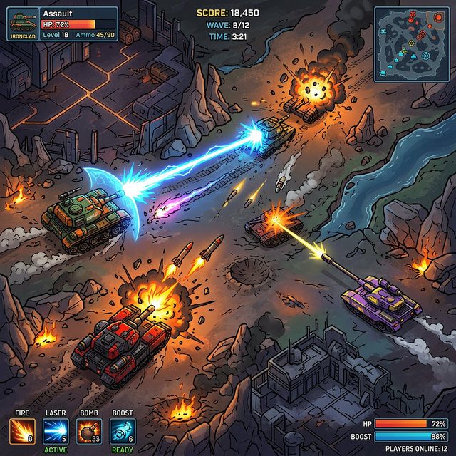

# ⚔️ 钢铁洪流：东线战场 (Iron Clash) —— 科技驱动的博弈实验

## 一、 项目初衷：不仅是游戏，更是代际创新的桥梁

《钢铁洪流：东线战场》是一款基于网页的 2D 坦克对战游戏，但它的背后隐藏着一个温馨的故事：这是开发者与孩子共同合作编写的作品。这个项目展示了如何通过技术将复杂的博弈逻辑转化为直观的交互体验，是一次完美的“科技启蒙”实践。

## 二、 核心机制与玩法设计

系统的核心目标是操作一支由三辆不同特性的坦克组成的小队，在无穷无尽的敌军攻势下生存并反击。

### 1. 深度平衡的三类单位
*   **突击坦克 (Assault)**：全能战士，在速度与火力间取得了完美平衡。
*   **狙击坦克 (Sniper)**：极致的速度与远程杀伤，搭载“轨道炮”技术，虽然装甲薄弱，但能瞬间扭转乾坤。
*   **爆破坦克 (Demolisher)**：重装巨兽，搭载导弹发射器，通过大范围爆炸清理敌军集群。

### 2. 丰富的策略深度
玩家不仅可以自由切换坦克视角（全景/驾驶舱），还可以利用燃烧瓶、地雷和究极技“空中支援”来应对复杂的战场环境。

## 三、 技术攻坚：Web 端的实时战争模拟

*   **高性能渲染**：在浏览器环境下实现了大规模物体的实时物理碰撞与粒子特效，保证了射击与移动的丝滑响应。
*   **复杂的 AI 路径算法**：敌方坦克具备基本的战术意识，能够根据玩家位置进行包围与战术规避。
*   **动态视角系统**：实现了无缝的 Top-Down 与 Cockpit 视角切换，为简单的 2D 游戏增添了深度空间感。

## 四、 业务与社会价值
这不仅是一个技术 Demo，更是一个**教育创新的真实案例**。它证明了复杂的编程逻辑（如状态机、物理引擎、协同作战）可以被拆解为孩子也能参与的创意实践。对于客户而言，这展示了开发者在处理复杂实时交互、单位管理系统以及“寓教于乐”产品设计方面的卓越能力。
